## 编程模型

### Grid-Block-Thread

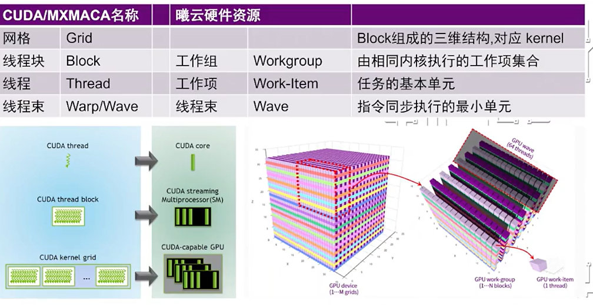

<!-- more -->

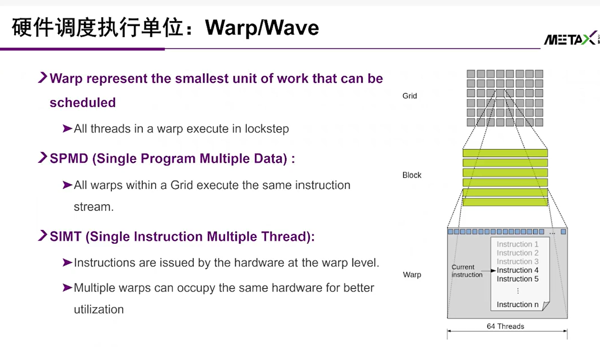

- 同一个warp当中的thread是共享部分资源的

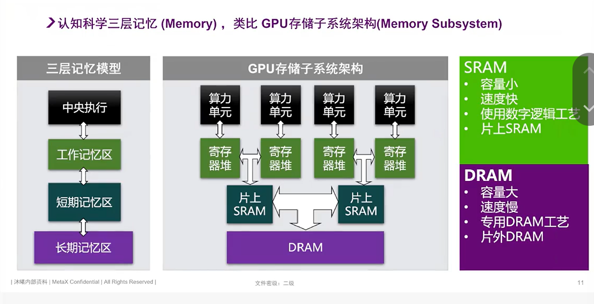

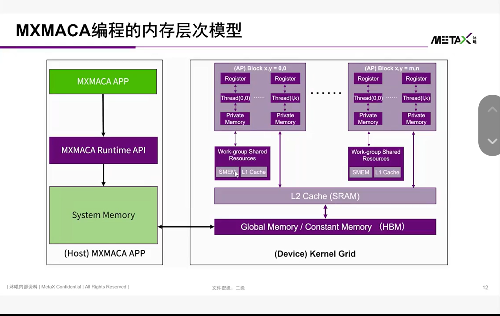

## 体系结构相关的优化案例

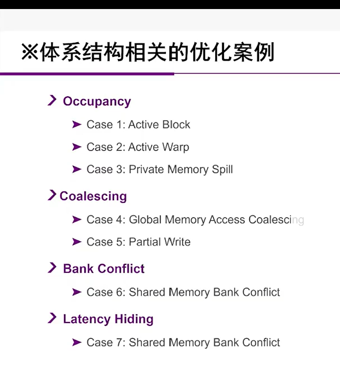

### Occupancy-资源占用
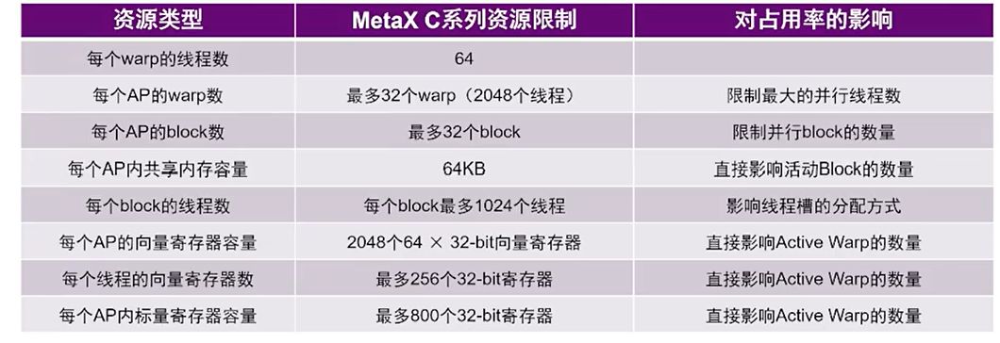

#### case 1: active block

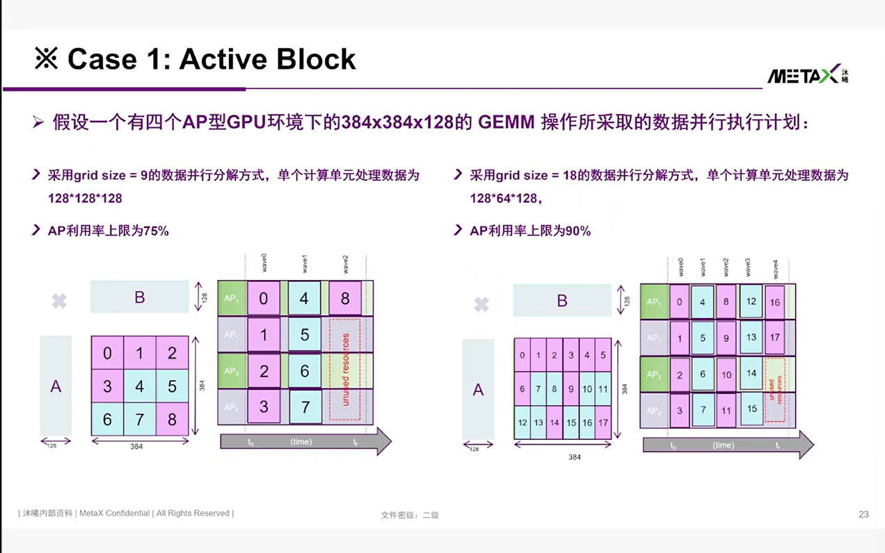

> 追求相对较小的task分割大小，以获得更高的block利用率（当然最好是切成block的倍数）

> 简单的数学就可以证明，由于每一个计算单元的计算速度是固定的，所以只要空转时间越短，整体效率就会越高

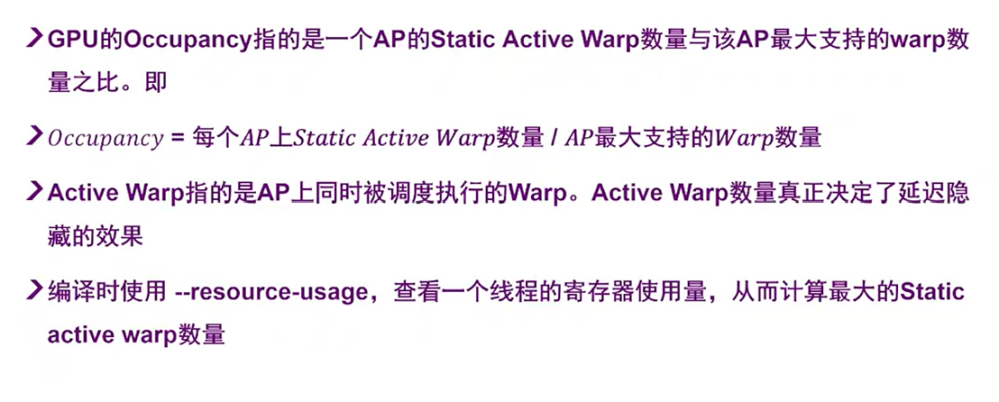

#### case 2: active warp

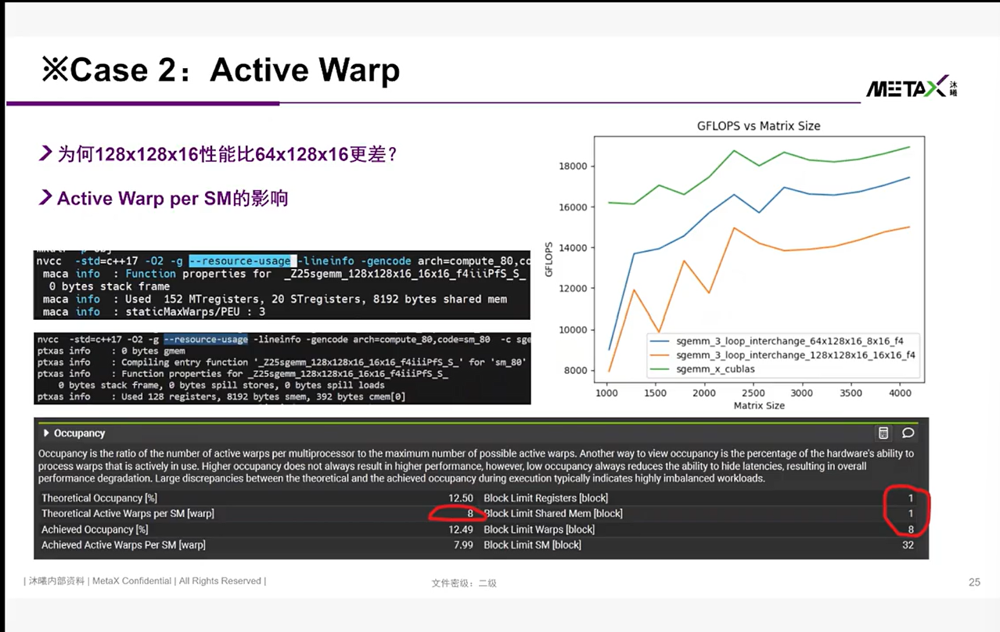

#### case 3: private memory

> 简单来说，就是使用的临时变量太多，导致最快的寄存器分配器无法满足，会出现溢写到private memory当中的情况，而private memory的访问周期往往是寄存器的上百倍，导致显著的性能损失

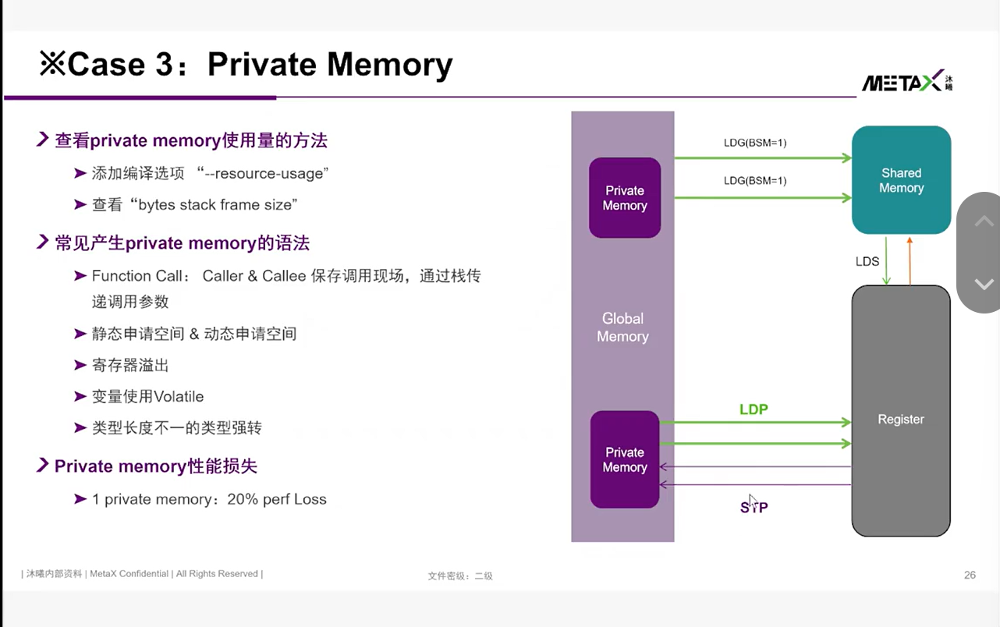
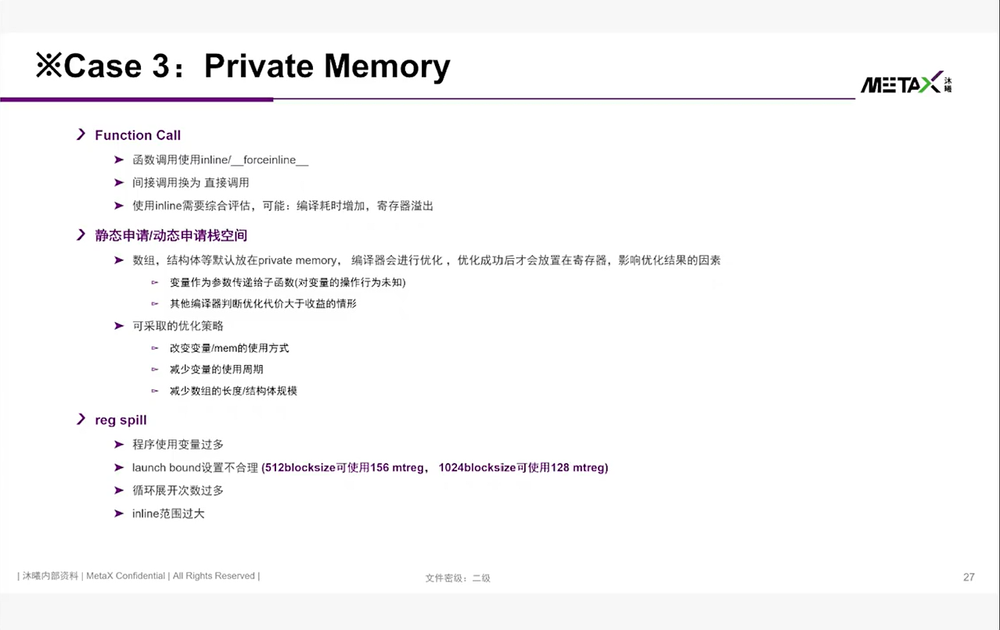

##### 一个优化示例

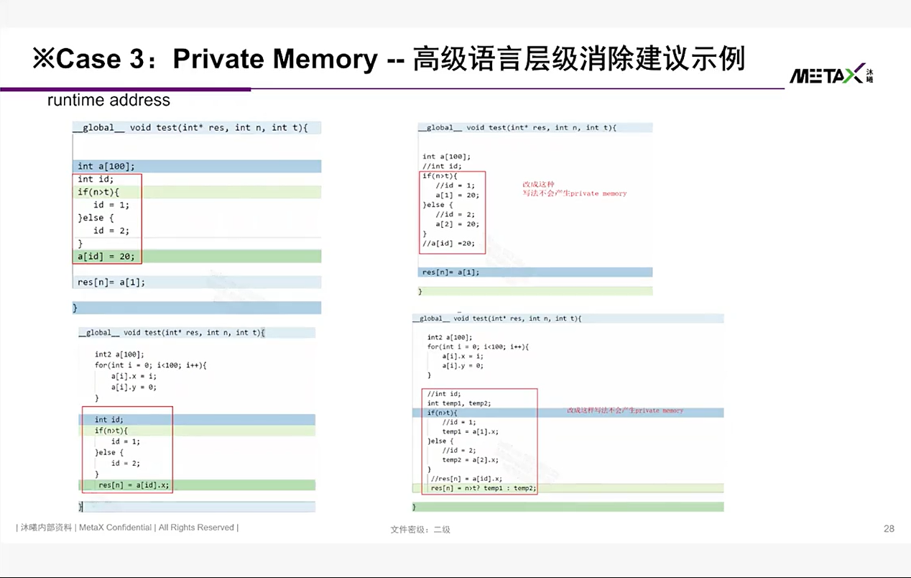

### Coalescing-合并
> coalescing 是指将连续的访问合并成一个访问，从而提高访存效率

#### case 4: Global Memory Access Coalescing

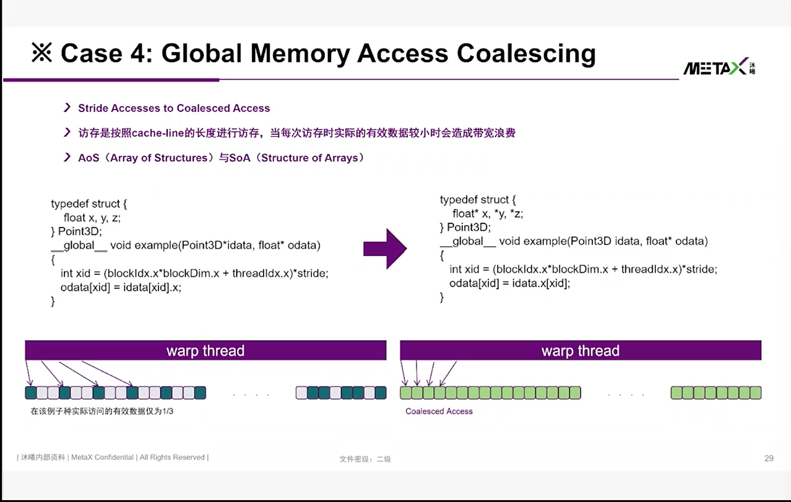

#### case 5: Partial Write降低HBM写带宽
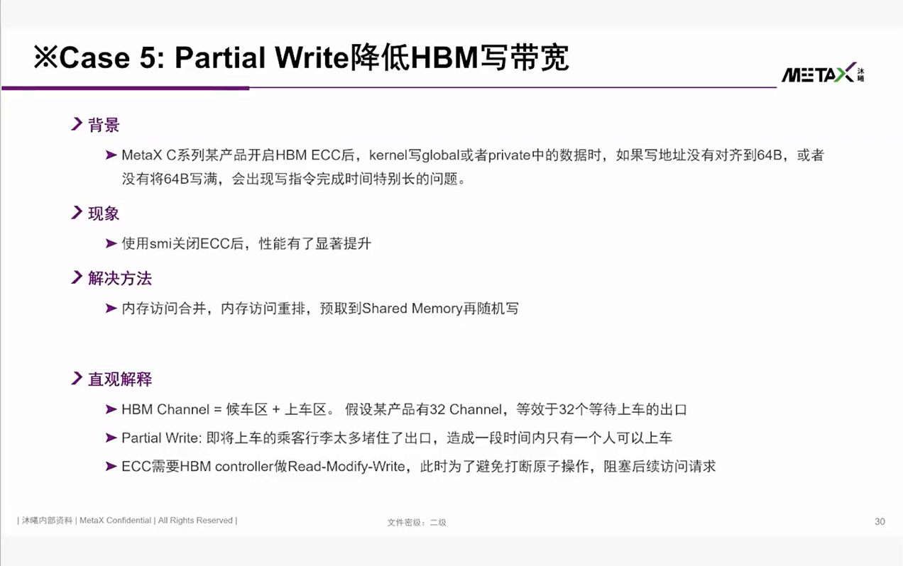

### Bank Conflict - bank冲突
#### case 6: Shared Memory Bank Conflicts

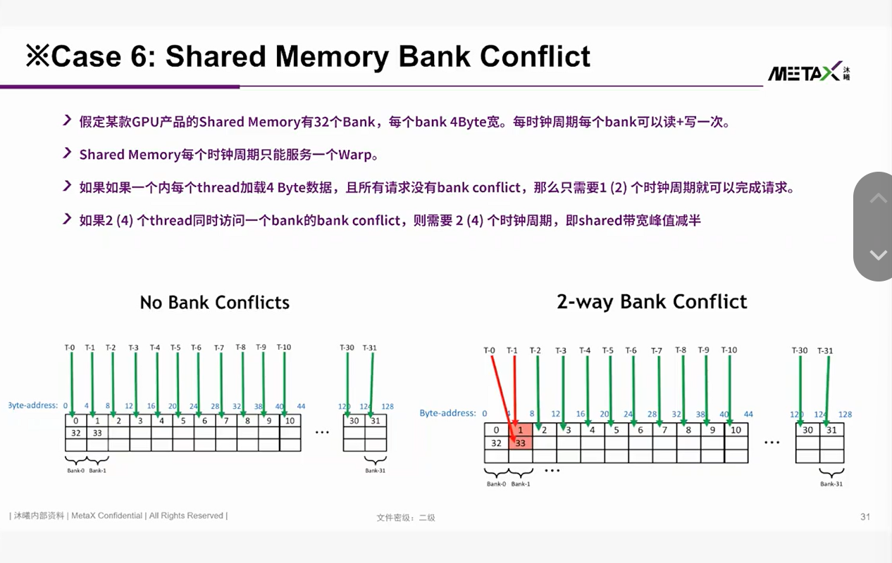

##### 一个优化示例

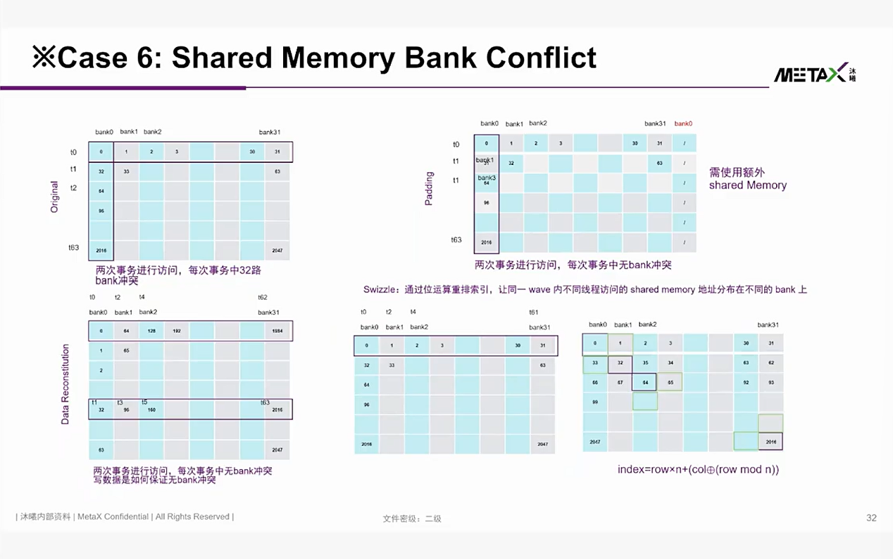

### Latency Hiding - 延迟隐藏
#### Latency Hiding

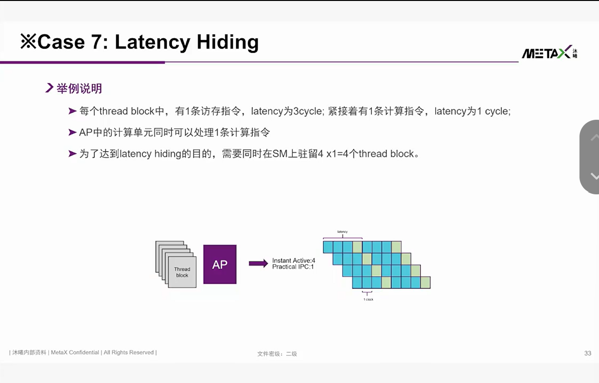

