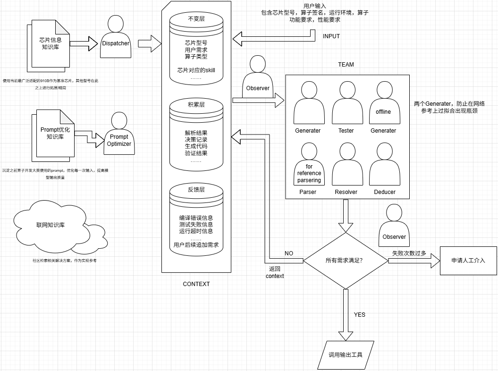

<!-- more -->

## 多智能体系统职责说明书（针对 CANN 算子生成场景）

### Dispatcher（分发器 / 调度总控）
- **定位**：系统的入口大脑。
- **核心职责**：
    - **接收与解析**：接收用户输入的原始需求（芯片型号、算子签名、运行环境、功能/性能要求）。
    - **路由分发**：将需求转化为标准化的任务指令，分发至 `Context` 层的数据库以及 `Team` 中的指定智能体。
    - **知识库激活**：决定需要从哪个知识库（芯片库、Prompt库、联网库）提取信息。
    - **策略选择**：决定采用多智能体并行策略还是串行策略（例如，如果包含联网需求，则必须等待；如果纯本地知识，可并行处理）。

### Prompt Optimizer（提示词优化器）
- **定位**：提升大模型生成质量的“弹药精炼师”。
- **核心职责**：
    - **模板提取**：从 `Prompt优化知识库` 中检索历史积累的、针对特定算子类型（如 Conv2D、MatMul）的最佳提示词模板。
    - **动态优化**：根据当前输入的芯片型号（如 910B vs 310P）和用户需求，对原始 Prompt 进行增量改写或参数填充。
    - **针对性补充**：针对算子开发中的常见陷阱（例如内存对齐、Tiling 限制），在 Prompt 中自动追加约束条件（硬约束），防止 LLM 产生幻觉。

### Observer（观察员/监控者）
- **定位**：系统的“鹰眼”，负责横向监控与质量保障。
- **核心职责**：
    - **流程监控**：监控 `Team` 中所有智能体的执行状态、耗时以及输出质量。
    - **死循环检测**：当系统陷入“生成-失败-重试”循环时，Observer 负责统计失败次数。
    - **触发仲裁**：当失败次数超过预设阈值（例如 3 次），向判定节点发出信号，触发 **“申请人工介入”** 流程，防止系统无谓消耗 Token 与时间。
    - **反馈记录**：将流程中的异常状态写入 `Context` 的反馈层，用于后续的自我学习。

### Team 内部智能体（生成与解析团队）

#### Generator A & B（双重生成器）
- **定位**：核心代码铸造师。
- **核心职责**：
    - **双路并行生成**：两个 Generator 独立接收相同 Prompt，并行生成两套算子代码方案。
    - **异构防过拟合**：如果 Generator A 调用网络参考，Generator B 则强制要求基于本地知识库生成，防止两者同时陷入相同的“网络诱捕”或“共谋错误”。
    - **代码产出**：输出符合 CANN 编程规范（TIK/TBE）的 CCE 代码或 Python 代码。

#### Tester（测试验证者）
- **定位**：代码质量的守门员。
- **核心职责**：
    - **测试用例生成**：根据算子签名和运行环境，自动生成单元测试（GTest/Pytest）和边界测试用例（包括极端输入、异常输入）。
    - **执行与报告**：调用 CANN 运行时环境执行测试，并收集详细的执行日志（编译错误、运行超时、结果偏差）。
    - **测试覆盖度评估**：输出测试通过率及覆盖率报告，判定当前生成代码是否满足需求。

#### Parser（解析器 - 参考分析）
- **定位**：语义与依赖的解构者。
- **核心职责**：
    - **代码结构化**：对生成的代码进行 AST（抽象语法树）解析，提取数据流向、依赖关系。
    - **合规性预检**：检查代码是否违反了硬性约束（例如：使用了被禁止的汇编指令、内存访问越界等），在不运行的情况下提前发现潜在错误。

#### Resolver（解决者 / 冲突仲裁）
- **定位**：多智能体矛盾的协调员。
- **核心职责**：
    - **矛盾融合**：当 Generator A 和 B 生成的代码在逻辑层面发生冲突（例如，A 使用 A 方式计算，B 使用 B 方式计算），Resolver 需要根据测试结果和解析器报告决定采用哪种方案。
    - **修复建议**：针对 Tester 报出的编译错误，Resolver 负责分析错误日志，生成“修复指令”，指导 Generator 重新生成。

#### Deducer（推导者 / 逻辑深化）
- **定位**：性能与架构的优化师。
- **核心职责**：
    - **硬件映射推演**：将代码层面的逻辑映射到昇腾芯片的物理资源（AICore、内存层级、流水线）。
    - **性能瓶颈预判**：分析代码中的 Tiling 策略、内存排布、并发调度，预测其在目标芯片上的运行性能。
    - **决策辅助**：输出一份“性能评估报告”，指导最终是否采纳当前生成的算子。

### Context 子系统（知识库存储与更新）

虽然 Context 不是智能体，但它是智能体工作的“共享大脑”，其分层存储机制对每个智能体都有影响：

- **不变层**：存储芯片型号、算子签名、用户核心需求。**任何智能体不得修改此层**，确保任务基线不漂移。
- **积累层**：存储解析结果、生成代码、验证结果。**Generator 和 Resolver 负责写入此层**，供后续智能体参考。
- **反馈层**：存储编译错误、测试失败、超时信息。**Tester 和 Observer 负责写入此层**，用于驱动流程循环与人工介入判断。

---

### 判定节点与输出机制

#### 判定节点（决策点）
- **所有需求满足**：当 `Resolver`、`Deducer`、`Tester` 三方确认通过，且性能达标时，输出为 **YES**。
- **失败次数过多**：当 `Observer` 检测到失败循环超过阈值（例如 3 次），输出为 **NO -> 申请人工介入**。
- **常规失败**：输出为 **NO -> 返回 Context 追加反馈**。

#### 申请人工介入
- **触发条件**：系统无法解决当前问题或陷入僵局。
- **输出内容**：生成一份“诊断报告”，包含：原始需求、失败尝试过程、各智能体的输出日志、当前生成的代码版本，以及具体的失败根因分析。

#### 调用输出工具
- **最终动作**：输出一份可直接用于部署的算子包（包含源码、测试脚本、性能报告），或直接调用插件接口嵌入开发环境。
