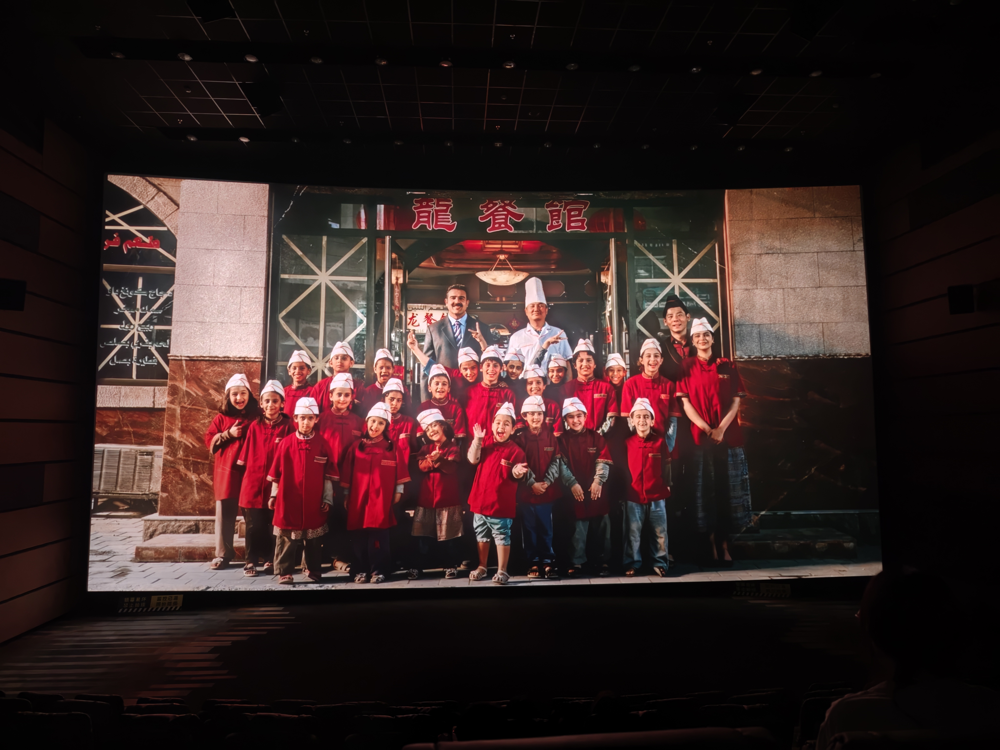

## 奏与衔接

作为一部以战争为背景的现实主义影片，《欢迎来龙餐馆》的叙事效率值得单独指出。全片以徐福（沈腾饰）赴中东还债开篇，以二十年后的废墟与一份菜单收束，中间经历餐馆兴衰、战乱爆发、人物离散，信息量不小，但观影过程中几乎感觉不到拖沓。

文牧野延续了《我不是药神》以来以事件推人物、以人物带情绪的编剧方法，每一段情节同时承担"推进处境"与"改写人物"两种功能，前后衔接因此显得自然：餐馆从门庭若市到成为安全区供餐点，再到沦为危局中的庇护所，是一根由外部局势与人物选择共同拧成的连续线索，而非段落式拼接。

<!-- more -->

## 创作背景：三个真实故事与一个母题

影片并非凭空虚构。据导演文牧野及媒体披露，主角徐福的塑造取材于多位在伊拉克战乱中经营中餐馆的华人真实经历：

**陈宪忠（"伊拉克炒饭哥"）**：吉林人，退伍后考入北京大学阿拉伯语专业，1984 年以翻译身份首次赴伊，此后在巴格达扎根数十年。2003 年战争爆发后，他经营的"宴龙湾"中餐馆因中国国籍的特殊性，成为交战各方默认的中立区域，外国记者、本地医生、逃难儿童陆续涌入，他主动收留庇护，还接纳了 4 名无处谋生的福建同胞。2005 年他因被误认与美军有联系而遭绑架，头部受伤——这是"战火中的安全屋"情节的出处。

**刘磊与帅学军**：2003 年 7 月，两人带着约 3700 美元抵达巴格达，开起战后第一家中餐馆"中国龙"（店名由时任中国驻伊大使馆复馆小组组长孙必干题写）。白天做美式中餐，夜里向驻伊美军售卖威士忌，高峰期一天收入 3500 美元，一年多赚回约 308 万元人民币；代价是餐厅半径 50 米内一年可落几十颗炮弹。这段经历后被写成纪实作品《在死神脚下揾钱》。影片中"白天炒饭、黑夜成酒吧"的桥段即由此而来。

**文牧野的创作缘起**：2017 年《我不是药神》后期制作期间，他因一则中东华人餐馆的新闻形成"美食与战争相遇"的构思。影片的内核落点不是宏大的反战宣言，而是一句家常话——"好好吃饭"。用他自己的话说，母亲常讲"人生最重要的事不过两件：好好吃饭，好好养孩子"。

## 历史坐标：从海湾战争到伊拉克战争

影片的时间设定应放到真实历史中校准。1990—1991 年，伊拉克入侵科威特，联合国授权的多国部队发动"沙漠风暴"行动将其逐出，萨达姆政权却得以存续——这是通常所说的海湾战争（第一次海湾战争）。2003 年 3 月，美英联军以"大规模杀伤性武器"为由发动伊拉克战争（第二次海湾战争），萨达姆政权在数周内垮台；5 月 1 日主要战事宣布结束，但伊拉克随即陷入占领、抵抗与教派冲突交织的漫长动荡。

影片主人公于 2002 年抵达巴格达，经历战前最后的平静，随后被卷入战乱——这个时间点恰好落在两次战争的余波与爆发之间。战前巴格达的繁华（陈宪忠回忆初到时"灯火通明、别墅林立"）与战后的破碎（"道路年久失修，居民区毁败不堪"），构成影片背景的真实底色。片中各方默认的中立餐馆、向美军及记者供餐的生意、炮火下的日常，均有现实对应物。

## 人物品鉴：打破脸谱化

影片最值得称道之处在于人物。战争题材最容易滑入非黑即白，此处被有意回避：

**徐福**：出场时不是英雄，而是一个欠债的、想"借助战争发财"的普通人。他最初争取餐馆一半股权，动机是还债养家；给安全区供餐，首先也是生意。他的转变是渐进的、被环境推着走的：从"他们不是你的孩子"到"那也是孩子"。文牧野说徐福"心存侥幸，想借助战争发财，但也为此付出代价"——人物始终带着瑕疵，因此最后的选择才显得可信。

**马俊生（蒋奇明饰）**：孤儿出身，女友丽娜是孤儿院老师。他善良、恋家，渴望开店迎娶丽娜，却在危急时刻利用发芽的土豆为被训练的孩子争取逃脱的窗口——而发芽土豆正是开篇徐福明令禁止使用的"有毒食材"。同一件被否定的东西在绝境中成了救人的手段，道具复用的设计相当精妙。

**扎伊德**：龙餐馆的本地老板，失去妻女后只剩下复仇。他与徐福构成镜像——"他们不是你的孩子"与"那也是孩子"的对话在片中出现了两次，一次在马俊生与徐福之间，一次在徐福与扎伊德之间。战争的残酷在于，它把每个人都推向自己最极端的那一面。

**赛夫**：名字在阿拉伯语中意为"刀刃"的孤儿，被极端组织利用，最终却在徐福与马俊生的引导下成为厨师而非战士。结尾处年迈的徐福重返已成废墟的餐馆，看到赛夫手里拿的是勺子而不是枪——这是全片最克制也最有分量的画面。

**老扎**：葬礼后徐福给他喂饭的"张嘴"，与他在生死关头用中文（对方能听懂、敌人听不懂的语言）给徐福传递活命暗号形成呼应。从"我喂你吃饭"到"我给你生路"，语言与食物在这里完成了超越国界的联结。

## 细节与母题：好好吃饭

贯穿全片的母题是"好好吃饭"。这四个字出现在徐福对家人、对美军士兵、对孩子们的不同场合，并以"徐福烩饭"的形态完成闭环：那道最初被认为"上不了台面"的烩饭，是徐福在绝境中让孩子们吃饱的最后手段，二十年后被写进龙餐馆的菜单，成为善意与手艺传承的见证。

餐馆英文招牌从"Chinese Restaurant"变为"Loong Restaurant"，"龙"从抽象的中国标签落地为被具体的人和事接纳的文明标识。这些设计不煽情，靠的是情节本身的勾连与回响。

## 结语

《欢迎来龙餐馆》的价值不在于提供立场，而在于呈现处境：它把战争还原为普通人"想好好吃饭、想活着、想回家"的日常挣扎，把中国人在异国战乱中的生存经验转化为可供共情的叙事。影片没有给出答案，只留下一间餐馆、一口锅和一句朴素的话。就当下中国电影的战争叙事而言，这是一次克制而有效的补充。

---

**附：影片基本信息**

- 导演：文牧野
- 监制：宁浩
- 主演：沈腾、蒋奇明
- 公映日期：2026 年 8 月 11 日
- 片长：140 分钟
- 豆瓣开分 8.4 / 猫眼 9.7 / 淘票票 9.8
- 票房：截至 8 月 13 日破 4 亿元

> 成稿时间：2026-08-16 01:30（GMT+8）。部分原型细节综合自《环球时报》《鲁豫有约》、封面新闻及中国侨网报道。