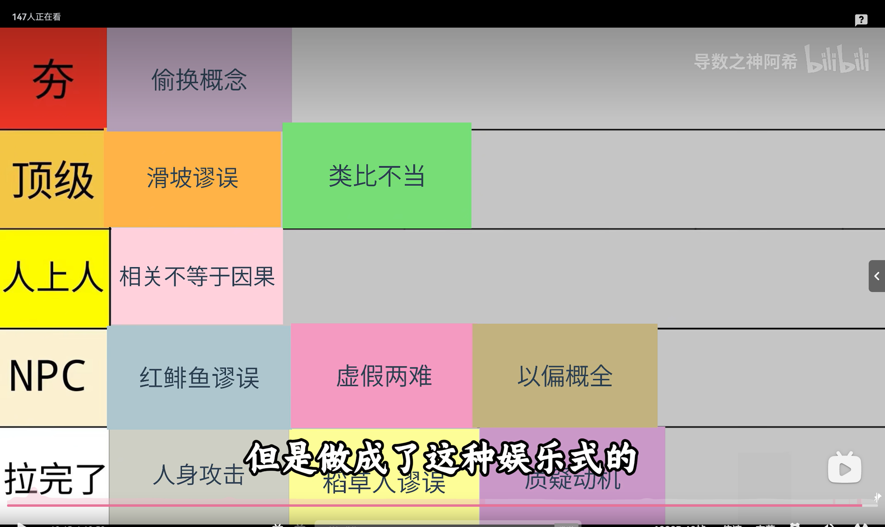

网上冲浪的时候总会看到各种令人忍不住重击太阳穴的逆天言论，特地做一个整理。本文所罗列的谬误分类与分级，参考自B站UP主“导数之神阿希”制作的逻辑谬误Tier表。

[原视频链接：【锐评各种逻辑谬误】](https://www.bilibili.com/video/BV1XnMS6nEDx?vd_source=ffd653dd49b30379ccc6d1544133db32)

<!-- more -->
## **偷换概念**

解释：在论证过程中，将同一个词或短语在不同语境下的含义进行混淆，从而得出一个看似合理实则荒谬的结论。

例子：人是由细胞构成的，细胞是活的，所以人都是活的。前一个“活的”指生命组成单位，后一个“活的”指宏观个体的生命状态，概念被偷换了。

## **滑坡谬误**

解释：主张如果允许某件事发生，就一定会引发一连串不可控的、灾难性的连锁反应。这种谬误的关键在于未提供任何证据来证明这一连串事件之间存在着必然的因果联系。

例子：如果你今天敢熬夜打游戏，明天你就敢逃课，后天你就敢去偷东西，大后天你就得进局子。

## **类比不当**

解释：试图用两个本质上截然不同的事物进行对比，强行套用相似的逻辑，从而得出不成立的结论。

例子：人类为什么要保护动物？那细菌也是生命，为什么不保护细菌？将复杂的情感伦理和简单的生物学概念进行了不恰当的强行类比。

## **相关不等于因果**

解释：仅仅因为两件事在时间或统计上具有相关性，就断定其中一件事是另一件事的原因。

例子：统计数据显示，夏天冰淇淋销量越高，溺水的人数也越多。于是得出结论：吃冰淇淋会导致溺水。真实原因是夏天天气热，大家既爱吃冰淇淋，也爱去游泳，导致溺水几率上升，两者都是天气热的结果，而非因果关系。

## **红鲱鱼谬误**

解释：故意引入一个无关的话题或观点，转移对手和听众的注意力，从而避开原本的争论焦点。

例子：争论对方考试作弊。回答：我虽然作弊了，但你没发现我语文考得特别好，说明我学习很用功啊。完全回避了作弊本身的问题，转移到语文成绩上。

## **虚假两难**

解释：刻意把复杂的问题简化为只有非此即彼的两种极端选择，强迫对方在两者中选一个，忽略了其他所有中间地带或第三种选项。

例子：你是支持我还是支持他？不站队就是我的敌人。把中立、观望、不关心等全部抹杀，强行推入两极对立。

## **以偏概全**

解释：基于极少数的个例或小样本数据，就推导出普遍的、绝对的结论。

例子：我遇到过一个司机开车很没素质，所以所有网约车司机都是垃圾。

## **人身攻击**

解释：不去反驳对方的观点或论据，而是直接攻击对方的品格、动机、背景或外貌等个人特征，以此作为否定对方论点的理由。

例子：对方提出应该提高最低薪资标准。你回答：你个连自己都养活不了的穷鬼，有什么资格谈提高薪资？用对方的贫穷来否定其观点的合理性。

## **稻草人谬误**

解释：对方原本提出了一个观点，但你故意歪曲、夸大或虚构出一个极其荒谬的对方观点，然后把这个假观点打倒在地，显得自己赢了。

例子：对方说那个地方地理位置太偏，不适合开超市。你回答：你的意思是全世界偏远地方的人都不配买东西？你也太傲慢了吧。对方根本没有表达这个意思，你树立了虚假的靶子来攻击。

## **质疑动机**

解释：不去谈论观点的对错，而是去质疑对方提出这个观点的目的或动机。认为只要有利益相关，观点就一定是错的。

例子：对方说这家餐厅的菜确实很好吃。你回答：你是这家餐厅的托吧？拿钱了吧？完全抛开食物的味道本身去讨论动机。