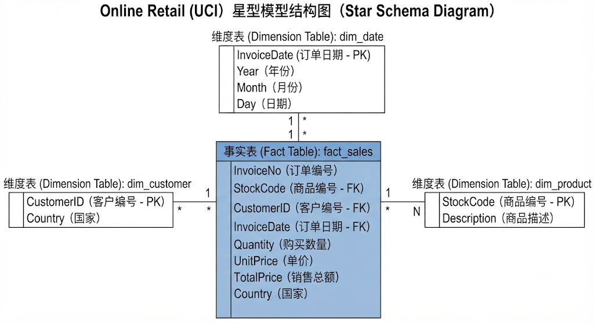
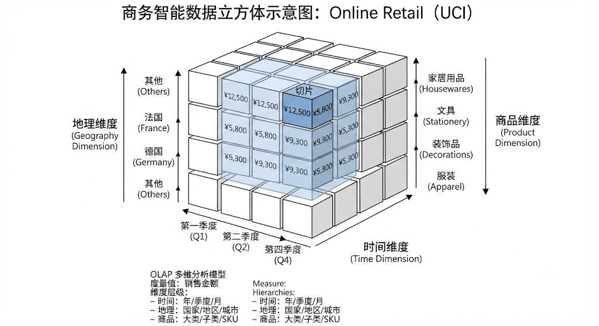
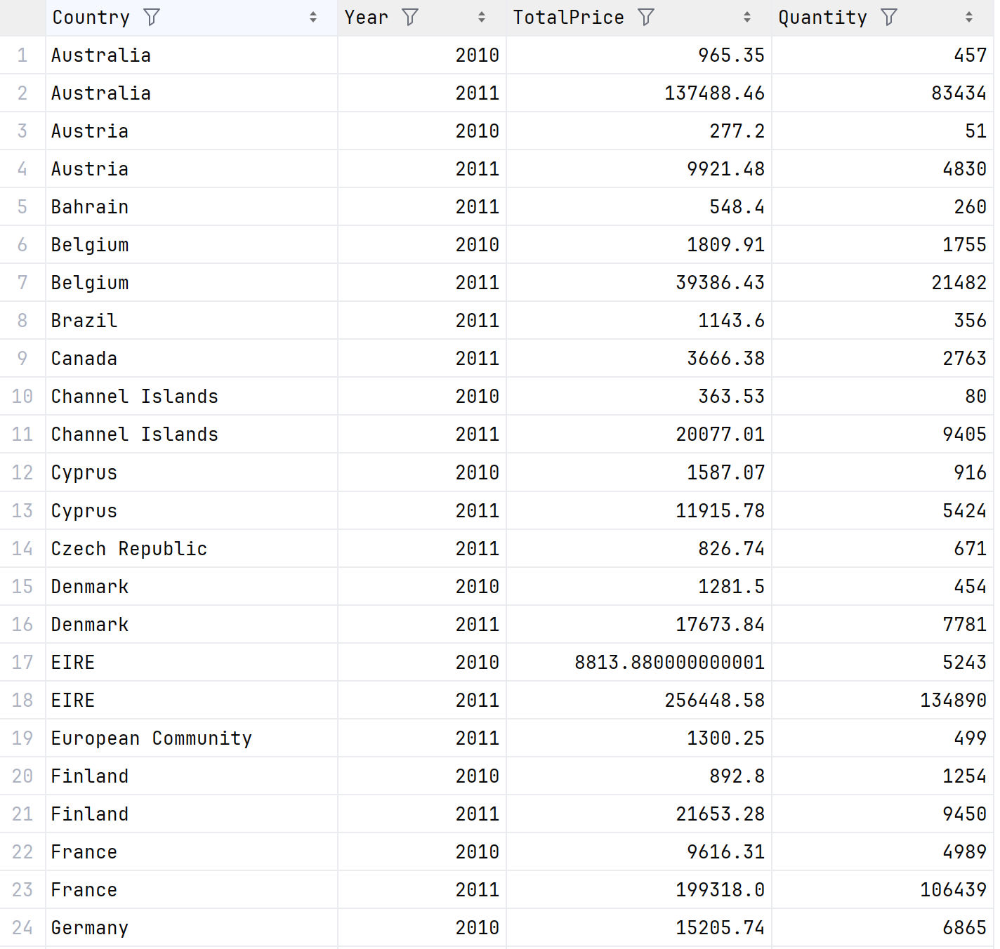
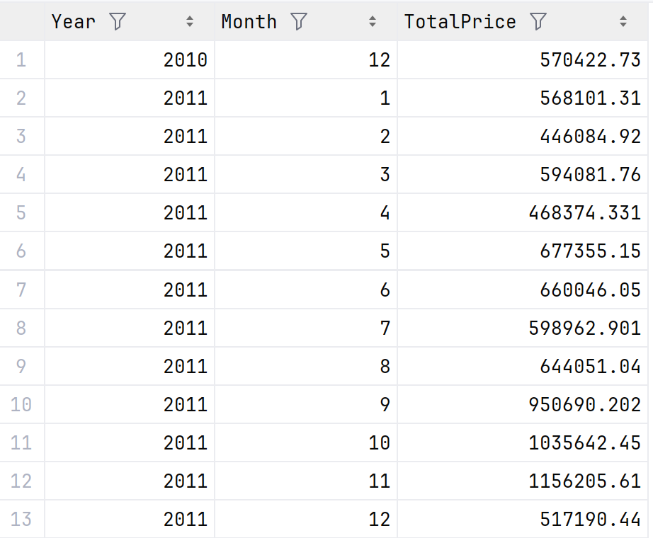
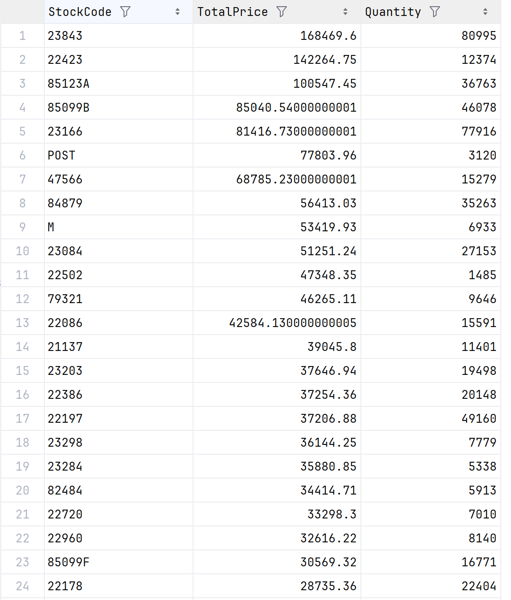
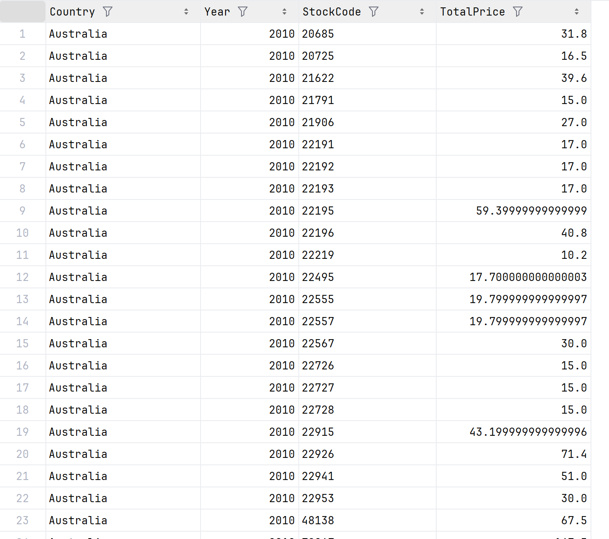

## 数据来源说明

本实验选取公开零售交易数据集作为分析对象，数据来源为UCI Machine Learning Repository中的Online Retail Dataset。该数据集记录了某在线零售公司的真实交易数据，包含订单、商品、客户及时间等多维度信息。

数据字段说明如下：

| 字段名称 | 字段说明 |
|---------|---------|
| InvoiceNo | 订单编号 |
| StockCode | 商品编号 |
| Description | 商品描述 |
| Quantity | 购买数量 |
| InvoiceDate | 订单时间 |
| UnitPrice | 单价 |
| CustomerID | 客户编号 |
| Country | 国家 |


<!-- more -->

## 工具选型说明

本实验各阶段工具选型如下：

### ETL工具

本实验采用Python结合Pandas库实现数据抽取、清洗、转换与加载全过程。

功能实现说明：
- Extract（抽取）：通过`pd.read_excel()`完成原始数据的读取导入。
- Transform（转换）：包括缺失值处理（dropna）、去重操作（drop_duplicates）、异常值过滤（Quantity与UnitPrice正值约束）、时间字段拆分（Year/Month/Day）以及特征构造（TotalPrice）。
- Load（加载）：通过`to_csv()`将处理后的数据输出至数仓分层文件。

### 数据仓库工具

本实验未采用传统数据仓库系统（如Hive、SQL Server或Snowflake），而是基于Python Pandas构建轻量级数据仓库实现方案。具体实现方式包括构建事实表（Fact Table）与维度表（Dimension Tables），并利用CSV文件模拟数据分层存储架构（ODS/DWD/DWS）。

### OLAP工具

本实验采用Python Pandas的groupby聚合功能模拟OLAP引擎，实现多维数据分析操作。

工具选型汇总如下：

| 阶段 | 工具 |
| ---- | ---- |
| ETL | Python + Pandas |
| 数据仓库 | Pandas + CSV模拟数仓 |
| OLAP | Pandas groupby分析 |


## ETL流程说明

### 数据抽取（Extract）

通过Pandas读取Excel格式的原始交易数据文件，将数据载入DataFrame结构以便后续处理。

```python
df = pd.read_excel("Online Retail.xlsx")
```

### 数据转换（Transform）

转换阶段包含以下处理步骤：

**缺失值处理**：剔除CustomerID和Description字段中的缺失记录，确保关键维度字段的完整性。

```python
df = df.dropna(subset=["CustomerID", "Description"])
```

**去重处理**：移除数据中的完全重复记录，保证数据集的唯一性。

```python
df = df.drop_duplicates()
```

**异常值过滤**：筛选Quantity和UnitPrice均为正值的有效交易记录，剔除退货或异常交易数据。

```python
df = df[df["Quantity"] > 0]
df = df[df["UnitPrice"] > 0]
```

**时间字段处理**：将InvoiceDate字段转换为标准日期时间格式，并分别提取年、月、日作为独立维度属性。

```python
df["InvoiceDate"] = pd.to_datetime(df["InvoiceDate"])
df["Year"] = df["InvoiceDate"].dt.year
df["Month"] = df["InvoiceDate"].dt.month
df["Day"] = df["InvoiceDate"].dt.day
```

**派生指标构造**：根据购买数量与单价计算每笔交易的销售总额，作为核心度量字段。

```python
df["TotalPrice"] = df["Quantity"] * df["UnitPrice"]
```

### 数据加载（Load）

将处理后的数据按星型模型结构输出为数仓各层文件：

- fact_sales.csv（事实表）
- dim_product.csv（商品维度表）
- dim_customer.csv（客户维度表）
- dim_date.csv（时间维度表）
- agg_country_year.csv（国家年度汇总）
- agg_product.csv（商品汇总）
- agg_month.csv（月度汇总）


## 数据仓库模型说明

本实验采用星型模型（Star Schema）进行数据仓库建模。

### 事实表（Fact Table）

事实表fact_sales作为分析核心，记录每笔交易的具体度量数据，包含以下字段：

- InvoiceNo（订单编号）
- StockCode（商品编号）
- CustomerID（客户编号）
- InvoiceDate（订单日期）
- Quantity（购买数量）
- UnitPrice（单价）
- TotalPrice（销售总额）
- Country（国家）

### 维度表（Dimension Tables）

维度表为事实表提供分析视角，具体设计如下：

**商品维度（dim_product）** ：
- StockCode（商品编号）
- Description（商品描述）

**客户维度（dim_customer）** ：
- CustomerID（客户编号）
- Country（国家）

**时间维度（dim_date）** ：
- InvoiceDate（订单日期）
- Year（年份）
- Month（月份）
- Day（日期）

### 星型模型图示




## Cube结构说明

本实验构建OLAP数据立方体（Cube）用于多维数据分析。

### 维度设计

- 时间维度（Time）：Year（年份）/ Month（月份）/ Day（日期）
- 地理维度（Geography）：Country（国家）
- 商品维度（Product）：StockCode（商品编号）

### 度量设计

- TotalPrice（销售总额）：反映销售收入规模
- Quantity（销量）：反映销售数量规模

### Cube逻辑结构

Cube名称为Sales Cube，其逻辑结构定义如下：

- 维度组合：(Country, Time, Product)
- 度量指标：(TotalPrice, Quantity)

具体层级关系为：时间维度支持Year→Month→Day的下钻路径，地理维度以Country为分析粒度，商品维度以StockCode为最细粒度。

### Cube结构图示




## OLAP多维分析操作说明

本实验基于构建的数据立方体，实现了四种基本OLAP操作，示例如下：

### 上卷操作（Roll-up）

上卷操作沿维度层级向上汇总，将分析粒度从细粒度提升至粗粒度。本实验按国家与年度两个维度对销售数据进行汇总统计，分析各国各年度的整体销售表现。

```python
df.groupby(["Country", "Year"]).agg({
    "TotalPrice": "sum",
    "Quantity": "sum"
})
```



### 钻操作（Drill-down）

下钻操作沿维度层级向下细化，从较粗粒度深入至更细粒度。本实验从年度汇总下钻至月度粒度，分析销售数据的年内月度变化趋势。

```python
df.groupby(["Year", "Month"]).agg({
    "TotalPrice": "sum"
})
```



### 切片操作（Slice）

切片操作在某一维度上选定单个值，对数据立方体进行子集提取。本实验在商品维度上按StockCode进行分组聚合，分析各商品的销售总额分布。

```python
df.groupby("StockCode").agg({
    "TotalPrice": "sum"
})
``` 



### 切块操作（Dice）

切块操作在多个维度上同时进行选择与组合分析，形成多维交叉分析视图。本实验同时以国家、年份和商品编号三个维度进行分组汇总，实现跨维度的综合销售分析。

```python
df.groupby(["Country", "Year", "StockCode"]).agg({
    "TotalPrice": "sum"
})
```


## 实验总结

本实验基于Python Pandas技术栈，完整实现了从原始交易数据到数据仓库多维分析的端到端流程。实验主要成果包括：

1. 完成了包含抽取、清洗、转换与加载的完整ETL过程，对原始零售交易数据进行了有效的预处理和质量控制
2. 构建了基于星型模型的数据仓库，包含事实表与三个维度表（商品、客户、时间），形成了规范化的数据分层存储体系
3. 设计了支持时间、地理、商品三维分析的数据立方体，定义了销售总额与销量两个核心度量指标
4. 实现了上卷、下钻、切片和切块四种基本OLAP操作，能够满足多角度、多粒度的销售分析需求

整体数据处理流程概括如下：

```
原始数据集 → ETL（抽取/转换/加载） → 星型数仓建模 → Cube构建 → OLAP多维分析 → 结果输出
```

## 附录

### 数据来源地址

https://archive.ics.uci.edu/static/public/352/online+retail

[点击此处直接下载](https://archive.ics.uci.edu/static/public/352/online+retail.zip)

### 原始python分析代码

```python

import pandas as pd 

df = pd.read_excel("OnlineRetail.xlsx")


df = df.dropna(subset=["CustomerID", "Description"])

# 删除重复数据
df = df.drop_duplicates()

# Quantity <= 0
df = df[df["Quantity"] > 0]

# UnitPrice <= 0
df = df[df["UnitPrice"] > 0]


# 把字符串时间转换成标准时间格式
df["InvoiceDate"] = pd.to_datetime(df["InvoiceDate"])

# 提取时间维度
df["Year"] = df["InvoiceDate"].dt.year      # 年
df["Month"] = df["InvoiceDate"].dt.month    # 月
df["Day"] = df["InvoiceDate"].dt.day        # 日
df["Hour"] = df["InvoiceDate"].dt.hour      # 小时


# 计算每一条订单的总金额
df["TotalPrice"] = df["Quantity"] * df["UnitPrice"]


# 去掉国家字段多余空格
df["Country"] = df["Country"].str.strip()

# 统一小写
df["Description"] = df["Description"].str.lower()


fact_sales = df[[
    "InvoiceNo",     # 订单号
    "StockCode",     # 商品编号
    "CustomerID",    # 客户ID
    "InvoiceDate",   # 时间
    "Quantity",      # 数量
    "UnitPrice",     # 单价
    "TotalPrice",    # 总价
    "Country"        # 国家
]]

dim_product = df[[
    "StockCode",
    "Description"
]].drop_duplicates()


dim_customer = df[[
    "CustomerID",
    "Country"
]].drop_duplicates()


dim_date = df[[
    "InvoiceDate",
    "Year",
    "Month",
    "Day",
    "Hour"
]].drop_duplicates()


agg_country_year = df.groupby(["Country", "Year"]).agg({
    "TotalPrice": "sum",   # 总销售额
    "Quantity": "sum"      # 总销量
}).reset_index()

agg_product = df.groupby("StockCode").agg({
    "TotalPrice": "sum",
    "Quantity": "sum"
}).sort_values(by="TotalPrice", ascending=False).reset_index()

agg_month = df.groupby(["Year", "Month"]).agg({
    "TotalPrice": "sum"
}).reset_index()

agg_slice = df.groupby(["Country", "Year", "StockCode"]).agg({
    "TotalPrice": "sum"
}).reset_index()

# 保存事实表
fact_sales.to_csv("fact_sales.csv", index=False)

# 保存维度表
dim_product.to_csv("dim_product.csv", index=False)
dim_customer.to_csv("dim_customer.csv", index=False)
dim_date.to_csv("dim_date.csv", index=False)

# 保存OLAP汇总表
agg_country_year.to_csv("agg_country_year.csv", index=False)
agg_product.to_csv("agg_product.csv", index=False)
agg_month.to_csv("agg_month.csv", index=False)
agg_slice.to_csv("agg_slice.csv", index=False)


```