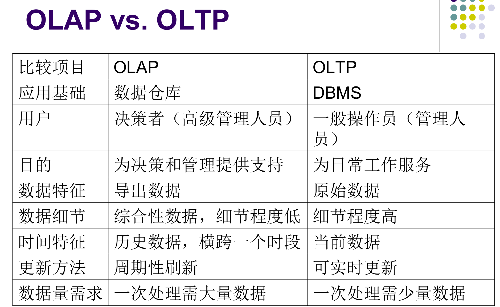
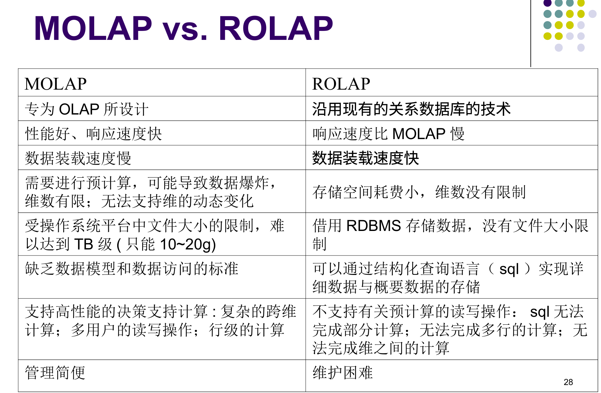
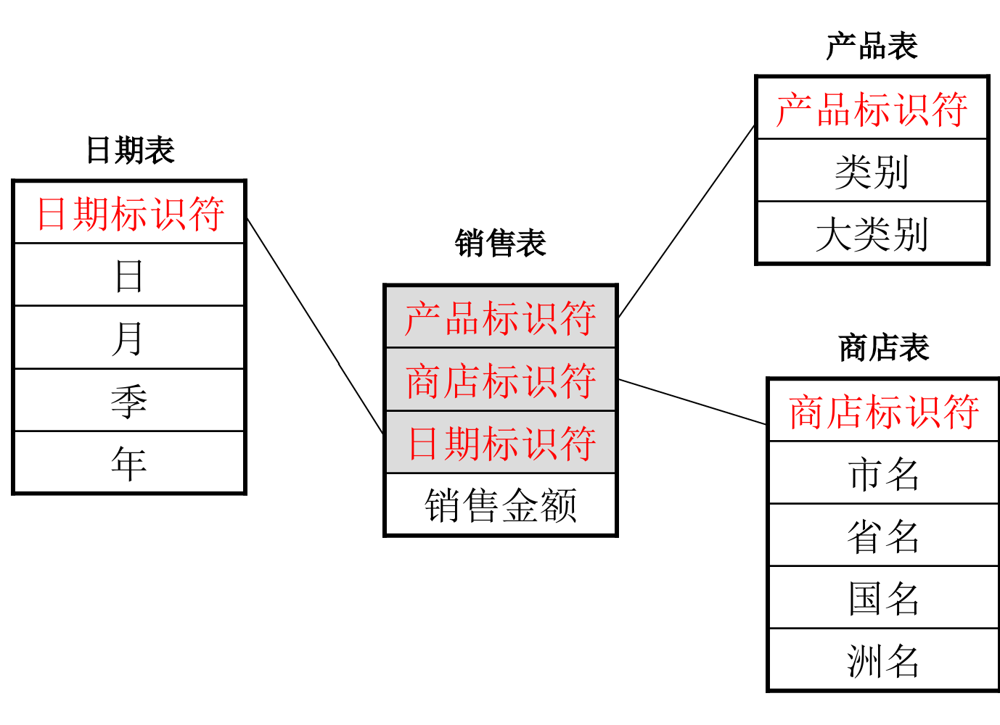
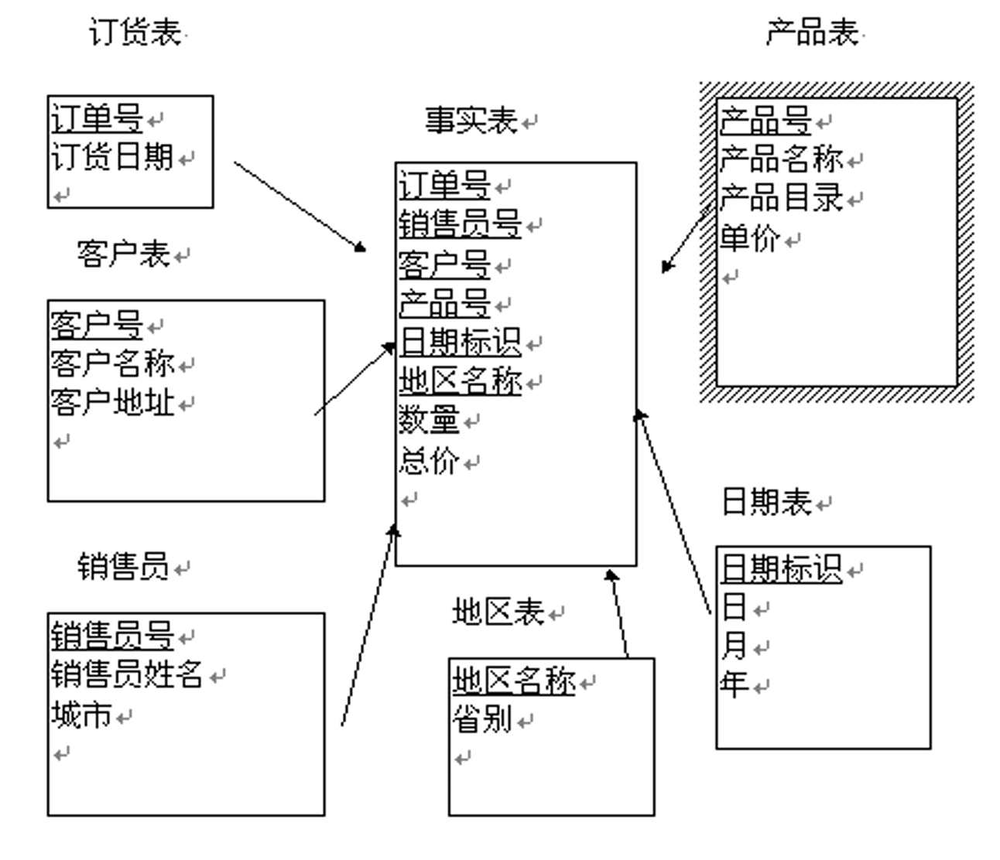
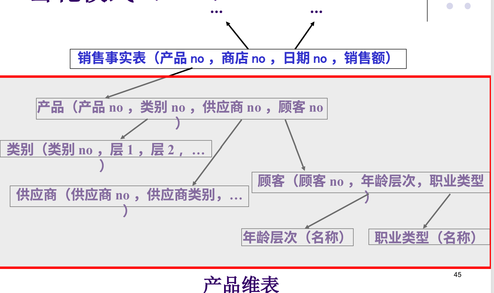
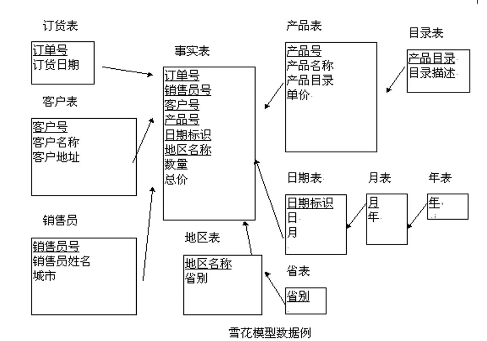
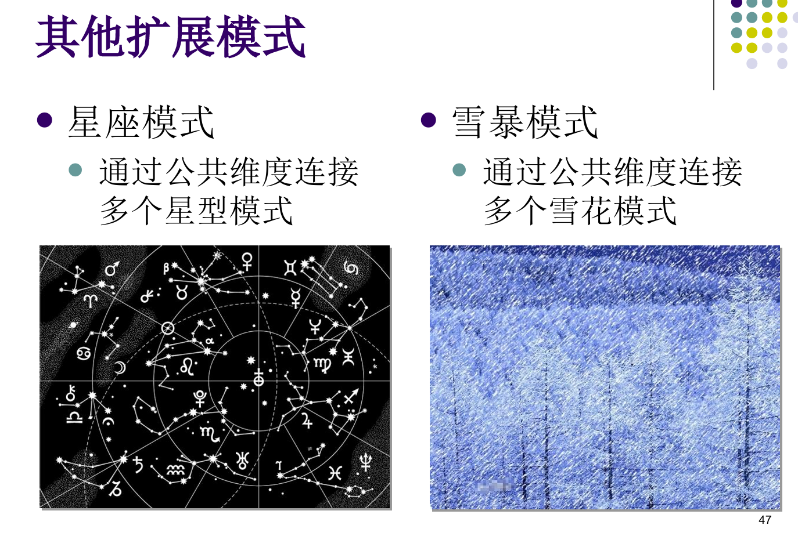

## OLAP

<!-- more -->

### Codd 关于OLAP的评价准则

> 这些只需要理解就可以，不要背诵 ~~（不过我不知道咋考就对了）~~

1. **多维概念视图**
   - OLAP必须提供多维概念视图，从多个维度考察对象

2. **透明性准则**
   - OLAP在体系结构中的位置对用户是透明的
   - OLAP的数据源对用户也是透明的

3. **存取能力准则**
   - 将OLAP的概念视图映射到异质的数据存储上
   - 能访问数据并执行所需转换，从而提供单一、完整、连续的用户视图

4. **稳定的报表功能**
   - 数据的维数和数据的综合层次增加时，提供给最终分析人员的报表能力和响应速度不应该有明显的降低和减慢

5. **客户/服务器体系结构**
   - 服务器保证透明性和建立统一的公共概念模式、逻辑模式和物理模式
   - 客户端负责应用逻辑和界面

6. **维的同等性原则**
   - 每一数据维在数据结构和操作能力上都是等同的

7. **动态的稀疏矩阵处理准则**
   - OLAP工具必须使得模型的物理模式充分适应指定的维数，尤其是特定模型的数据分布

8. **多用户支持能力准则**
   - OLAP工具必须提供并发访问、数据完整性及安全性机制

9. **非受限的跨维操作**
   - 对于多维数据之间存在的固有的层次关系，OLAP工具应自己推导而不是由用户明确定义相关计算
   - 对于无法从固有关系中得出的计算，提供计算完备的语言来定义各种计算公式

10. **直观的数据操作**
    - 提供直观易用的数据操作方式，降低用户使用门槛

11. **灵活的报表生成**
    - 支持灵活多样的报表生成方式，满足不同分析需求

12. **不受限维与聚集层次**
    - 维数不应小于15
    - 支持任意聚集层次

### MOLAP和ROLAP的差别

### OLAP 的基本数据模型

#### MOLAP

**多维联机分析处理（MOLAP）**

- MOLAP使用专门的多维数据库来存放所需要的数据
- 数据以多维的方式存放，并且使用多维的方式进行展现。
- 多维数组比关系数据表表达更清晰且占用存储小（在处理稠密数据时）
- 高速的综合速度，MOLAP适用于需要高速处理的复杂分析
- 维护多维数组需要大量资源

**多维数据库存取**

- 经压缩的、类似于数组的对象构成
- 这些对象带有高度压缩的索引及指针结构
- 并非维间的每种维成员组合都对应合理的度量值，MDDB必须具有高效的稀疏数据处理能力，能略过零元、缺失和重复数据
- 使用多维查询语言MDSQL

#### ROLAP

**关系联机分析处理（ROLAP）**

- ROLAP使用通用的关系数据库来存储所需数据
- ROLAP适应于处理大量数据
- 低效率
- 现有的关系型数据库已经对OLAP做了很多优化，包括并行存储、并行查询、并行数据管理、基于成本的查询优化、位图索引、SQL的OLAP扩展(cube, rollup)等，性能有所提高

**常用的两种ROLAP数据模型**

> 重点是区分这两种模式

- 星形模型
- 雪花模型

##### 星型模式

**星型模式**

- 星型模式是一种多维表结构，它一般由两种不同性质的二维表组成：
    - 事实表（Fact table）：存放多维表中的主要事实，称为度量值（Measure）
    - 维表（Dimension Table）：存放多维表中的维成员的取值
- 一般一个n维的多维表往往有n个维表和一个事实表，它们构成了一个星形结构，因而称其为“星型模式”
- 在星型模式中主体是事实表，而有关维的细节则放置于维表内以达到简化事实表的目的，事实表与维表间由公共属性相连以使它们构成一个整体

**关系转化**

上述的星型模式可以转化成下面的四个关系：

- 事实表：
    - 销售表（产品标识符，商店标识符，日期标识符，销售额）
- 维表1：
    - 产品表（产品标识符，类别，大类别）
- 维表2：
    - 商店表（商店标识符，市名，省名，国名，洲名）
- 维表3：
    - 时间表（时间标识符，日期，月份，季度，年份）

**星型模式（4/4）**

##### 雪花模式

**雪花模式（1/4）：定义与优缺点**

- 雪花模型是对星型模型的扩展
- 雪花模型对星型模型的维表进一步层次化，原有的各维表可能被扩展为小的事实表，形成一些局部的“层次”区域
- 优点：使维表尽可能地规范化，最大限度地减少维表的数据存储量
- 缺点：执行查询时需要更多的连接操作，可能会影响查询性能

**雪花模式（2/4）：扩展示例**

例如：前面的维表1“产品表”也可以是一个如下所示的星型结构：

- 产品（类别，供应商，顾客）
- 在前面的“星型模式”中，我们只考虑产品的分类（“类别”属性），在这里我们还可以从产品的“供应商”或“购买顾客”角度来考虑对产品进行分析
- 也可以以其中的“供应商”为中心再构成一个“星型模式”

**雪花模式（3/4）：关系示例**

**雪花模式（4/4）**

##### some others

### 数据立方体物化策略

**1. 不进行物化**
- 只存原始明细数据，查询时临时计算。
- 特点：最省空间，但查询速度极慢。

**2. 全物化**
- 将所有可能的维度组合汇总结果全部提前计算并存储。
- 特点：查询速度最快，但存储空间消耗极其巨大（现实中极少采用）。

**3. 部分物化（现实主流）**
- 只预先计算并存储一部分常用的汇总结果，平衡空间与速度。
- **冰山方体**：只保留超过特定阈值（如销售额>100万）的高价值汇总结果，舍弃低价值小数据。
- **按需物化（查询驱动）**：初期不预计算，当用户首次查询某类汇总时，系统在计算后缓存该结果，供后续复用。

**4. 更新维护**
- 物化的汇总结果需要随新数据（增量）进行及时更新。
- 采用**增量刷新**：只计算新产生的增量数据并累加到原有汇总中，避免每次重算全部历史数据。

### 一些概念

#### 上钻（Roll-up）
- **含义**：在数据立方体中**沿维度层次向上**移动，减少细节，进行汇总。
- **例子**：把“按城市”汇总的销售额，向上汇总成“按省份”的销售额。
- **效果**：数据变得更宏观、更概括，信息量变小但视野变宽。

#### 下钻（Drill-down）
- **含义**：在数据立方体中**沿维度层次向下**移动，增加细节，展开明细。
- **例子**：把“按省份”汇总的销售额，向下展开成“按城市”甚至“按门店”的销售额。
- **效果**：数据变得更微观、更细致，能看到更深层的原因。它是“上钻”的反向操作。

#### 切片（Slice）
- **含义**：在数据立方体中，**固定某一个维度的某一个具体值**，只看该值下的所有数据。
- **例子**：在包含“时间、地区、产品”的三维立方体中，固定“时间 = 2026年6月”，只看这个时间切片下的所有销售数据。
- **效果**：就像用刀切下一块，将一个“面”变成二维表格来观察。
