点击-->[这里](https://ref.hanerson.top/#/post/20260610)<--查看原始笔记参考


> 本文使用例题加上知识点复习的方式对于南京大学编译原理课程做一个简单的复习

## 正则表达式以及 NFA & DFA


### 正则语法符号（最常用）

| 符号 | 含义 | 示例 | 匹配结果 |
| :---: | :---: | :---: | :---: |
| `*` | 0次或多次 | `ab*c` | `"ac"`, `"abc"`, `"abbc"` |
| `+` | 1次或多次 | `ab+c` | `"abc"`, `"abbc"` |
| `?` | 0次或1次 | `ab?c` | `"ac"`, `"abc"` |
| `\|` | 或 | `a\|b` | `"a"`, `"b"` |

<!-- more -->

### Thompson构造NFA
- 为正则表达式的每个基本元素(单个字符、空串等)构造简单的NFA片段
- 通过连接、选择(或)、闭包(*)三种操作组合这些片段
- 最终得到完整的NFA
### 子集构造法构造DFA

> DFA的每个状态对应NFA的一个状态集合

1. 从NFA的起始状态的ε闭包开始
2. 对每个输入符号，计算状态集合的转移结果
3. 逐步构建DFA的状态和转移函数

#### Epsilon Closure
- 状态集合的ε闭包：从状态集合中，将所有状态的ε闭包求并得到一个状态集合
### 分割法最小化DFA

- 基本思路：将状态划分为等价类，可区分的状态分到不同组
- 初始划分：接受状态和非接受状态两组
- 反复细分：如果同一组中的状态对某个输入符号转移到不同组，则拆分
- 直到不能再分为止，每组合并为一个状态

### 例题
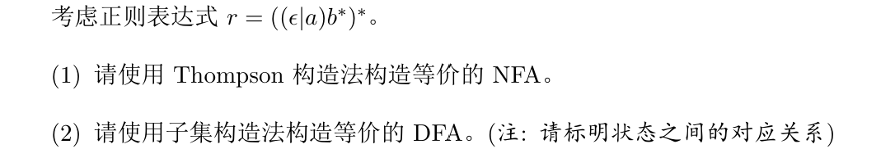
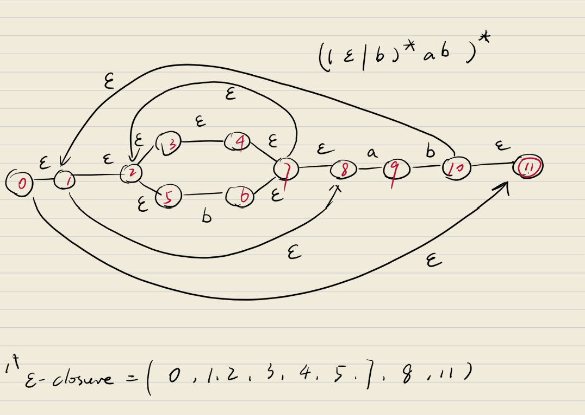
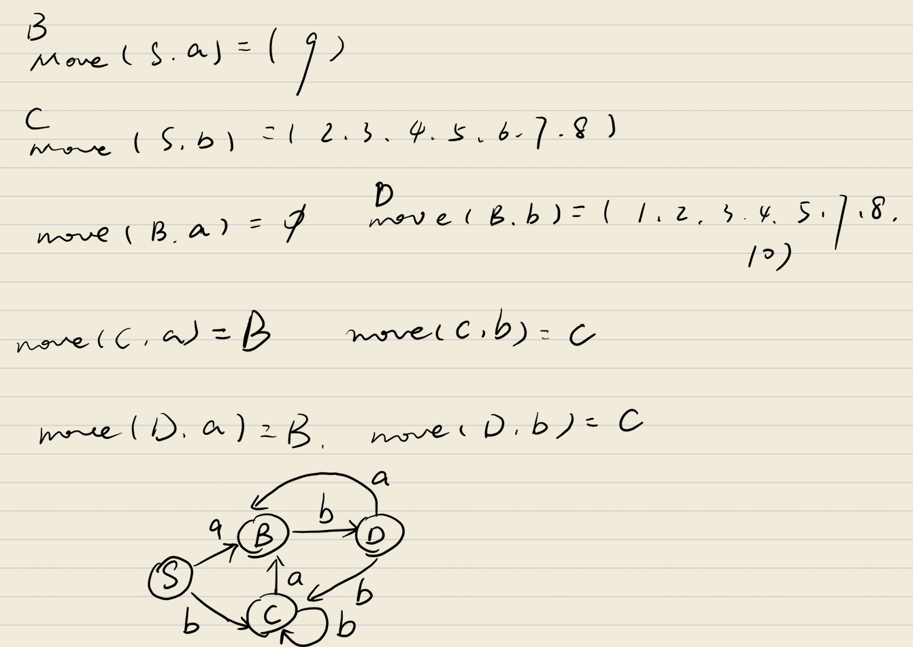

## LL语法分析

<!--
这是一个测试
-->

### FIRST和FOLLOW集合


- FIRST 集合

**定义**：对于文法符号 X，FIRST(X) 是从 X 推导出的所有终结符串的**第一个终结符**的集合。

1. **若 X 是终结符**：FIRST(X) = {X}
2. **若 X 是非终结符**：
    - 若有产生式 X → ε，则 ε ∈ FIRST(X)
    - 若有产生式 X → Y₁Y₂...Yₙ，则：
        - 将 FIRST(Y₁) 中除 ε 外的所有元素加入 FIRST(X)
        - 若 Y₁ 可推出 ε，则继续将 FIRST(Y₂) 中除 ε 外的元素加入，以此类推
        - 若所有 Yᵢ 都可推出 ε，则将 ε 加入 FIRST(X)

- FOLLOW 集合

**定义**：对于非终结符 A，FOLLOW(A) 是在文法所有句型中，**紧跟在 A 后面的终结符**的集合。

1. **初始**：若 A 是开始符号，则 $ ∈ FOLLOW(A)
2. **迭代**：反复应用以下规则直到集合不再变化：
    - 若有产生式 B → αAβ，则：
        - 将 FIRST(β) 中除 ε 外的所有元素加入 FOLLOW(A)
        - 若 β 可推出 ε（或 β 不存在），则将 FOLLOW(B) 加入 FOLLOW(A)

#### 示例演示

考虑文法：
```
E → TE'
E' → +TE' | ε
T → FT'
T' → *FT' | ε
F → (E) | id
```

1. 计算 FIRST 集合：
```
FIRST(E) = FIRST(T) = FIRST(F) = {(, id}
FIRST(E') = {+, ε}
FIRST(T') = {*, ε}
FIRST(F) = {(, id}
```

2. 计算 FOLLOW 集合：
```
FOLLOW(E) = {$, )}    // E是开始符号，且F → (E) 中E后面是)
FOLLOW(E') = FOLLOW(E) = {$, )}    // E'可推出ε，所以FOLLOW(E)加入
FOLLOW(T) = {+, $, )}    // E' → +TE' 中T后面是FIRST(E')={+}，且E'可ε
FOLLOW(T') = FOLLOW(T) = {+, $, )}
FOLLOW(F) = {*, +, $, )}   // T' → *FT' 中F后面是FIRST(T')={*}，T'可ε
```

### 预测分析表

- 若 ε ∈ FIRST(α)（即 α 可推导出空串）
  - 对 FOLLOW(A) 中的每个终结符 b（包括 $），在 M[A, b] 填入该产生式

- 否则（α 不能推导出空串）
  - 对 FIRST(α) 中的每个终结符 a（不含 ε），在 M[A, a] 填入该产生式

### 是不是LL(1)文法？

> 预测分析表没有冲突 <==> 是LL(1)文法


### 例题

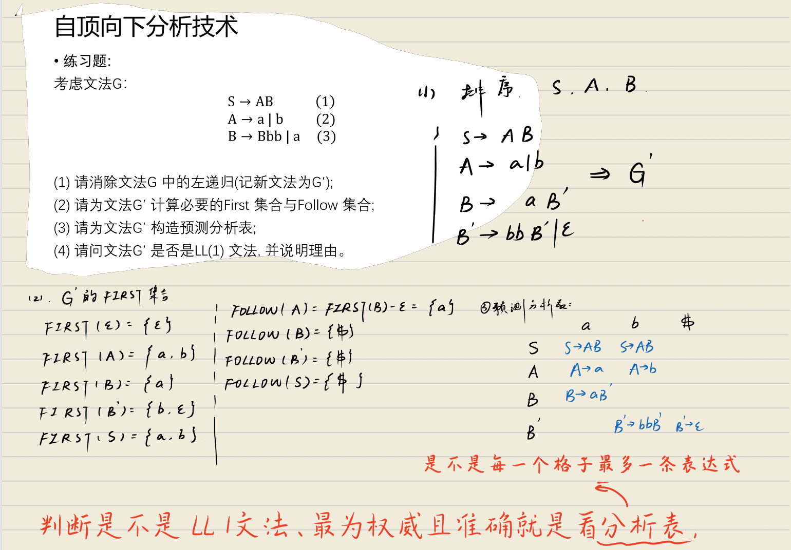

## 语法制导定义与翻译(SDD)

SDD 是对上下文无关文法的**扩展**，它在每个产生式上附加了**语义规则**，用来计算与文法符号相关的**属性**。

> **简单理解**：SDD = 上下文无关文法 + 属性 + 语义规则

### 核心概念
- **属性**：文法符号（终结符或非终结符）携带的值（如类型、数值、地址等）
- **语义规则**：每个产生式 A → X₁X₂...Xₙ 都有一条规则，计算 A 或 Xᵢ 的属性值

### 属性的两种类型

| 属性类型 | 传递方向 | 例子 |
|----------|----------|------|
| **综合属性**（Synthesized） | 自底向上（子→父） | 表达式的值、标识符的类型 |
| **继承属性**（Inherited） | 自顶向下（父→子） | 变量的环境、符号表上下文 |

### 翻译

**翻译**就是根据 SDD 的语义规则，**自底向上或自顶向下**地计算属性值，最终将源程序转换成目标形式（如抽象语法树、三地址码、中间代码）。

### 翻译过程示例：
```
产生式：E → E1 + E2
语义规则：E.val = E1.val + E2.val
```

### 实现方式（翻译方案）

| 方式 | 说明 |
|------|------|
| **L-属性定义** | 依赖图是 L-属性的，可用一遍扫描（左到右）完成翻译 |
| **S-属性定义** | 仅含综合属性，适合自底向上分析（如 LR 分析器） |

### 例题

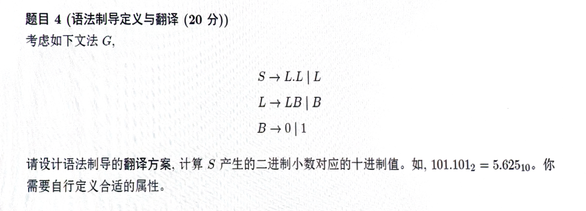
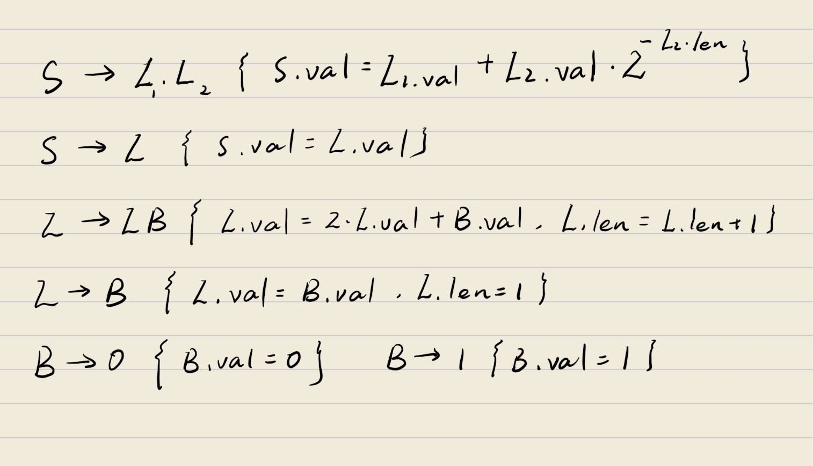


## 自底向上的语法分析

由于笔者比较懒，而且这一块做过比较详细的笔记，所以这里就不多做解释了，多贴了几张图片

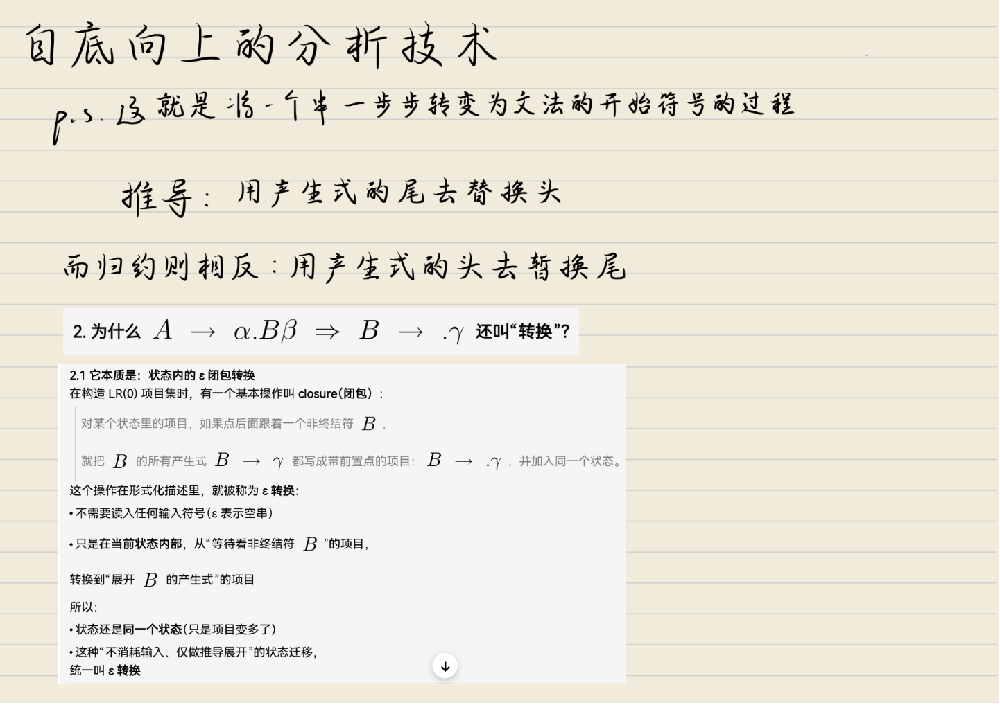
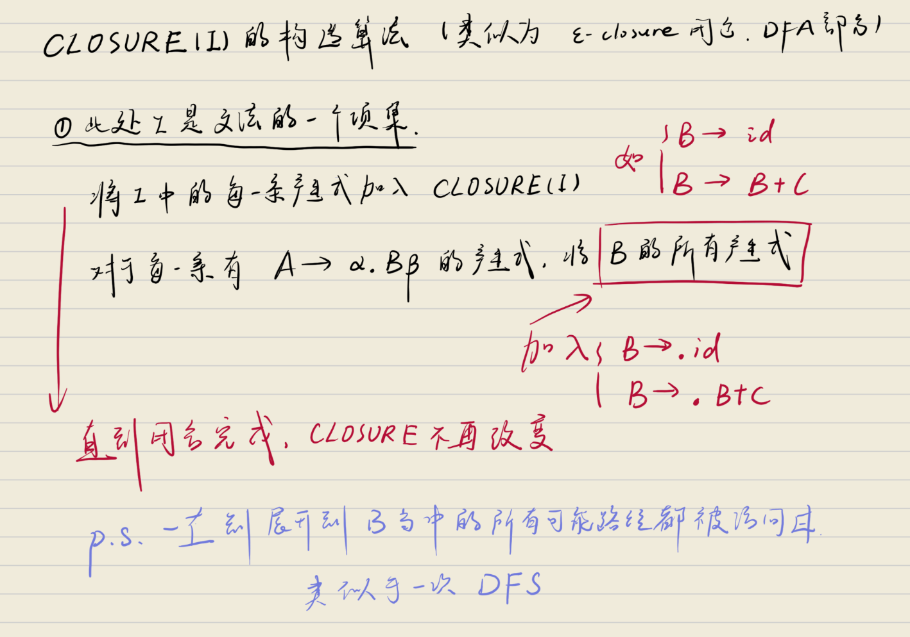
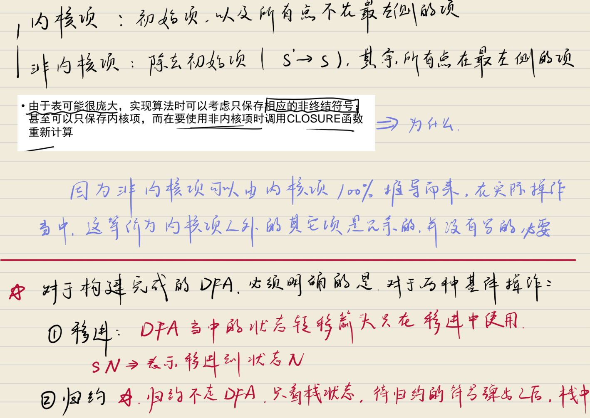
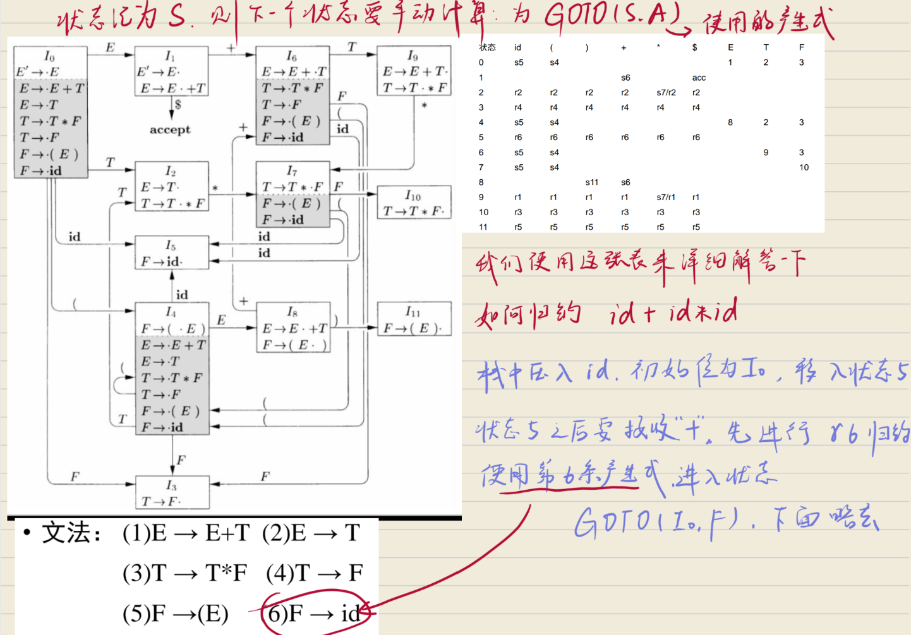
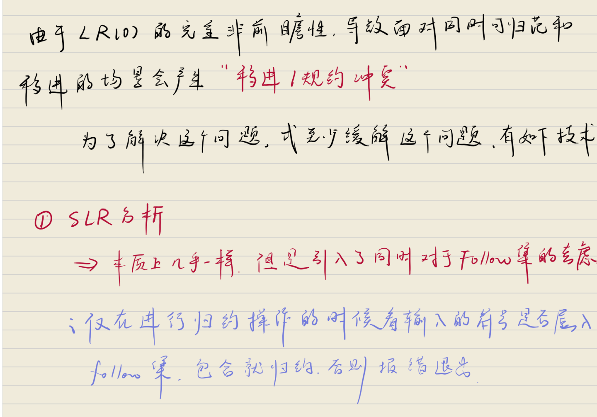
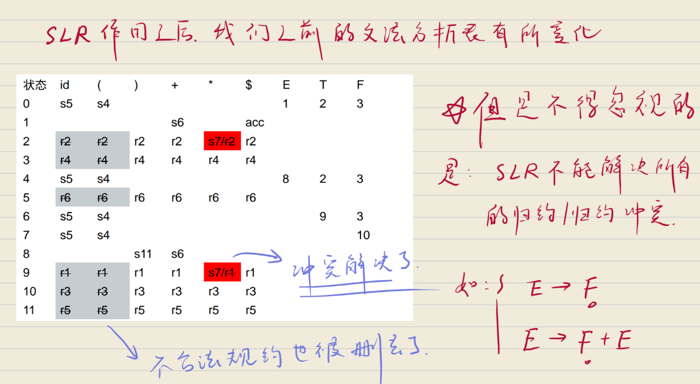


