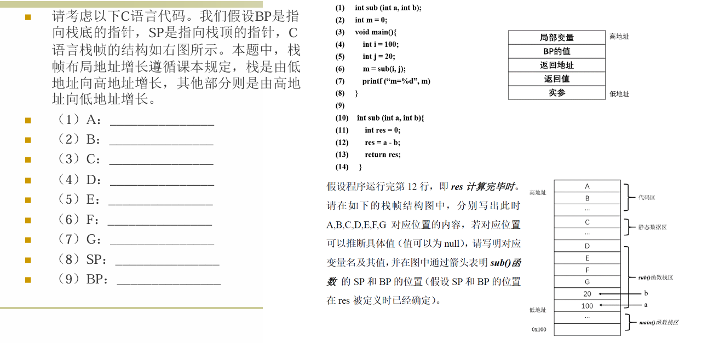
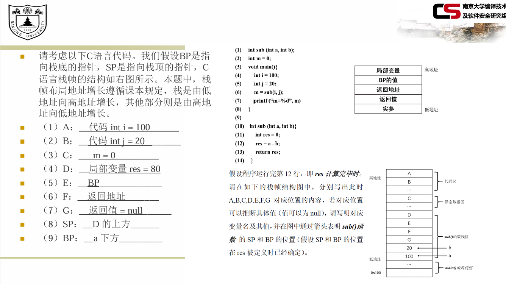
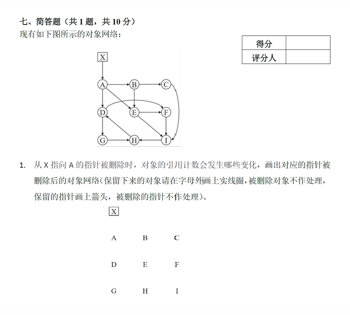
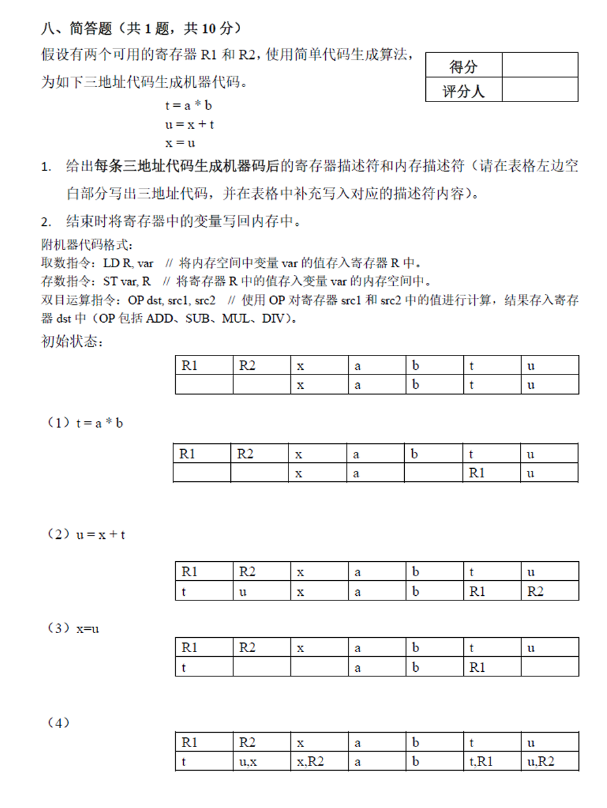
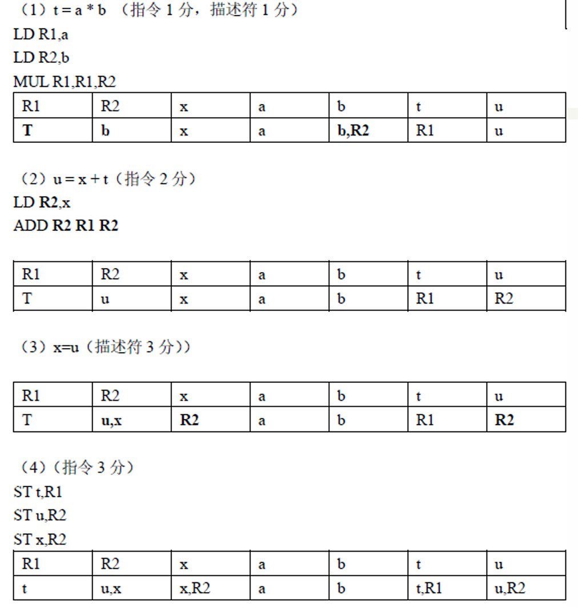

> 本文是题目导向的，立足于期末考试可能会出现的题目，并且对于提到的相关概念做了一个简单整理

## 运行时存储结构 (Runtime Storage Organization)

程序的运行时内存通常划分为三个主要区域，分别存放不同生命周期的数据：

*   **代码区 (Code Segment)**：存放编译后的机器指令（如 `main` 和 `sub` 函数的代码）。由于大小在编译时已知，属于静态区域。
*   **静态数据区 (Static Data Segment)**：存放**编译时大小已知**的数据对象。
    *   包括：全局变量（如 $int$ $m=10$）、全局常量、编译器产生的辅助数据。
    *   生命周期：贯穿整个程序运行过程。
*   **动态数据区 (Dynamic Data Segment)**：存放运行时动态产生的数据，分为**栈区**和**堆区**。
    *   **栈区 (Stack)**：存放**活动记录 (Activation Record)**，即函数调用的栈帧。遵循后进先出（LIFO）原则。由 `BP` (栈底指针) 和 `SP` (栈顶指针) 管理。
    *   **堆区 (Heap)**：存放**生命周期不确定**的数据（如 `malloc`/`new` 申请的对象），由程序员手动释放或由垃圾回收器管理。

<!-- more -->

### 栈帧结构 (Stack Frame Layout)
一个典型的 C 语言栈帧（活动记录）通常包含以下内容（从高地址到低地址）：
1.  **局部变量** (Local Variables)
2.  **旧的 BP 值** (Control Link / Dynamic Link)：保存调用者的栈底指针，用于函数返回时恢复栈。
3.  **返回地址** (Return Address)：被调用函数执行完后，应回到调用者代码中的位置。
4.  **返回值** (Return Value)：存放函数返回给调用者的结果。
5.  **实参** (Arguments/Parameters)：调用者传递给被调用函数的参数。

---

### 例题1：栈帧布局详解与正确解法

## 空间管理 (Space Management)

### 堆空间分配方法 (Heap Allocation)
*   **Best-Fit (最佳适应)**：分配能满足请求的**最小空闲块**。好处是保留大块内存，缺点是容易产生难以利用的小碎片。
*   **First-Fit (首次适应)**：分配**第一个**能容纳请求的空闲块。速度快，且通常具有较好的数据局部性。

### 垃圾回收 (Garbage Collection)
垃圾是指**不可达**的数据。垃圾回收通过自动回收不可达对象来管理内存。

**1. 引用计数 (Reference Counting)**
*   **原理**：每个对象维护一个计数器，记录指向它的指针数量。
*   **维护方式**：
    *   分配时计数为 1。
    *   参数传递、指针赋值 (`u=v`) 时，目标对象计数 +1，原对象计数 -1。
    *   函数返回时，局部变量指向的对象计数 -1。
*   **回收**：当计数归零时，立即回收。
*   **缺点**：**无法回收循环引用**（如 A指向B，B指向A，且无外部引用时，计数不为0，但对象已不可达）。

**2. 标记-清扫 (Mark-Sweep)**
*   **原理**：
    1.  **标记**：从根集（Root Set，如全局变量、栈上变量）出发，遍历所有可达对象，进行标记。
    2.  **清扫**：扫描整个堆，回收未标记的对象。
*   **缺点**：会产生**内存碎片**（存活对象和空闲空间交错），且需要暂停整个程序（Stop-the-world）。

**3. 标记-压缩 (Mark-Compact)**
*   **原理**：在标记后，将存活的对象全部移动（压缩）到堆的一端，合并空闲空间。
*   **优点**：解决了碎片问题，分配速度快。
*   **代价**：移动对象开销大。

**4. 拷贝回收 (Copying Collector)**
*   **原理**：将堆分为两半（From空间和To空间）。只在From空间分配。From空间满时，将存活对象**复制**到To空间，然后交换角色。
*   **优点**：无碎片，分配速度快（只需移动指针）。
*   **缺点**：只能利用一半的堆空间，移动对象开销大。

**5. 分代回收 (Generational GC)**
*   **原理**：根据对象存活时间划分成新生代（Young）和老年代（Old）。
*   **策略**：新生代对象存活时间短，使用拷贝回收频繁清理。老年代对象存活久，使用标记-清扫或标记-压缩进行低频回收。

---

### 例题2：引用计数

## 代码生成与寄存器分配

### 代码生成器中的关键问题

代码生成器需要将中间代码（IR）映射为目标机器代码，主要面临以下三个核心挑战：

#### 指令选择 (Instruction Selection)
*   **复杂性因素**：IR的层次、指令集体系结构的特性、要求的代码质量。
*   **映射方式**：一个形如 `x = y + z` 的语句通常被翻译为：
    *   `LD R0, y` (将 y 加载到寄存器 R0)
    *   `ADD R0, R0, z` (将 z 加到 R0)
    *   `ST x, R0` (将 R0 存回 x)
*   **优化机会**：现代机器指令集丰富，同一条 IR 可能对应多种机器指令序列。例如 `a = a + 1` 可以直接使用 `INC a` 一条指令完成，无需加载和存储。

#### 寄存器分配与指派
*   **分配 (Allocation)**：决定哪些变量在程序的哪个阶段放在寄存器中。
*   **指派 (Assignment)**：决定具体的某个变量放在哪个具体的寄存器（如 R0, R1）中。
*   **核心目标**：最大程度减少加载（LD）和保存（ST）指令，充分利用寄存器。

#### 目标机器模型
*   **三地址机器模型**：具有加载、保存、计算、跳转等通用指令。
*   **指令代价**：通常每条指令有一个固定的代价（1 + 寻址模式代价）。生成最优代码通常是一个**不可判定问题**。

### 基于基本块与流图的优化

代码生成通常以**基本块**为单位进行。基本块是顺序执行的代码段，只在入口进入，只在出口离开。

#### 基本块的划分
1.  确定**首指令**（Leader）：
    *   程序的第一条指令。
    *   任何跳转指令的目标。
    *   紧跟在跳转指令之后的指令。
2.  **划分块**：从每个首指令开始，直到遇到下一个首指令（或程序结束）为止。

#### 活跃性与后续使用信息 (Liveness & Next-Use)
*   **作用**：用于寄存器指派优化。如果一个变量在之后的代码中不再被使用（不活跃），其占用的寄存器可以立即被释放。
*   **确定方法**：从基本块的最后一条语句开始**反向扫描**。
    *   对于语句 `x = y + z`：
        1.  记录当前活跃信息。
        2.  设置 `x` 为不活跃（被定值覆盖）。
        3.  设置 `y` 和 `z` 为活跃，并记录它们的下一次使用位置。

#### 流图 (Flow Graph)
*   基本块作为图中的**结点**。
*   **边**：表示控制流（顺序执行或跳转）。
*   **循环识别**：流图的一个重要应用是识别循环，因为循环是程序运行时间最集中的部分。

### 基本块的 DAG 优化

#### DAG (有向无环图) 表示
*   **叶子结点**：代表变量的初始值或常量。
*   **内部结点**：代表三地址语句中的**运算符**。子节点是该运算的操作数。
*   **关联变量**：结点与一组变量关联，表示基本块中“最晚”对该变量定值的语句。

#### DAG 的主要优化
1.  **消除公共子表达式**：如果在构建时发现相同的运算已经存在，则复用该结点，从而消除重复计算。
2.  **消除死代码**：如果一个 DAG 结点没有关联任何活跃变量，且没有父节点，则该指令可以删除。
3.  **数组与指针的特殊处理**：
    *   由于数组赋值 `a[j] = y` 可能改变数组 `a`，因此在 DAG 中，赋值语句会**杀死**（Kill）所有依赖于该数组的先前取值结点。

### 基本块内的寄存器分配算法

#### 核心指标
*   **MAXLIVE**：在基本块中任意一点，同时存活（活跃）的数值的最大数量。
    *   若 MAXLIVE ≤ k（寄存器总数），则不需要溢出，分配极其简单。
    *   若 MAXLIVE > k，则必须将部分值**溢出**（Spill）到内存中。

#### 简单寄存器分配算法
目标：尽量将值保留在寄存器中，减少内存读写。

1.  **寄存器描述符**：记录每个寄存器当前存放了哪些变量的值。
2.  **地址描述符**：记录某个变量的值当前存放在哪里（寄存器、内存，或两者都有）。

#### `getReg` 函数的选择逻辑
为指令 `x = y op z` 选择寄存器的策略：

*   **为操作数 `y` 选寄存器**：
    1.  若 `y` 已经在某个寄存器 `R` 中，选 `R`。
    2.  若不在寄存器中，且有**空闲寄存器**，选一个空闲的。
    3.  若没有空闲寄存器，**寻找一个可替换的寄存器 `R`**：
        *   如果 `R` 中的变量 `v` 不在其他地方需要（地址描述符表明仅在此处，且 `v` 不再活跃），直接覆盖。
        *   否则，生成 `ST v, R` (溢出)，将 `v` 写入内存再覆盖 `R`。
*   **为结果 `x` 选寄存器 `Rx`**：
    *   通常选择与操作数 `z` 相同的寄存器，或选择存放 `x` 原值（如果已被覆盖）的寄存器。

#### 算法流程示例
对于基本块结尾，如果变量 `x` 在出口处活跃且不在内存中，需生成 `ST x, Rx`。

### 例题以及参考答案

### 总结核心考点
1.  **指令选择与指令代价**：注意机器指令的寻址模式，如何用最少的代价完成 IR 映射。
2.  **基本块划分与 DAG**：理解 DAG 如何消除公共子表达式和死代码，特别是数组取值的 DAG 构建（明确 `a[j]=y` 会杀死之前的 `a[i]` 取值）。
3.  **简单寄存器分配算法**：掌握 `getReg` 的选择逻辑（找空闲 -> 找可覆盖 -> 发生溢出）。
4.  **描述符记录**：必须熟练掌握如何通过更新寄存器描述符和地址描述符，来避免产生冗余的 `LD` 和 `ST` 指令。尤其是赋值语句 `x=y` 只需更新描述符即可。

## 机器无关优化——数据流分析

### 代码优化概述

*   **代码优化**：在目标代码中消除不必要的指令，或以更快的指令序列替换功能相同的序列。
*   **机器无关优化**：基于**数据流分析（Data Flow Analysis）**技术，收集程序运行时的数据流信息。
*   **优化的主要来源**：
    1.  **公共子表达式消除**：避免重复计算相同的值。
    2.  **复制传播**：消除不必要的中间赋值。
    3.  **死代码消除**：删除永远不会被用到的计算。
    4.  **常量折叠**：编译时直接计算出常量表达式的结果。

### 数据流分析基础

#### 核心概念
*   **程序点 (Program Points)**：三地址语句之前或之后的位置。基本块内部语句之间逐次连接。
*   **执行路径**：从入口到某个点可能经过的指令序列。
*   **数据流抽象**：将可能出现在某个程序点上的程序状态总结为特性（如变量的值、可达性等），不管程序怎样运行，到达该点时特性均成立。

#### 数据流分析基本模式
数据流分析是对一组约束方程的求解，主要分为**正向**和**逆向**两种方向。

*   **基本组件**：
    *   **IN[s]**：语句 `s` 执行前的数据流状态。
    *   **OUT[s]**：语句 `s` 执行后的数据流状态。
    *   **传递函数 (Transfer Function) $f_s$**：描述语句 `s` 如何将输入状态转化为输出状态。如 $OUT[s] = gen_s \cup (IN[s] - kill_s)$。
    *   **交汇运算 (Meet Operator)**：当控制流合并（多个前驱）时，如何合并多个输入状态。常见的有并集 ($\cup$) 和交集 ($\cap$)。

 

###  三大核心数据流分析技术

#### 到达定值分析 (Reaching Definitions)

**定义**：
如果存在一条从定值 $d$ 后面的程序点到达点 $p$ 的路径，且该路径上该定值没有被**杀死**（即没有被重新赋值），那么定值 $d$ **到达** $p$。

*   **直观含义**：在点 $p$ 使用的变量值，可能由哪个 $d$ 定值产生。
*   **主要用途**：用于检测变量是否被未初始化使用，以及为后续优化提供基础。

**数据流方程 (Forward)**：
*   **方向**：**前向 (Forwards)**。从程序入口向出口传播。
*   **边界条件**：$OUT[ENTRY] = \varnothing$（入口基本块外部没有定值到达）。
*   **传递函数**：
    *   $gen_B$：基本块 `B` 中生成的定值集合（即块内部赋值语句产生的定值）。
    *   $kill_B$：基本块 `B` 中杀死的定值集合（即所有在块内被重新赋值的变量所对应的**全局**定值）。
    *   $OUT[B] = gen_B \cup (IN[B] - kill_B)$
*   **交汇运算**：**并集 ($\cup$)**。只要任一前驱的定值能到达，该定值就到达当前块。
    *   $IN[B] = \cup_{P \text{是 } B \text{的前驱}} OUT[P]$
*   **迭代算法初始化**：除 `ENTRY` 外，所有 `OUT[B]` 初始化为 **空集**。

#### 活跃变量分析 (Live Variables Analysis)

**定义**：
变量 $x$ 在程序点 $p$ 上**活跃**，当且仅当存在一条从 $p$ 开始的路径，该路径的末端使用了 $x$，且该路径上 $x$ 没有被重新定值（覆盖）。

*   **直观含义**：在当前程序点，变量 $x$ 的值在后续是否还会被用到。
*   **主要用途**：**寄存器分配**（如果一个变量不再活跃，其占用的寄存器可以被释放），以及死代码消除。

**数据流方程 (Backward)**：
*   **方向**：**后向 (Backwards)**。从程序出口向入口反向传播。
*   **边界条件**：$IN[EXIT] = \varnothing$（程序出口处没有变量是活跃的）。
*   **传递函数**：
    *   $use_B$：在块 `B` 中**先被使用、后被定值**的变量集合。即进入块之前就应该是活跃的。
    *   $def_B$：在块 `B` 中**被定值且定值前未被使用**的变量集合。即块内被覆盖的变量。
    *   $IN[B] = use_B \cup (OUT[B] - def_B)$
*   **交汇运算**：**并集 ($\cup$)**。如果一个变量在任一后继中是活跃的，那在当前块出口就是活跃的。
    *   $OUT[B] = \cup_{S \text{是 } B \text{的后继}} IN[S]$
*   **迭代算法初始化**：除 `EXIT` 外，所有 `IN[B]` 初始化为 **空集**。

#### 可用表达式分析 (Available Expressions)

**定义**：
表达式 $x+y$ 在程序点 $p$ 上**可用**，当且仅当从流图入口到达 $p$ 的**每条路径**都对 $x+y$ 进行了求值，且在最后一次求值之后，没有对 $x$ 或 $y$ 进行赋值。

*   **直观含义**：在这个点上，表达式已经计算过了，结果可以复用，不用重复计算。
*   **主要用途**：**全局公共子表达式消除**。

**数据流方程 (Forward)**：
*   **方向**：**前向 (Forwards)**。
*   **边界条件**：$OUT[ENTRY] = \varnothing$（入口处没有可用的表达式）。
*   **传递函数**：
    *   $e\_gen_B$：块 `B` 内计算并生成的表达式集合（且在块内后续没有被覆盖其操作数）。
    *   $e\_kill_B$：块 `B` 内因赋值导致其操作数改变，从而被**杀死**的所有表达式的集合（U是全体表达式）。
    *   $OUT[B] = e\_gen_B \cup (IN[B] - e\_kill_B)$
*   **交汇运算**：**交集 ($\cap$)**。**必须**所有路径都能生成该表达式，才算可用。
    *   $IN[B] = \cap_{P \text{是 } B \text{的前驱}} OUT[P]$
*   **迭代算法初始化**：除 `ENTRY` 外，所有 `OUT[B]` 初始化为 **全集 (U)**（非空集）。这是为了在进行交集运算时，不会在第一轮迭代就空掉。

---

### 三种数据流分析的对比总结

| 特性                  | **到达定值 (Reaching)**          | **活跃变量 (Live Variables)**   | **可用表达式 (Available)**              |
|:--------------------|:-----------------------------|:----------------------------|:-----------------------------------|
| **数据流值 (域)**        | 定值 (Definitions) 的集合         | **变量 (Variables)** 的集合      | **表达式 (Expressions)** 的集合          |
| **分析方向**            | **前向 (Forward)**             | **后向 (Backward)**           | **前向 (Forward)**                   |
| **传递函数**            | $OUT = gen \cup (IN - kill)$ | $IN = use \cup (OUT - def)$ | $OUT = e\_gen \cup (IN - e\_kill)$ |
| **边界条件**            | $OUT[ENTRY] = \varnothing$   | $IN[EXIT] = \varnothing$    | $OUT[ENTRY] = \varnothing$         |
| **交汇运算 ($\wedge$)** | **并集 ($\cup$)**              | **并集 ($\cup$)**             | **交集 ($\cap$)**                    |
| **初始化值**            | $OUT = \varnothing$          | $IN = \varnothing$          | $OUT = \mathbf{U}$ **(全集)**        |
| **主要用途**            | 检测未初始化变量                     | **寄存器分配**、死代码消除             | **全局公共子表达式消除**                     |

**记忆技巧：**
1.  **主动与被动**：
    *   **到达定值**和**可用表达式**是从**入口**往**出口**推（前向），研究“我们带来了什么”。
    *   **活跃变量**是从**出口**往**入口**推（后向），研究“后面还需要什么”。
2.  **“全部”与“任一”**：
    *   **可用表达式**要求每一条路径都计算过（做交集）。
    *   **到达定值和活跃变量**只要有一条路径达成即可（做并集）。
3.  **初始化陷阱**：
    *   对于**交集**运算（可用表达式），必须初始化为**全集**，否则第一次求交集就会变成空集，导致数据流信息丢失。

### 流图与循环

#### 配结点 (Dominators)
*   如果从入口结点到结点 $n$ 的所有路径都必须经过结点 $d$，则称 $d$ **支配** $n$，记为 $d\ dom\ n$。
*   **直接支配结点 (Immediate Dominator)**：距离结点 $n$ 最近的支配结点。
*   **支配结点树**：将直接支配关系用树状结构表示，根节点为入口节点，子树代表被支配的节点集合。

#### 自然循环 (Natural Loop)
*   **回边 (Back Edge)**：边 $a \to b$，如果 $b$ 支配 $a$，则该边为回边。
*   **自然循环**：给定回边 $n \to d$，自然循环是 $d$ 加上所有不经过 $d$ 就能到达 $n$ 的节点集合。$d$ 称为循环头 (Header)。
*   **性质**：
    *   必须有唯一的入口（循环头）。
    *   循环内部节点两两可达（强连通分量）。
    *   大多数程序流图是**可归约的**（所有回边都是支配关系，实践中经常出现）。