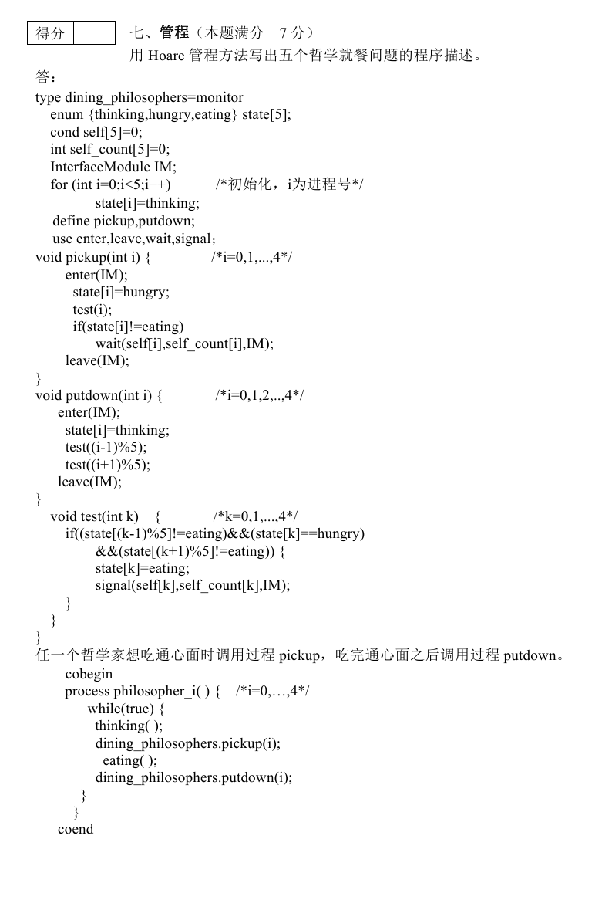

## 一、管程数据结构定义

```c
type dining_philosophers = monitor
    enum {thinking, hungry, eating} state[5];
    cond self[5] = 0;                     // 条件变量（信号量），初值为0
    int self_count[5] = 0;                // 每个条件变量的等待计数，初值为0
    InterfaceModule IM;                   // Hoare管程接口模块

    // 初始化（管程构造函数）
    for (int i = 0; i < 5; i++)           /* 初始化，i为进程号 */
        state[i] = thinking;

    // 声明管程内部过程
    define pickup, putdown;
    use enter, leave, wait, signal;       // 使用给定的管程原语
```

<!-- more -->

## 二、管程过程实现

### 1. `pickup` 过程 —— 哲学家申请进餐

```c
void pickup(int i) {          /* i = 0, 1, ..., 4 */
    enter(IM);                // 进入管程
    state[i] = hungry;        // 设置自身状态为饥饿
    test(i);                  // 尝试拿叉子（检查左右邻居）
    
    if (state[i] != eating)   // 若未能成功进餐，则等待
        wait(self[i], self_count[i], IM);
    
    leave(IM);                // 退出管程
}
```

### 2. `putdown` 过程 —— 哲学家放下叉子

```c
void putdown(int i) {         /* i = 0, 1, 2, ..., 4 */
    enter(IM);                // 进入管程
    state[i] = thinking;      // 恢复为思考状态（放下叉子）
    
    // 测试左右邻居是否能进餐，并唤醒它们
    test((i - 1) % 5);        // 检测右邻居
    test((i + 1) % 5);        // 检测左邻居
    
    leave(IM);                // 退出管程
}
```

### 3. `test` 过程 —— 检测哲学家是否能进餐

```c
void test(int k) {            /* k = 0, 1, ..., 4 */
    // 条件：自己饥饿，且左右邻居都不在进餐
    if ((state[(k - 1) % 5] != eating) && 
        (state[k] == hungry) && 
        (state[(k + 1) % 5] != eating)) {
        
        state[k] = eating;                    // 允许进餐
        signal(self[k], self_count[k], IM);   // 唤醒自己（若已在等待）
    }
}
```

---

## 三、哲学家进程代码

```c
// 管程初始化后，任意一个哲学家想吃通心面时调用过程 pickup，吃完通心面之后调用过程 putdown。

cobegin
    process philosopher_i() {   /* i = 0, ..., 4 */
        while (true) {
            thinking();
            dining_philosophers.pickup(i);
            eating();
            dining_philosophers.putdown(i);
        }
    }
coend
```

## 一个解决示例

