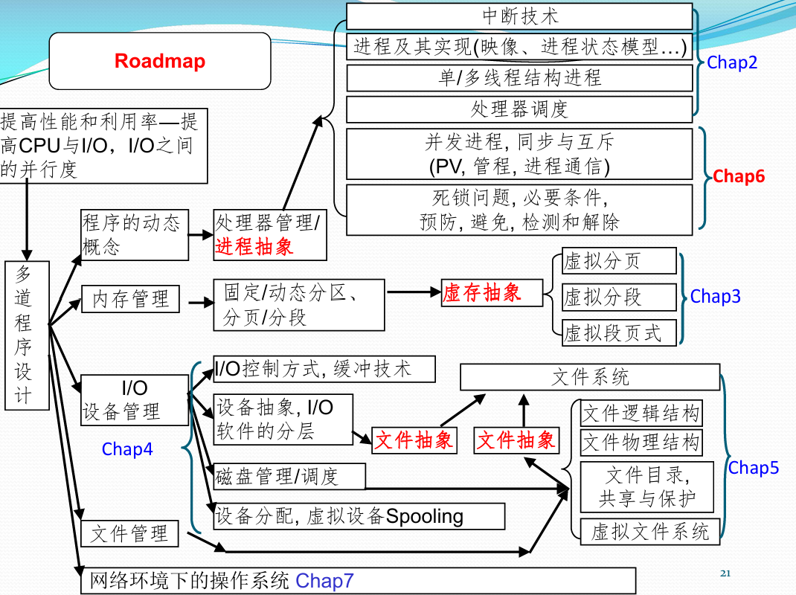
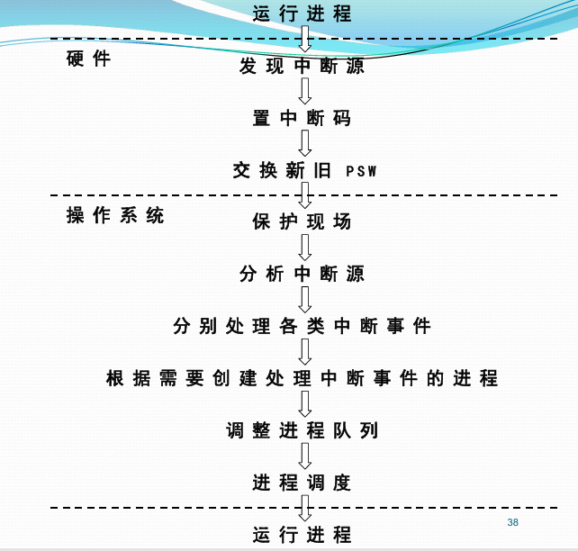
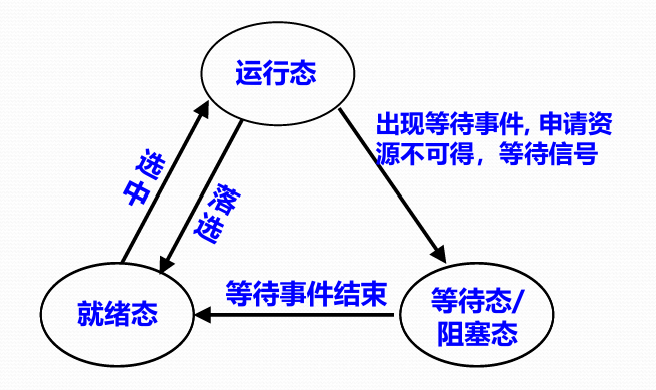
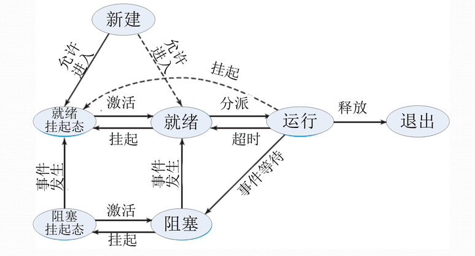
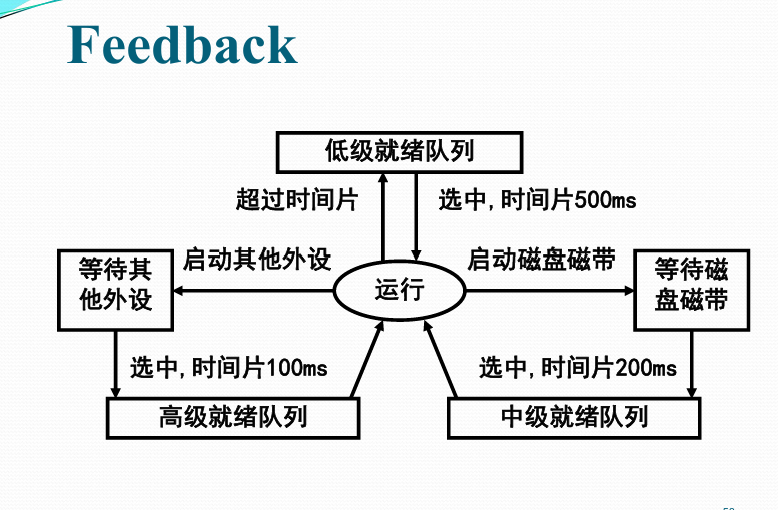
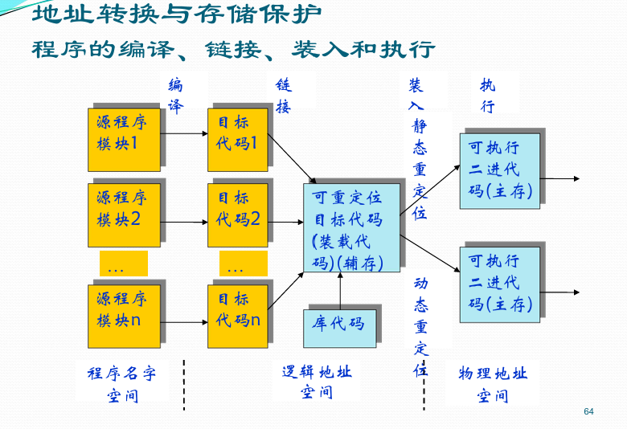
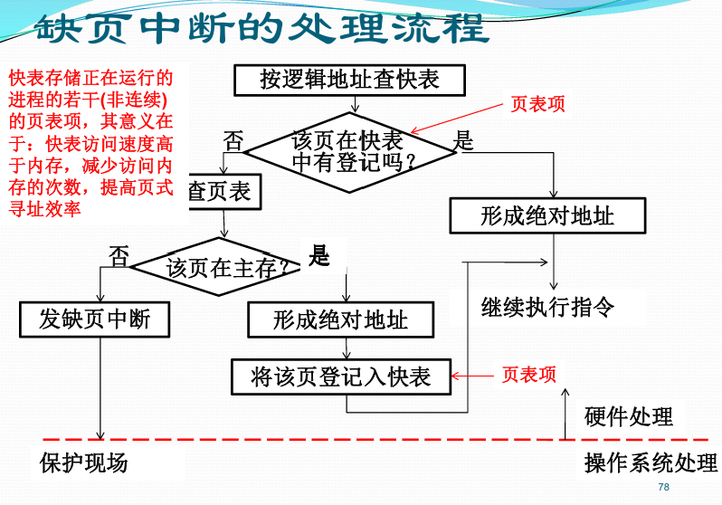
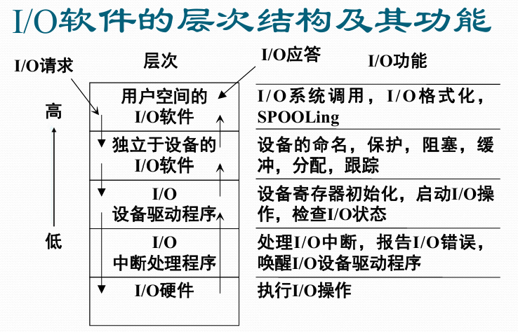
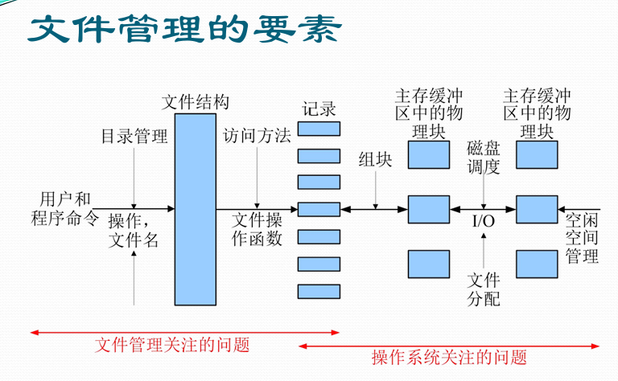
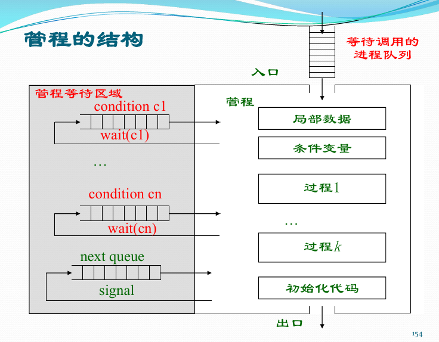

> 此课程维持了南软诸多专业课的一贯的水准。理论部分底蕴悠久，一脉相承，与南软同寿
> <br> -- [南软佛脚玩乐指南](https://costg.gitbook.io/njuse/notes/os)


## 课程学习路线总览



操作系统是计算机系统的核心系统软件，负责管理硬件资源、控制程序运行、为用户提供接口。整个课程围绕"**资源管理**"和"**程序控制**"两条主线展开，涵盖进程管理、内存管理、文件管理、设备管理四大资源管理功能，以及并发程序设计这一核心控制问题。

---

## 操作系统概述

### 不同类型的操作系统

#### 批处理操作系统

- **工作方式**：成批处理作业，使用作业控制语言编写作业说明书
- **工作模式**：脱机工作方式
- **追求目标**：系统效率与吞吐量
- **特点**：用户不直接与系统交互，适合计算密集型任务

#### 分时操作系统

- **工作方式**：用户通过终端直接控制程序执行
- **工作模式**：交互式工作方式
- **核心特征**：交互性、友善性、快速响应
- **地位**：今天最常见的计算机操作方式

#### 实时操作系统

- **工作方式**：事件驱动，有严格的时间要求
- **分类**：
    - 过程控制系统（数据采集 → 加工处理 → 操作控制 → 反馈处理）
    - 信息查询系统
    - 事务处理系统

### 操作系统结构分类

1. **单体式结构**：所有模块合为一个整体，无清晰层次
2. **层次式结构**：模块按功能分层，每层只依赖更低层
3. **虚拟机结构**：在裸机上提供多个虚拟机环境
4. **微内核结构**：内核仅包含最基本功能，其他服务运行在用户态
5. **客户/服务器结构**：操作系统服务以服务器形式提供

### 中断技术

#### 中断与中断源

- **中断**：CPU暂停当前程序，转去处理另一事件，处理完后返回
- **中断源**：引起中断的事件来源（硬件中断、软件中断）

#### 中断响应与处理流程



#### 自愿性中断事件处理

- 用户程序执行**访管指令**（广义指令/系统调用）
- 操作系统把系统调用参数作为中断字，分析检查后进行相应处理

#### 特权指令与处理器状态

- **特权指令**：执行有可能对系统有害的指令
- **管态（系统态/内核态）**：可执行全部指令，使用所有资源，可改变处理器状态
- **目态（用户态）**：只能执行非特权指令


## 处理器管理

### 进程的概念

**进程**是程序在某个数据集上的一次运行活动，是系统进行资源分配和调度的独立单位。

引入进程的目的：使多个程序并发执行，改善资源使用率，提高系统效率。

### 进程的状态与转换

#### 三状态模型



- **运行态**：进程正在CPU上执行
- **就绪态**：进程已获得除CPU外的所有资源，等待CPU调度
- **阻塞态**：进程因等待某事件（如I/O完成）而暂停执行

#### 七状态模型（含挂起态）


- 在五状态模型基础上增加：**就绪挂起**、**阻塞挂起**
- **挂起**：将进程从内存移至外存，释放内存空间
- **挂起的原因**：内存不足、进程长时间未活动、系统调试等

<!-- 

### 进程控制块（PCB）

PCB是操作系统为每个进程维护的数据结构，包含：

| 组成部分 | 具体内容 |
|---------|---------|
| 进程标识号 | 进程ID、父进程ID等 |
| 处理器状态信息 | 寄存器内容、PSW、栈指针 |
| 进程控制信息 | 状态、优先级、调度信息 |
| 用户栈/核心栈 | 用户态/内核态下的栈空间 |
| 地址空间信息 | 程序、数据、共享地址空间 |

### 进程控制原语

**原语**：在内核态下、关中断环境中执行的一段不可分割的指令序列。

- **创建进程**：分配PCB、分配内存、初始化PCB、加入就绪队列
- **撤销进程**：回收资源、撤销PCB
- **阻塞进程**：保存现场、改变状态、进入阻塞队列
- **唤醒进程**：从阻塞队列移出、改变状态、加入就绪队列


-->
### 线程

#### 线程引入的原因

单线程结构进程存在以下问题：
- 进程切换开销大
- 进程通信开销大
- 限制了进程并发的粒度
- 不适合并行计算

**解决方案**：将进程的两项功能分离
- **进程**：作为系统资源分配和保护的独立单位
- **线程**：作为系统调度和分派的基本单位

#### 线程的优点

1. **快速线程切换**：同一进程内的线程切换不涉及资源变更
2. **减少管理开销**：线程创建/撤销比进程轻量
3. **通信易于实现**：同一进程内的线程共享地址空间
4. **便于共享资源**：线程共享进程的资源
5. **并行程度提高**：更细粒度的并发

#### 线程的三种实现模型

| 模型 | 特点 | 优点 | 缺点 |
|-----|------|------|------|
| **用户级线程** | 线程管理在用户空间完成，内核不知道线程存在 | 切换快，不依赖内核 | 一个线程阻塞则整个进程阻塞 |
| **内核级线程** | 线程管理由内核完成 | 充分利用多核，一个线程阻塞不影响其他 | 切换开销大 |
| **混合模型**（如Solaris） | 用户级线程与内核级线程多路复用 | 兼顾两者优势 | 实现复杂 |

### 处理机调度

#### 调度方式

- **抢占式**：优先级高的进程可剥夺当前进程的CPU
- **非抢占式**：当前进程主动放弃CPU后方可调度

#### 典型调度算法

| 算法 | 缩写 | 核心思想 | 特点 |
|-----|------|---------|------|
| 先来先服务 | FCFS | 按到达先后顺序调度 | 公平但平均等待时间长 |
| 短作业优先 | SPN/SJF | 选择预估运行时间最短的 | 最小平均等待时间，但可能饥饿 |
| 最短剩余时间优先 | SRT | 选择剩余时间最短的 | SPN的抢占式版本 |
| 时间片轮转 | RR | 每个进程运行固定时间片 | 响应时间好，适合分时系统 |
| 优先级调度 | - | 优先级高的先运行 | 可静态或动态优先级 |
| 高响应比优先 | HRRF | 响应比=(等待时间+要求服务时间)/要求服务时间 | 兼顾长短作业 |
| 多级反馈队列 | Feedback | 多级队列，优先级动态调整 | 综合性能优秀 |


#### 多级反馈队列调度算法（Feedback）


- **核心机制**：
    - 设置多个优先级队列，高优先级队列时间片短
    - 新进程进入最高优先级队列
    - 在时间片内未完成则降级到下一级队列
    - 高优先级队列为空时才调度低优先级队列（可抢占）
- **优点**：兼顾长短作业，响应时间好，吞吐量高


## 存储管理

### 内存管理基础概念

#### 程序装入与链接



**链接方式**：
- **静态链接**：编译时将所有模块链接成一个完整程序
- **装入时动态链接**：装入时才链接需要的模块
- **运行时动态链接**：运行时根据需要动态链接

**装入方式**：
- **绝对装入**：程序地址与实际物理地址一致
- **可重定位装入**：装入时统一修改地址（静态重定位）
- **动态运行时装入**：执行时通过重定位寄存器转换（动态重定位）

#### 地址概念

- **逻辑地址**：程序中的地址（相对地址）
- **物理地址**：内存中的实际地址（绝对地址）
- **地址转换**：将逻辑地址转换为物理地址（重定位）

### 连续分配管理方式

#### 单一连续分配

- 内存分为系统区和用户区，每次只装入一个程序
- 优点：简单，无地址转换开销
- 缺点：内存利用率低，不支持多道

#### 分区分配

**固定分区**：
- 内存预先划分为若干固定大小的分区
- 优点：管理简单
- 缺点：分区内碎片（内部碎片）

**动态分区**：
- 根据进程需求动态划分分区
- 优点：无内部碎片
- 缺点：产生外部碎片

**适配算法**：
- **首次适配**：从低地址开始找第一个满足的空闲分区
- **最佳适配**：找大小最接近需求的空闲分区
- **最差适配**：找最大的空闲分区

**伙伴系统**：
- 将内存划分为大小为2的幂的块
- 分配时找到最小的满足需求的块
- 回收时与相邻伙伴合并

### 非连续分配管理方式

#### 分页管理

**核心思想**：
- 物理内存划分为固定大小的**页框（帧）**，大小为2的幂
- 进程逻辑地址空间划分为相同大小的**页**
- 通过**页表**建立页号到页框号的映射

**地址结构**：逻辑地址 = 页号 + 页内偏移

**地址转换过程**：
1. 从逻辑地址中提取页号和偏移量
2. 查询页表，获取页框号
3. 物理地址 = 页框号 × 页大小 + 偏移量

**页表结构**：
- 每个进程一个页表
- 页表项包含页框号、有效位、访问位、修改位、保护位等

#### 多级页表

- 解决页表占用连续大块内存的问题
- 32位地址空间 + 4KB页 + 4B页表项：需要约4MB页表
- 多级页表将页表分页存储，按需调入

#### 反置页表

- **面向实存**：每个页框只有一个表项
- 页表大小与物理内存大小相关，与虚拟地址空间无关
- 通过哈希表加速查找
- 用于PowerPC、UltraSPARC、IA-64

**结构**：
- 页号 + 进程标识符 + 控制位 + 链指针
- 通过哈希表定位到反置页表项

#### 分段管理

**核心思想**：
- 按程序的逻辑结构划分段（代码段、数据段、栈段等）
- 每段大小可变，起始地址任意
- 通过**段表**管理，段表项包含段基址和段长

**地址结构**：逻辑地址 = 段号 + 段内偏移

**优点**：
- 模块化好，符合用户视图
- 便于共享和保护
- 可动态增长

**缺点**：
- 产生外部碎片
- 地址转换开销较大

#### 段页式管理

- 分段管理的外层 + 分页管理的内层
- 程序先分段，段内再分页
- 地址结构：段号 + 页号 + 页内偏移
- 结合了分段的逻辑性和分页的物理性优点

### 虚拟内存管理

#### 虚拟内存基本概念

- 程序无需全部装入内存即可运行
- 基于**程序局部性原理**（时间局部性、空间局部性）
- 逻辑地址空间可大于物理地址空间

**局部性原理**：
- **时间局部性**：被访问的地址可能很快再次被访问
- **空间局部性**：被访问地址附近的地址很可能被访问

#### 请求分页管理方式

**页表新增字段**：
- 状态位（有效位）：页面是否在内存
- 访问位：页面是否被访问过
- 修改位：页面是否被修改过
- 外存地址：页面在外存的位置

**缺页中断处理流程**：


#### 页面置换算法

| 算法 | 缩写 | 核心思想 | 特点 |
|-----|------|---------|------|
| 最佳置换算法 | OPT | 淘汰未来最长时间不使用的页面 | 理想算法，无法实现 |
| 先进先出置换算法 | FIFO | 淘汰最早进入内存的页面 | 简单，可能Belady异常 |
| 最近最少使用置换算法 | LRU | 淘汰最长时间未使用的页面 | 性能好，实现开销大 |
| 时钟置换算法 | CLOCK | 循环扫描，使用位为0则淘汰 | 近似LRU，实现简单 |

**Belady异常**：FIFO算法中，页框数增多反而导致缺页次数增加。

**时钟置换算法（Clock）**：
1. 维护一个循环缓冲区，每个页框有一个使用位
2. 指针指向当前帧
3. 需要替换时扫描：使用位为1则清零继续扫描；使用位为0则淘汰该页
4. 一轮循环后所有使用位清零，淘汰指针当前指向的页

#### 页面分配策略

- **固定分配**：每个进程固定数量的页框
- **可变分配**：根据进程运行情况动态调整页框数

**置换范围**：
- **局部置换**：仅置换该进程自己的页面
- **全局置换**：可置换系统中任何进程的页面

#### 抖动与工作集<lower>*（仅作为了解）
**抖动现象**：
- 进程频繁发生缺页中断
- 系统忙于在内存和外存之间交换页面
- CPU利用率急剧下降

**工作集**：
- 进程在某一时间段内频繁访问的页面集合
- 工作集大小W(t, Δ)：在时间间隔Δ内访问的不同页面数
- 页面调度策略应确保进程的工作集在内存中

#### 请求分段/段页式管理

与请求分页类似，但以段为单位调进调出
- 支持段的动态增长
- 段的共享更方便
- 需处理段外存管理

## 设备管理

### I/O控制方式

#### 三种主要方式

| 方式 | 工作流程 | 特点 |
|-----|---------|------|
| **轮询方式** | CPU不断检查I/O状态 | 简单但CPU浪费 |
| **中断驱动I/O** | I/O完成后发中断通知CPU | 效率较高 |
| **DMA方式** | DMA模块控制数据交换，完成后发中断 | 高效，适合批量数据传输 |

### I/O缓冲

#### 缓冲的目的
1. 匹配CPU与I/O设备的速度差异
2. 减少中断频率
3. 提高CPU与I/O设备的并行性

#### 缓冲区类型
- **单缓冲**：一个缓冲区
- **双缓冲**：两个缓冲区交替使用
- **循环缓冲**：多个缓冲区组成环
- **缓冲池**：多个缓冲区统一管理

### 磁盘调度

#### 磁盘结构
- **磁道**：盘面上的同心圆环
- **扇区**：磁道上的基本存储单元
- **磁盘物理块地址**：（柱面号，磁头号，扇区号）

#### 磁盘访问时间
- **寻道时间**：磁臂移动到目标磁道的时间
- **旋转延迟**：目标扇区旋转到磁头下的时间
- **传输时间**：数据读写时间

#### 磁盘调度算法

| 算法 | 核心思想 | 特点 |
|-----|---------|------|
| **FCFS** | 按请求到达顺序服务 | 公平，但性能差 |
| **SSTF** | 选择距离当前磁头最近的请求 | 性能好，但可能饥饿 |
| **SCAN（电梯算法）** | 沿一个方向扫描，到边界后反向 | 公平性好，寻道性能优 |
| **LOOK** | SCAN改进版，无需到边界 | 更高效 |
| **C-SCAN** | 单向扫描，到边界后直接返回起点 | 对两端请求更公平 |

> 此处详细可见 [操作系统——磁盘调度以及RAID](https://blog.hanerson.top/2026/06/06/review/OS/%E6%93%8D%E4%BD%9C%E7%B3%BB%E7%BB%9F%E2%80%94%E2%80%94%E7%A3%81%E7%9B%98%E8%B0%83%E5%BA%A6%E4%BB%A5%E5%8F%8ARAID/)


### 虚拟设备（SPOOLing）

**SPOOLing** = Simultaneous Peripheral Operations On-Line
（同时联机外围操作）

**核心思想**：使用共享设备（磁盘）模拟独占设备（打印机）

**三个组成部分**：
1. **预输入程序**：将作业数据从输入设备预先输入到磁盘
2. **缓输出程序**：将作业输出数据暂存磁盘，完成后统一输出
3. **井管理程序**：管理磁盘上的输入/输出缓冲区

**优点**：
- 提高了I/O速度
- 将独占设备改造为共享设备
- 实现了设备虚拟化

### I/O软件的层次结构



## 文件管理



### 文件与文件系统基础

#### 文件概念

文件是操作系统对信息的逻辑组织单位，是存储在外部介质上的具有名字的一组相关信息的集合。

**文件属性**：
- 文件名、文件类型、位置、大小
- 保护信息（权限）
- 时间信息（创建、修改、访问时间）

#### 文件结构

| 结构类型 | 特点 | 优点 | 缺点 |
|---------|------|------|------|
| **顺序文件** | 记录按顺序排列 | 简单，适合批量访问 | 随机访问慢 |
| **索引文件** | 为文件建立索引表 | 随机访问快 | 存储开销大 |
| **索引顺序文件** | 结合索引和顺序 | 兼顾顺序和随机访问 | 实现复杂 |

#### 目录结构

**文件控制块（FCB）**：
- 包含文件名、文件类型、文件大小、物理地址、访问权限、时间信息等
- **索引节点（inode）**：将FCB中与文件管理相关的信息分离出来

**目录结构类型**：
1. **单级目录**：所有文件在同一目录下
2. **两级目录**：用户目录 + 文件目录
3. **树形目录**：多级层次结构（最常用）
4. **图形目录**：允许共享，形成DAG结构

#### 文件共享

- **硬链接**：多个目录项指向同一个inode（i_nlink计数）
- **软链接（符号链接）**：快捷方式，指向另一个文件

**共享语义**：
- UNIX语义：写入立即对所有用户可见
- 会话语义：同一会话内一致
- 不可变文件语义：共享只读文件

#### 文件保护

**访问类型**：读、写、执行、追加、删除、列出等

**访问控制**：
- **访问控制列表（ACL）**：为每个用户/组指定权限
- **权限位**（UNIX）：owner/group/other + r/w/x
- 用户需具有相应权限才能执行操作

### 文件系统实现


#### 文件物理结构

**连续分配**：
- 文件存储在连续的磁盘块中
- 优点：顺序访问快、实现简单
- 缺点：外部碎片、文件大小限制

**链接分配**：
- 文件占用的磁盘块通过指针链接
- 优点：无外部碎片、文件易扩展
- 缺点：随机访问慢、指针占用空间

**索引分配**：
- 为每个文件建立索引块
- 优点：随机访问快、无外部碎片
- 缺点：索引块存储开销

#### UNIX/Linux多重索引结构

inode中包含：
- **10个直接地址**：直接指向数据块
- **一次间接索引**：指向一个索引块
- **二次间接索引**：指向两级索引块
- **三次间接索引**：指向三级索引块

**计算示例**（每块512B，每个地址4B，每块可存128个地址）：

- 直接块容量 = 10 × 512B = 5KB
- 一次间接容量 = 128 × 512B = 64KB
- 二次间接容量 = 128 × 128 × 512B = 8192KB
- 三次间接容量 = 128 × 128 × 128 × 512B = 1048576KB

### 文件系统调用

#### 文件创建（create）

**执行过程**：
1. 为新文件分配外存索引节点和活动索引节点
2. 将索引节点编号与文件名组成新目录项，写入目录
3. 在活动索引节点中置初值（权限、连接计数等）
4. 分配用户打开文件表项和系统打开文件表项
5. 设置读写位移f_offset=0
6. 返回文件描述符

#### 文件打开（open）

**执行过程**：
1. 检索目录，将外存索引节点复制到活动索引节点表
2. 根据mode参数核对权限
3. 合法时分配用户打开文件表项和系统打开文件表项
4. 建立表项与活动索引节点的联系
5. 返回文件描述符

#### 文件读/写（read/write）

- 根据f_offset和文件物理块地址读取对应块到缓冲区
- 再传送到用户主存区（读）/从用户主存区写入缓冲区再到磁盘（写）
- 更新f_offset

#### 文件关闭（close）

1. 根据fd找到用户打开文件表项和系统打开文件表项
2. 释放用户打开文件表项
3. 系统打开文件表项f_count减1，若为0则释放
4. 活动索引节点i_count减1，若为0则写回外存后释放

#### 文件随机存取（lseek）

- 改变文件读写位移指针f_offset
- whence=0：f_offset = offset
- whence=1：f_offset = 当前位置 + offset
- 实现文件的随机访问

#### 文件共享与位移指针

- 不同进程共享文件时，各进程的位移指针独立（通过系统打开文件表项）
- f_count：不同进程通过同一个系统打开文件表项共享（共享f_offset）
- i_count：不同进程通过不同系统打开文件表项共享（独立f_offset）

---


## 并发程序设计

### 进程同步机制的比较

| 机制 | 层次 | 适用范围 | 特点 |
|-----|------|---------|------|
| **忙式等待** | 低级 | 简单互斥 | 浪费CPU，适用于低层 |
| **信号量与PV操作** | 低级 | 同步与互斥 | 阻塞/唤醒，不传递消息 |
| **管程** | 高级 | 同步与互斥 | 集中临界区，面向语句 |
| **消息传递** | 高级 | 通信与同步 | 可传递消息 |

### 管程的应用

管程将所有临界资源及其操作封装在模块内，对外提供过程调用接口。

**与信号量的对比**：
- 信号量：分散临界区，需在多个进程中正确使用P/V操作
- 管程：集中临界区，编译器保证互斥性

### 死锁与并发的关系

死锁是并发程序设计中的特殊问题，发生在进程因竞争资源而相互等待时。

**死锁避免**（银行家算法）和**死锁检测**是系统层面的保障机制，在并发程序设计中至关重要。


### 进程同步

#### 两种基本关系

| 关系 | 类型 | 含义 | 解决手段 |
|-----|------|------|---------|
| 竞争关系 | 间接制约 | 进程竞争共享资源 | **互斥** |
| 协作关系 | 直接制约 | 进程为完成同一任务分工协作 | **同步** |

- **进程互斥**：两个以上进程不能同时进入同一临界区
- **进程同步**：进程在某些协调点需等待或唤醒

#### 临界区互斥的实现方法

**软件实现**：
- Dekker算法、Peterson算法
- 缺点：复杂、需要忙式等待

**硬件实现**：
- 关中断
- 测试并建立指令（Test-and-Set）
- 对换指令（Swap）
- 优点：简单、支持多处理器；缺点：可能饥饿、需忙式等待

#### 信号量与PV操作

**信号量数据结构**：
```
s.value  // 整型值，表示资源数量
s.queue  // 等待队列
```

**PV操作定义**：

```
P(s)：s.value = s.value - 1
      如果 s.value < 0，则该进程进入s.queue等待

V(s)：s.value = s.value + 1
      如果 s.value <= 0，则唤醒s.queue中的一个进程
```

**重要推论**：
1. s > 0：值为可用的物理资源数
2. s < 0：绝对值为等待队列中的进程数
3. P操作 = 请求资源/阻塞操作；V操作 = 释放资源/唤醒操作

#### 经典同步问题

**生产者-消费者问题**：
- 缓冲区大小为N
- 互斥信号量：mutex（初值1）
- 资源信号量：empty（初值N），full（初值0）
- 生产者：P(empty) → P(mutex) → 生产 → V(mutex) → V(full)
- 消费者：P(full) → P(mutex) → 消费 → V(mutex) → V(empty)

**读者-写者问题**：
- 读者可同时读，写者互斥访问
- 读者优先：读者计数rc，写者可能饥饿
- 写者优先：使用额外的信号量控制

**哲学家就餐问题**：
- 5位哲学家，5根筷子
- 解决方案：最多允许4人同时拿筷子；或奇数先拿左再拿右，偶数相反

**苹果-桔子问题**：
- 桌上一个盘子放水果
- 爸爸放苹果，妈妈放桔子
- 儿子吃桔子，女儿吃苹果
- 使用信号量或管程实现

### 管程（Monitor）

#### 管程的定义与属性

**管程**是由局部于自己的公共变量及其说明和所有访问这些公共变量的过程所组成的软件模块。

**属性**：
- **共享性**：管程可被多个进程共享
- **安全性**：管程内的数据只能通过管程过程访问
- **互斥性**：同一时刻最多一个进程在管程内执行

#### 管程的结构



#### 条件变量

- **wait()**：阻塞调用进程，释放管程
- **signal()**：唤醒一个在该条件变量上等待的进程

> 霍尔（Hoare）方法：执行signal的进程等待，直到被释放进程退出管程

#### Hoare管程的PV实现

关键数据结构：
- `mutex`：进程调用管程过程的互斥信号量（初值1）
- `next`：发出signal的进程挂起自己的信号量（初值0）
- `next_count`：在next上等待的进程数
- `x_sem`：条件变量x的资源等待信号量（初值0）
- `x_count`：在x_sem上等待的进程数

### 死锁

#### 死锁的定义

一组进程中的每个进程都在等待该组中其他进程占用的资源，导致所有进程永远等待。

#### 死锁的四个必要条件

1. **互斥条件**：资源为临界资源，一次只能一个进程使用
2. **占有和等待条件**：进程等待新资源时不释放已占资源
3. **不剥夺条件**：已分配资源只能由进程主动释放
4. **循环等待条件**：存在进程-资源循环等待链

#### 死锁处理策略

| 策略 | 方法 | 说明 |
|-----|------|------|
| **预防** | 破坏四个必要条件之一 | 如：资源一次性申请（破坏占有等待）、资源编号（破坏循环等待） |
| **避免** | 银行家算法 | 动态检查资源分配是否导致不安全状态 |
| **检测** | 资源分配图化简 | 检测是否有环路，化简后剩余进程为死锁进程 |
| **解除** | 撤销进程/剥夺资源 | 选择代价最小的进程撤销 |

#### 银行家算法（死锁避免）

**安全状态**：存在一个进程序列，使每个进程都能顺利完成。

**算法步骤**：
1. 检查请求是否不超过进程的需求和系统可用资源
2. 试探性分配
3. 执行安全性算法检查是否处于安全状态
4. 若是则正式分配，否则拒绝

**数据结构**：
- Available：系统各类资源可用数量
- Max：每个进程对各类资源的最大需求
- Allocation：每个进程当前分配的资源
- Need = Max - Allocation：每个进程还需要的资源

#### 死锁检测

**资源分配图化简**：
1. 找到既不阻塞又非孤立的进程节点，消去其请求边和分配边
2. 重复直到无法继续
3. 若图不可完全简化，则存在死锁

**死锁定理**：系统处于死锁状态的充分必要条件是该状态的进程-资源分配图不可完全简化。