> 点击 -->[这里](https://ref.hanerson.top/#/post/2026061801)<-- 查看原始复习提纲

## Chapter 19

> 需要掌握白盒测试和黑盒测试的常见方法，并进行优缺点比较 能解释并区别白盒测试三种不同的方法：语句覆盖、分支覆盖和路径覆盖

### 基于规格的技术——黑盒测试方法
> 把测试对象看做一个黑盒子，完全基于输入和输出数据来判定测试对象的正确性
1. 等价类划分
2. 边界值分析
3. 决策表
4. 状态转换

### 基于代码的技术——白盒测试方法
> 将测试对象看做是透明的，不关心测试对象的规格，而是按照测试对象内部的程序结构来设计测试用例进行测试工作
1. 语句覆盖（对简单情况）  
   - 确保被测试对象的每一行程序代码都至少执行一次
2. 分支覆盖（对复杂代码）
   - 确保程序中每个判断的每个结果都至少满足一次
3. 路径覆盖（对关键、复杂的代码）
   - 确保程序中每条独立的执行路径都至少执行一次

<!-- more -->

### 追求

- 给出一个场景，判断应该使用哪种测试方法，如何去写
- 对给定的场景和要求的测试方法，设计测试用例
- 给出功能需求，则要求写功能测试用例

### 一个例子

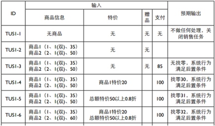
- 给出设计图，则要求写集成测试用例，Stub and　Driver
- 给出方法的描述，则要求写单元测试用例，Mock Object
- JUnit基本使用方法

## Chapter 20 & 21

### 如何理解软件维护的重要性？

人们需要经常“修改”软件，修改软件的代价是非常高的，这使得软件维护将其工作重点放在了软件修改和变更上。

### 开发可维护软件的方法
- 分析需求的易变性
- 为变更进行设计
- 编写详细的技术文档并保持及时更新
- 保证代码的可读性
- 维护需求跟踪链
- 维护回归测试基线
- 演化式生命周期模型

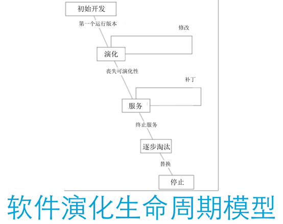

### 用户文档、系统文档
- 用户文档是指为用户编写参考指南或者操作教程，常见的有用户使用手册、联机帮助文档等
- 与用户文档注重系统使用细节不同，系统管理员文档更注重系统维护方面的内容
### 逆向工程、再工程
- 逆向工程技术是指：“分析目标系统，标识系统的部件及其交互关系，并且使用其他形式或者更高层的抽象创建系统表现的过程”
- 逆向工程的主要关注点是理解软件，但并不修改软件。再工程恰恰相反，它主要关注如何修改软件，不会花费很大气力理解软件。再工程的目的是对遗留软件系统进行分析和重新开发，以便进一步利用新技术来改善系统或促进现存系统的再利用。

## Chapter 22 & 23

### 软件生命周期模型

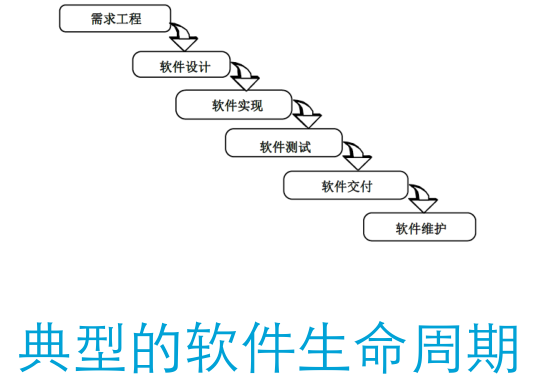

#### 构建-修复模型

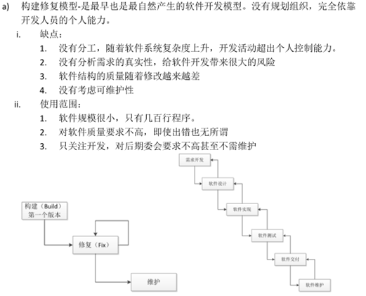

#### 瀑布模型

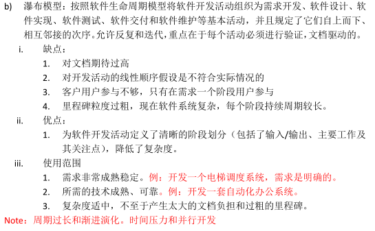

#### 增量迭代模型
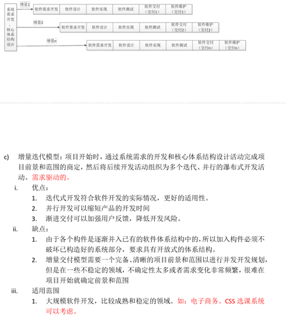

#### 演化模型

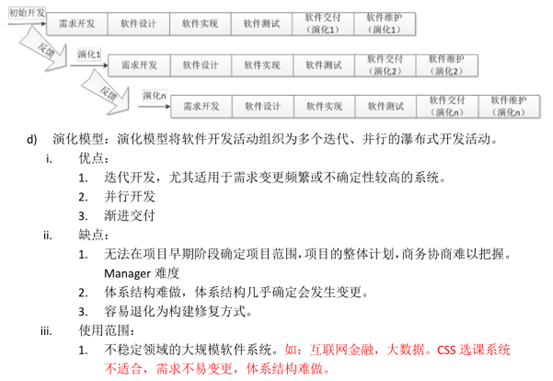

#### 原型模型

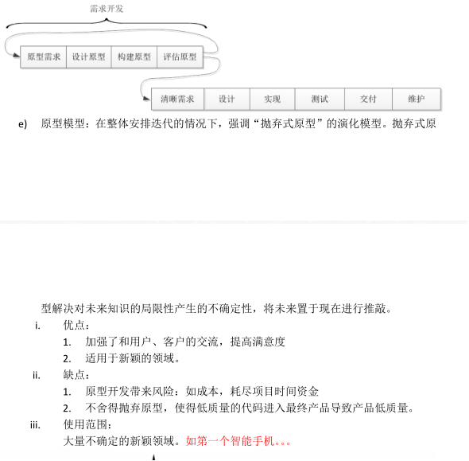

#### 螺旋模型
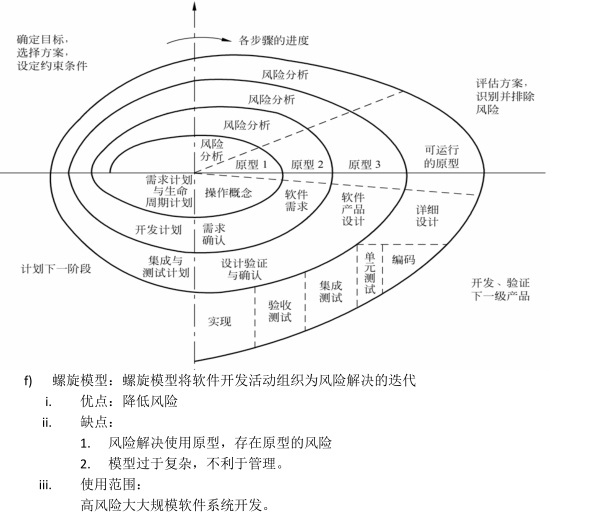
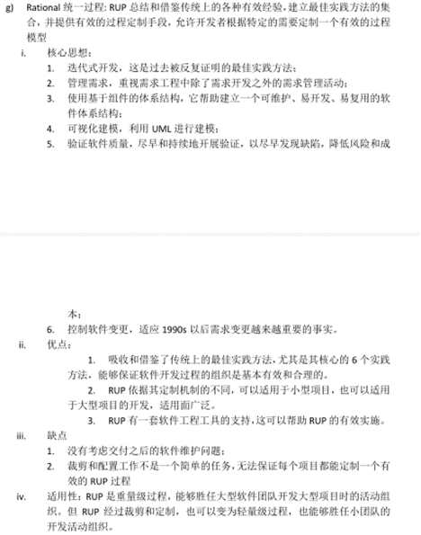
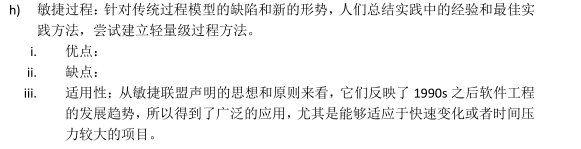

> 一般要求：对给定的场景，判定使用的开发过程模型

## 软件工程知识体系的知识域
- 软件需求
- 软件设计
- 软件构造
- 软件测试
- 软件维护
- 软件配置管理
- 软件工程管理
- 软件工程过程
- 软件工程工具和方法
- 软件质量

## 软件设计的七大原则

### 1. 开-闭原则 (Open-Closed Principle, OCP)
**核心思想**: 软件实体应该对扩展开放，对修改关闭。

**详细解释**:
- **对扩展开放**: 当需求发生变化时，可以通过添加新代码来扩展系统的行为，而不需要修改现有代码
- **对修改关闭**: 已经完成的模块代码不应该被修改，特别是已经被测试过的、稳定的代码
- **实现方式**: 通过抽象和多态来实现，定义稳定的抽象层（接口或抽象类），具体实现可以变化
- **优点**: 提高代码的可维护性和可扩展性，降低修改带来的风险
- **示例**: 使用策略模式，通过新增策略类来扩展算法，而不是修改原有的判断逻辑

### 2. 里氏代换原则 (Liskov Substitution Principle, LSP)
**核心思想**: 子类型必须能够替换它们的基类型。

**详细解释**:
- **定义**: 如果对于类型S的每一个对象o1，都存在一个类型T的对象o2，使得在所有针对T编写的程序P中，用o1替换o2后，程序P的行为功能不变，则S是T的子类型
- **通俗理解**: 子类对象应该能够在任何地方替换父类对象，而不会导致程序出错或行为异常
- **关键要求**:
  - 子类可以实现父类的抽象方法，但不能覆盖父类的非抽象方法
  - 子类可以增加自己特有的方法
  - 当子类重载父类的方法时，方法的形参要比父类方法的输入参数更宽松
  - 当子类实现父类的抽象方法时，方法的返回值要比父类更严格
- **违反示例**: 正方形继承长方形，但正方形的setWidth和setHeight会同时改变宽高，违反了长方形的行为约定

### 3. 依赖倒置原则 (Dependency Inversion Principle, DIP)
**核心思想**: 高层模块不应该依赖低层模块，两者都应该依赖其抽象；抽象不应该依赖细节，细节应该依赖抽象。

**详细解释**:
- **传统依赖关系的问题**: 高层模块直接依赖低层模块，导致耦合度高，难以维护和测试
- **倒置后的关系**:
  - 高层模块和低层模块都依赖于抽象接口
  - 具体的实现类依赖于抽象接口
- **实现方式**:
  - 使用接口或抽象类定义依赖关系
  - 通过依赖注入（构造函数注入、Setter注入、接口注入）实现
- **优点**: 降低耦合度，提高代码的可测试性和可维护性，便于替换实现
- **示例**: Service层依赖Repository接口，而不是具体的数据库实现类

### 4. 接口隔离原则 (Interface Segregation Principle, ISP)
**核心思想**: 客户端不应该依赖它不需要的接口；一个类对另一个类的依赖应该建立在最小的接口上。

**详细解释**:
- **问题背景**: 臃肿的接口会导致实现类不得不实现一些不需要的方法
- **解决方案**: 将庞大的接口拆分成更小的、更具体的接口
- **关键要点**:
  - 接口应该小而专注，只包含相关的方法
  - 客户端只需要知道与其相关的方法
  - 避免"胖接口"，即包含过多不相关方法的接口
- **优点**: 降低耦合度，提高内聚性，使系统更灵活、更容易维护
- **示例**: 将Printer接口拆分为Printable、Scannable、Faxable等小接口，让具体设备只实现需要的接口

### 5. 合成/聚合复用原则 (Composite/Aggregate Reuse Principle, CARP)
**核心思想**: 在一个新的对象里面使用一些已有的对象，使之成为新对象的一部分；新的对象通过这些对象的委派达到复用已有功能的目的。要尽量使用合成/聚合，尽量不要使用继承。

**详细解释**:
- **合成(Composition)**: 强拥有的关系，部分对象的生命周期依赖于整体对象
- **聚合(Aggregation)**: 弱拥有的关系，部分对象可以独立于整体对象存在
- **为什么优先使用合成/聚合**:
  - 继承是静态的，在编译时就确定了，无法在运行时改变
  - 继承破坏了封装性，子类可以访问父类的实现细节
  - 继承导致类之间的紧耦合，父类的改变会影响所有子类
  - 合成/聚合可以在运行时动态改变行为，更加灵活
- **实现方式**: 通过将其他类的实例作为成员变量，通过委托调用其方法
- **优点**: 降低耦合度，提高灵活性，支持运行时行为变化
- **示例**: Car类包含Engine对象和Wheel对象，而不是继承它们

### 6. 迪米特法则 (Law of Demeter, LoD)
**核心思想**: 一个对象应该对其他对象保持最少的了解，只与直接的朋友通信。

**详细解释**:
- **也称为**: 最少知识原则(Least Knowledge Principle)
- **直接朋友包括**:
  - 当前对象本身(this)
  - 方法的参数
  - 当前对象的成员变量
  - 方法创建的对象
- **不应依赖**: 通过链式调用访问的对象（如a.getB().getC()）
- **实现方式**:
  - 减少类之间的交互
  - 提供简洁的接口，隐藏内部实现
  - 使用中介者模式或外观模式简化交互
- **优点**: 降低耦合度，提高模块的独立性，使系统更容易维护和扩展
- **示例**: 不要写`order.getCustomer().getAddress().getCity()`，应该在Order类中提供getCity()方法

### 7. 单一职责原则 (Single Responsibility Principle, SRP)
**核心思想**: 一个类应该只有一个引起它变化的原因，即一个类只负责一项职责。

**详细解释**:
- **职责定义**: 类发生变化的原因，或者说类承担的功能
- **核心观点**: 
  - 如果一个类承担了多个职责，那么这些职责就会耦合在一起
  - 当一个职责发生变化时，可能会影响其他职责的正常运作
- **如何识别违反SRP**:
  - 类中有太多不同的方法组，每组处理不同的功能
  - 类的名称过于宽泛，如"Manager"、"Processor"、"Handler"
  - 修改一个功能时，经常需要同时修改看似无关的代码
- **解决方案**: 将多职责的类拆分为多个单职责的类
- **优点**: 
  - 降低类的复杂度，提高可读性
  - 提高可维护性，变更的影响范围更小
  - 提高可测试性，可以单独测试每个职责
- **示例**: 将UserService拆分为UserValidator（验证）、UserRepository（数据访问）、UserNotifier（通知）等