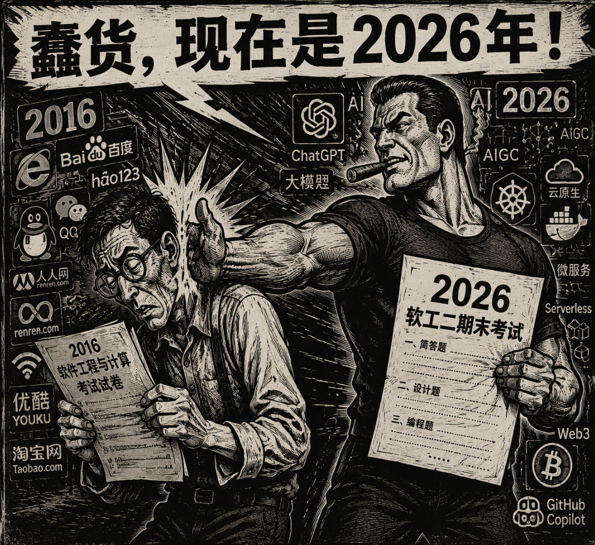

如下

<!-- more -->

>Prompt: 帮我生成一张复古风格的黑白漫画，使用冷战期间的夸张半写实手法，整体质感就像是木制版刻拓印，画面主体是两个人，一个人瘦弱弓腰，手中拿着2016年的软件工程与计算的考试试卷，正在仔细研究，占据画面左侧，周围背景使用2016年互联网的标志性符号作为装饰。画面右侧是一个强壮的男子，抽着雪茄，一手狠狠的给左侧的瘦弱男子抽了一巴掌，另外一只手拿着一张试卷，上面是“2026 软工二期末考试”，周围装饰为最新的互联网技术符号，整体画面标题为“蠢货，现在是2026年！”