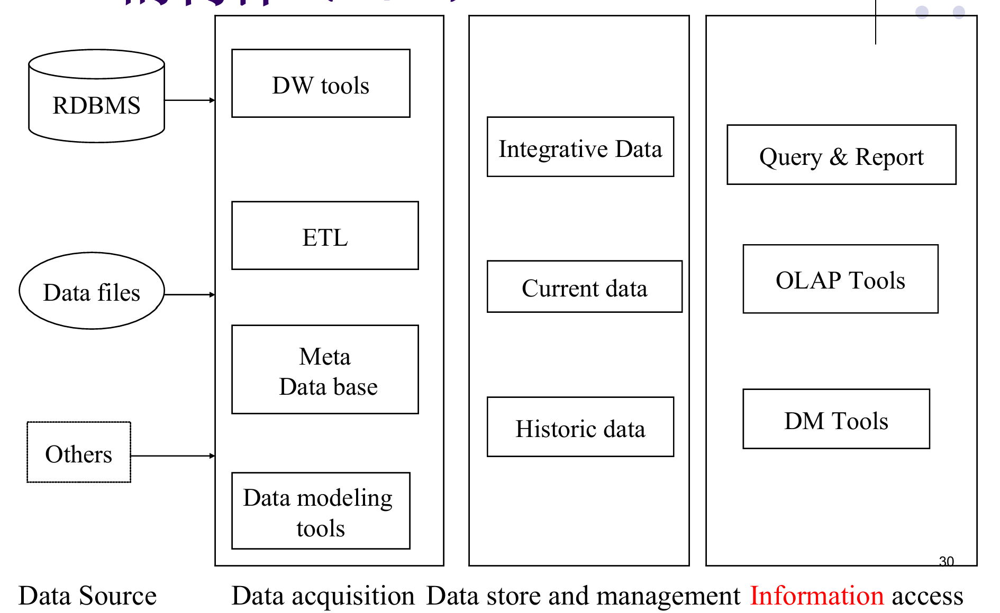
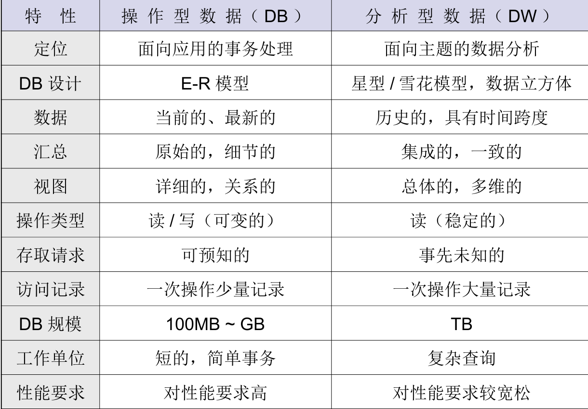
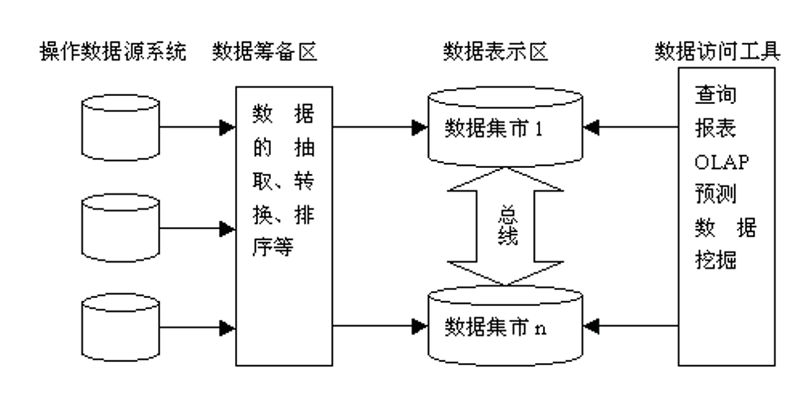
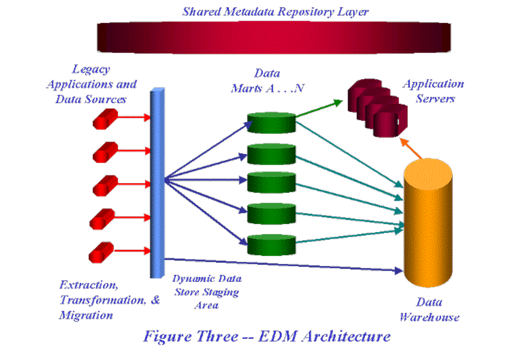

>写在前面: 本文致力于对于2026年春季南京大学商务智能（Business Intelligence）做一个简要的重点复习，内容不能用于实际生产实践 ~~（或者至少避免使用？）~~
> 
> 使用AI对于一些较为抽象的概念进行了简短解释 ~~（考试也只是要求能知道XXX是啥就可以）~~
## BI构件
> 需要明确各个构件的含义/作用

## Data WareHouse

### 什么是操作/分析型数据

- 操作型数据
    - 事务处理所需要的细节性的数据，是面向企业员工的日常业务处理过程的，通常由数据库管理系统来负责其存储与管理
- 分析型数据
  - 分析处理所需的综合性数据，是面向企业管理人员的决策需要的

<!-- more -->

#### 操作/分析的对比

> 考试导向来说，此处需要记忆大约60%，或者能够根据数据特性来说明具体差别

### 为什么需要使用数据仓库

<!-- need explantion -->
为什么需要使用数据仓库而不是数据库？（事务处理环境不适宜……的原因？）
- **事务处理和分析处理的性能特性不同**：OLTP（在线事务处理）追求快速增删改，而OLAP（在线分析处理）需要复杂查询和大量数据聚合，两者优化方向相反
- **数据集成问题**：企业数据分散在多个异构系统中（如ERP、CRM），格式不统一，需要整合到一处
- **数据的动态集成问题**：操作型数据实时变化，分析时需要一个稳定的、一致的数据视图
- **历史数据问题**：事务数据库通常只保留近期数据以节省空间，而决策分析需要多年历史数据做趋势分析
- **数据的综合问题**：原始交易数据过于细节，分析前需要汇总、计算衍生指标（如月销售额、平均客单价）
- **数据的访问问题**：频繁的分析查询会影响业务系统的性能，需要将分析负载分离出来

### 数据仓库的四大特征

<!-- need explantion -->
- **面向主题**：按业务主题（如"客户"、"产品"、"销售"）组织数据，而非按应用功能组织，便于从业务视角分析
- **集成**：从多个源系统抽取数据后，进行清洗、转换、统一编码和命名规范，消除数据不一致性
- **非易失（稳定）**：数据一旦进入仓库就不再修改或删除，只读不写，保证分析结果的可重复性和一致性
- **时变的（随着时间不断变化）**：数据都带有时间戳，记录历史变化轨迹，支持趋势分析和时间序列挖掘

> 注解: 此处的时变和非易失不冲突，传统的数据库系统使用的是历史数据直接覆盖或者干脆删除，但数据仓库更加类似于存档，旧数据依然存在

### 数据目标

> annotation: “数据目标”这个词语指向太过于模糊，读者可以理解为这些目标是数据中间以及最后会使用的组织形式，而不是数据本身（数据本身都是一样的），而之所以使用数据目标这个词，大概是认为这几个框架是数据最后想要变成的模样 ~~吗？~~

- 原子层（Atomic layer）和集成数据
- 数据集市（Data market）
- 操作数据存储（Operational Data Storage,ODS）
- 缓冲区（Staging area）

#### 原子层以及特点

<!-- need explantion -->
- **原子层保持历史集成性**：存储最原始的、未经过汇总的细节数据，并保留完整的历史变更记录
- **原子层拥有数据仓库的最低细节（粒度）数据**：例如每一笔交易记录、每一次点击日志，是最细粒度的数据单元
- **原子层的构建是迭代的**：随着业务发展逐步完善数据模型，不是一次性建成
- **原子层的数据结构是面向企业的**：采用统一的企业级数据模型，而非针对某个部门定制
- **原子层可以是集成的**：来自不同源系统的数据在此层完成整合和标准化
- **原子层是静态的**：数据加载后不再修改，保持历史快照的稳定性

### 数据刷新

<!-- need explantion -->
数据刷新是指将源系统的新增或变更数据同步到数据仓库的过程，常见方法有：
- **时间戳**：源表中有"最后更新时间"字段，定期抽取该时间晚于上次同步时间的记录
- **DELTA文件**：源系统生成的增量文件，只包含自上次导出以来发生变化的数据
- **建立映像文件**：定期生成源数据的完整副本，通过对比前后两个版本的差异来识别变化
- **日志文件**：读取数据库的事务日志（如binlog、redo log），捕获所有的INSERT/UPDATE/DELETE操作

### 为什么说数据仓库是“多维度，多层次”的

- 观察数据对象的角度是多维度的
- 数据对象的综合程度是多层次的

### 数据仓库的快照

数据仓库内部以一种称之为“快照”的数据结构为中心来组织。数据仓库中的数据记录是某一时刻生成的快照，包含多种数据类型，通常包括：
- 关键字，标志快照的关键字
- 时间，标志事件发生的时间单元
- 非关键字的主要数据，与关键字相关连的主要非关键字数据
- 二级数据。在形成快照时偶然捕获并被置入快照中的数据

> DeepSeek:  快照就是“带时间戳的历史记录”。它把数据在某一时刻的模样定格下来，一张张拼起来，就成了完整的历史变化轨迹。

### 数据集市

#### 什么叫做数据集市？
***数据集市***是面向特定部门或特定业务主题的、小型化的数据仓库。

它与全局数据仓库的核心区别在于“范围”：

- 全局数据仓库（大而全）：就像是一个“国家总档案馆”，存储全公司所有业务的历史数据，统一格式，供所有人查阅。

- 数据集市（专而精）：就像是给“财务部”或“销售部”单独设立的“部门档案室”。它只从总档案馆里提取出跟本部门相关的那一部分数据，进行重新整理和组织。

#### 为什么需要建立数据集市？（原因）
***太大、太慢、太杂***

1. 解决“太大”的问题（按需裁剪）

    原因：企业级的全局数据仓库非常庞大，数据量动辄几百T。让一个销售员去查整个公司的全量数据，不仅没必要，而且效率极低。

    解决：建立数据集市后，销售员只需访问“商品销售数据集市”，数据量瞬间缩小，查询速度大幅提升。

2. 解决“太慢”的问题（避免跨库查询）

    原因：PPT第1页提到，早期数据仓库只是一个“统一访问接口”。这意味着用户每次查数据，都要去不同的源头捞数据，响应极慢。

    解决：数据集市是把这些数据提前准备好、计算好并物理存储在本地。用户不需要再去源头“现捞”，直接查询数据集市即可，秒出结果。

3. 解决“太杂”的问题（面向业务）

    原因：全局数据仓库是按照“规范化”的计算机语言存储的（比如一张大表拆成无数张关联小表），业务人员根本看不懂。

    解决：数据集市是按照“业务语言”重新组织的（比如直接给销售员看一张“按地区、按月汇总的销售额宽表”），让数据真正能被业务人员用起来，而不是只躺在IT部门那里。

### 数据仓库与数据集市的关系

> ~~这两个不是都不在同一个层次上吗？？？~~

> 后来笔者发现，实际上讲的不是所谓关系，而是如何建立数据仓库以及数据集市，数据仓库是数据集市的超集，所以才有所谓的自顶向下以及自底向上

| 架构模式 | 核心策略 | 宏观特点 | 适用场景 |
| :--- | :--- | :--- | :--- |
| **1. 自顶向下** | 先总后分 | 稳、贵、慢 | 大型金融、电信（极度追求数据精确性） |
| **2. 自底向上** | 先分后总 | 快、乱、拼 | 初创企业、互联网敏捷团队（先跑通业务） |
| **3. 总线结构** | 统一接口，分头建 | 标准、解耦 | 成熟电商、零售平台（报表多，需数据对齐） |
| **4. 企业级混合** | 底层统一，上层独立 | 平衡、折中 | 实际工程中最常见的妥协实践 |

#### 自顶向下的结构

构建企业数据仓库：
- 建立公共中央数据模型
- 进行数据再加工
- 减少冗余和不一致性
- 搜集历史的、细节的、全局的数据

基于企业数据仓库构建数据集市：
- 选定企业模型下的部门主题
- 对数据进行聚集（汇总）
- 建立集市数据对企业数据仓库的依赖关系

##### 优缺点

优点：
- 建立数据集市能够减轻数据仓库（DW）的访问负载
- 各部门可以任意处理数据
- 数据转换和整合在DW阶段统一完成
- 具备数据缓冲功能

缺点：
- 成本高、见效慢
- 数据集市间不共享资源（各自独立从DW抽取）

#### 自底向上的结构

##### 构建过程

构建数据集市：
- 划定主题区域
- 快速实施，本地自治
- 易于复制
- 进行数据再加工
- 允许一定的冗余和不一致

基于数据集市构建企业数据仓库：
- 确定各数据集市的可用性
- 进行模型的合并
- 消除不同数据集市之间的数据不一致性

##### 优缺点

优点：
- 见效快、启动资金少

缺点：
- 各个部门都要独立进行数据清理和整合
- 可能造成“蜘蛛网”、数据不一致等问题
- 并且总体上没有节约资金

#### 总线结构的数据集市

##### 特点

- 不建立数据仓库，而直接建立数据集市
- 各个数据集市不是孤立的，相互之间通过一种共享维表和事实表的“总线结构”紧密联系在一起

##### 优缺点

优点：
- 共享维表和事实表，解决了建立数据集市的许多问题（如口径不统一）

缺点：
- 这种结构基于多维模型，应用限制于OLAP（联机分析处理）
- 多个数据源直接影响多个集市，造成数据仓库结构不十分稳定

#### 四、企业级数据集市结构
> 这个不重要！

