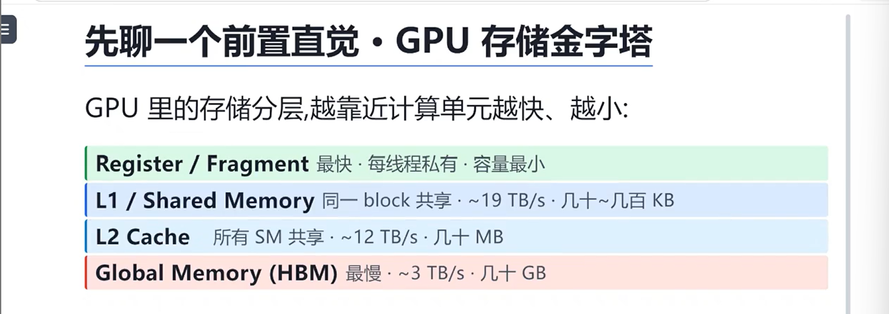
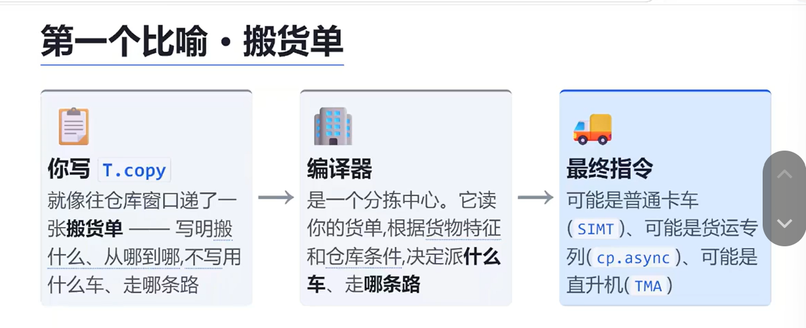
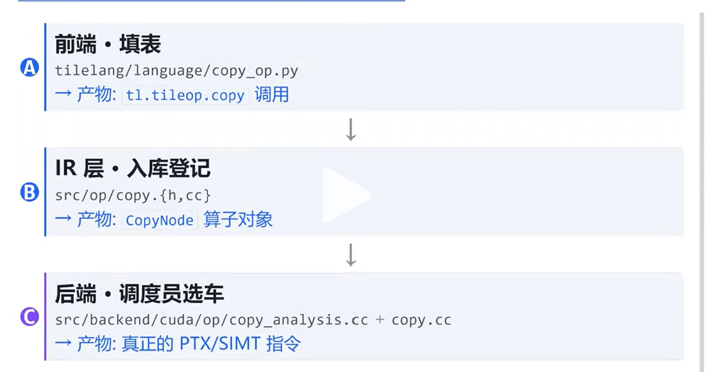

> 一行“T.copy”的旅行——从python到GPU指令，中间到底发生了什么？

## GPU 存储金字塔



> 类比：桌面/书架/同一个房间/仓库/下楼走一趟


<!-- more -->

## 什么叫做“T.copy”

> 一个比喻：就像一个搬货单



## tileLang的整体结构
```
tileLang/
├── tilelang/       Python 前端
| ├── language/     copy_op.py  <-- T.copy
| ├── transform/    IR 变换PASS 的py包装
| └── ...
|
├── src/            Cpp编译器后端
  ├── op/           通用IR算子
  ├── transform/
  └── backend/
      └── cuda/
          └── op/

```

## T.copy的三层旅行

### 总览



### frontend

#### 代码实现示例
```python
def copy(src, dst, *,
         coalesced_width=None,
         disable_tma=False,
         eviction_policy=None,
         annotations=None,
         loop_layout=None):
    # 1. 归一化拷贝区域
    src, dst = _normalize_copy_regions(src, dst)
    
    # 2. 收集所有“开关”到 annotations 字典
    ann = annotations.copy() if annotations else {}
    if "disable_tma" not in ann and disable_tma:
        ann["disable_tma"] = disable_tma
    
    # 3. 构建并返回 IR 节点（打包搬运意图）
    return tirx.call_intrin("handle",
                            tirx.op.Op.get("tl.tileop.copy"),
                            src, dst, annotations = ann)
```

#### 关键设计理念

| 步骤 | 含义 | 举例 |
|------|------|------|
| **归一化** | 确保 `src`/`dst` 为合法张量切片 | `_normalize_copy_regions()` |
| **塞进注解** | 所有性能开关放入 `annotations` | `disable_tma`、`eviction_policy` |
| **打包 IR 节点** | 用 `tirx.call_intrin` 创建 IR 节点 | 注册算子 `"tl.tileop.copy"` |

#### 核心总结

> **“前端只做一件事：把你的搬运意图打包成一个 IR 节点，把所有‘开关’塞进 annotations。”**

#### 设计优势

- **前后端解耦**：前端负责 API 友好与参数校验，后端负责代码生成与优化。
- **易于扩展**：新增开关只需在 `annotations` 中添加键值对，无需修改 IR 节点结构。
- **统一接口**：所有策略通过 `annotations` 字典传递，便于后续编译器流水线处理。

### Layer B: IR

#### 核心代码
```cpp
class CopyNode : public TileOperatorNode {
public:
    Buffer src, dst;           // 谁搬，搬到哪
    Array<Range> src_range, dst_range; // 搬哪一块
    Optional<PrimExpr> dst_block;      // (cluster copy 用)
    Map<String, ObjectRef> annotations; // ← 所有开关都在这里
    // "coalesced_width", "disable_tma",
    // "parallel_loop_layout", ...

    // 关键的两个虚函数
    Stmt Lower(const LowerArgs &T, arith::Analyzer *analyzer) const override;
    LayoutMap InferLayout(const LayoutInferArgs &T, InferLevel level) const override;
};

```

#### 字段含义

| 字段 | 含义 | 来源 |
|------|------|------|
| `src`, `dst` | 源/目标 Buffer | 前端 `T.copy` 参数 |
| `src_range`, `dst_range` | 拷贝的具体范围 | 经 `_normalize_copy_regions` 处理 |
| `dst_block` | 用于 Cluster Copy 的目标块 | 前端透传 |
| `annotations` | 所有性能开关字典 | Layer A 塞入的 `disable_tma`、`coalesced_width` 等 |

#### 两个核心虚函数

| 函数 | 作用 | 具体职责 |
|------|------|----------|
| `Lower()` | 降级为底层指令 | 根据 `annotations` 生成 TMA 指令、`memcpy` 或循环搬运 |
| `InferLayout()` | 计算内存布局 | 确定数据排布（如 Bank 对齐、行优先/列优先等） |

#### 核心总结

> **“IR 层就是一个数据容器 + 两个动作：InferLayout（算布局）和 Lower（落地）”**

#### 从 Layer A 到 Layer B 的流程

```
Layer A (前端)                            Layer B (IR层)
─────────────────────────────────────────────────────────────
用户调用 T.copy(...)                     CopyNode 定义数据
    │                                           ▲
    ▼                                           │
返回一个 IR 节点 (包含 annotations)      CopyNode 实例化
    │                                           │
    ▼                                           ▼
编译器流水线 → 进入 IR 层 → 调用 Lower() → 生成 CUDA 代码
```

### Layer C · 后端「调度员选车」


#### 核心功能
根据前端传递的 `annotations` 和数据特征，从高到低选择合适的 CUDA 拷贝指令。

#### 决策流程（优先级链表）


```cpp
CopyInstSelection SelectCopyInstForLowering(...) {
    // 0. 特殊标记 → 走特殊路径
    if (GetBoolAnnotation(op, "is_gather4"))   return ...kBulkLoadGather4;
    if (GetBoolAnnotation(op, "is_scatter4"))  return ...kBulkStoreScatter4;

    // 体检：收集数据特征（scope/dtype/shape...）
    CopyFacts facts = AnalyzeCopyFacts(op, ctx);

    // 1. 显式 TMA 请求 → 必须 TMA，不行就报错
    if (facts.explicit_tma) { ... }

    // 2. 显式 cp.async 请求 → 必须 cp.async
    if (facts.explicit_cp_async || facts.no_implicit_async_commit_wait) { ... }

    // 3. 没禁用 TMA 且体检通过 → 走 TMA
    if (!facts.disable_tma && !facts.pass_context_disables_tma) {
        CopyInst inst = SelectTmaInst(facts, ...);
        if (inst != CopyInst::kInvalid) return Supported(inst);
    }

    // 4. 都不行 → 退回普通 SIMT
    return Supported(SelectSyncLikeInst(facts));
}
```

#### 优先级列表（从高到低）

| 优先级 | 指令类型 | 触发条件 | 特点 |
|--------|----------|----------|------|
| 特殊路径 | `kBulkLoadGather4` / `kBulkStoreScatter4` | 前端标记 `is_gather4` / `is_scatter4` | 特定聚合/散播模式 |
| 1 | 显式 TMA | `explicit_tma == true` | 用户强制 TMA，否则报错 |
| 2 | 显式 cp.async | `explicit_cp_async` 或 `no_implicit_async_commit_wait` | 用户强制异步拷贝 |
| 3 | TMA 指令 | `!disable_tma` 且体检通过 | 自动选择最佳 TMA 变体 |
| 4 | 普通 SIMT | 以上均不满足 | 回退到 `memcpy` 或循环拷贝 |

#### 关键辅助函数

##### `AnalyzeCopyFacts(op, ctx)`
- **作用**：对拷贝操作做“体检”，收集关键信息：
    - 内存域（Global/Shared/Register）
    - 数据类型（float16/float32/int8 等）
    - 形状与对齐情况
    - 是否对齐到 128 位（向量化条件）
    - 是否存在 TMA 硬件支持

##### `SelectTmaInst(facts)`
- **作用**：根据 `facts` 选择具体的 TMA 指令变体：
    - `cp.async.bulk`（批量传输）
    - `cp.async`（异步传输）
    - `cp.async.cg`（cache global）
    - 若硬件不支持或条件不满足，返回 `kInvalid`

#### 核心总结

> **“这就是分拣中心的大脑 —— 一个优先级链表。”**

#### 设计优势

| 优势 | 说明 |
|------|------|
| **高效决策** | 优先级链表快速选定最优指令 |
| **用户控制力** | 可通过 `disable_tma`、`explicit_tma` 干预决策 |
| **回退机制** | 高级指令不可用时回退到普通 SIMT，保证总能生成代码 |
| **易于扩展** | 未来新增指令只需在链表中插入对应优先级 |

#### 完整流程

```
Layer A (前端)                  Layer B (IR 层)               Layer C (后端)
─────────────────────────────────────────────────────────────────────────────
T.copy(...)                   CopyNode                      SelectCopyInstForLowering
    │                              │                               │
    ▼                              ▼                               ▼
生成 IR 节点 (含 annotations)    实例化 CopyNode               优先级链表决策
                                ↓                               ↓
                            Lower() → 调用                  →  生成最终 CUDA 指令
```


## 在MetaX当中的不同

> 整体来说就是加上了一些新的内容，依旧兼容原先的CUDA