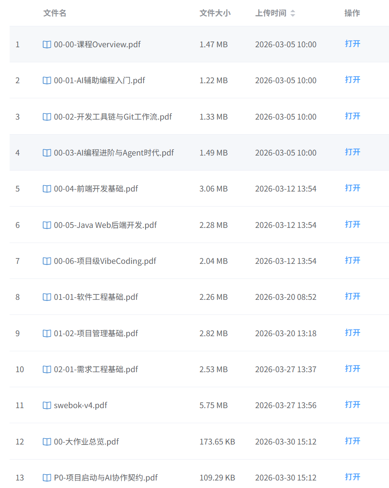

2026年6月4日，距离大二下的期末考试还有大约三周。这次考试对我来说意义比较重大——如果能拿到非常好的分数，我或许会重新考虑是否读研。虽然我一直倾向于本科毕业后直接就业，但总想试一试，觉得读研究生也是一个不错的选择。

<!-- more -->

## 复习的转折

为了考出好成绩，我开始了复习。起初一切顺利，效果也不错。直到复习到**软件工程与计算 II**，我彻底破防了。

我从未见过一门课程的官方资料能混乱到这种地步。给人的感觉就像老师喝醉酒后的潦草狂笔——不同层次的参考资料毫无章法地堆砌在一起（或许只是按首字母排序？），就像老家农村随意摆放的红砖堆，中间还夹杂着大量碎砖块，令人绝望。

## 我不理解

### 上帝的手笔

PPT的命名像一团浆糊，内容也是想到哪写到哪。和教材对比，就像把教材的目录彻底打散，所有层级目录变成同一级——没有结构，没有层次。

### 怎么去“理解”？

最让人头疼的是内容。古人说认识世界有几个层次，第一层是“看山是山，看水是水”——首先要知道什么是什么。

但这门课解释概念时，从不直接定义。上来就是一堆极其抽象、尚未定义的概念上做交集并集，充斥着“不是这样”“不是那样”的表述。  
那我的疑问是：**到底是什么样子？** 不解释。然后直接进入应用环节，对着某个东西一指：“听着！这个是XXX。”

由于定义时我只知道XXX不是另一个神奇的YYY（实际上我也不知道YYY是什么），我无法反驳，只能“好吧，那就是吧”。循环往复，直到某天我像王阳明一样“顿悟”——原来XXX是ZZZ。

但我依旧痛苦：为什么当初不能好好说清楚？难道这种未必准确的“悟道”才是教育的真谛？我不认为这是正确的。

一个典型的解释链条是：

- 告诉你“它不是什么”
- 再告诉你“它和另一个你还没学的概念不同”
- 过了十几页PPT，才告诉你那个概念是什么  
- 然后那句话是：“它和最开始那个概念不同”

这就像在迷宫里原地转圈。

## SO?

我有时怀疑：这些概念和理论，到底是为了做好软件服务，还是为了水论文、出考题而硬造出来的？靠背诵它们拿高分的人，真的能写好代码吗？

我不知道，也不想知道。我只想赶紧考完，然后忘掉这些东西。

**有些考试不值得理解，只值得通过。**