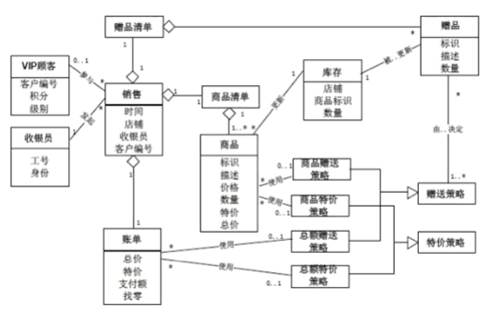
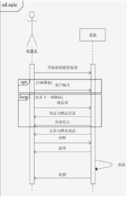
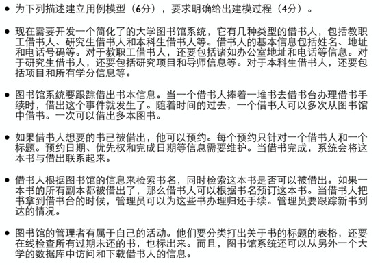
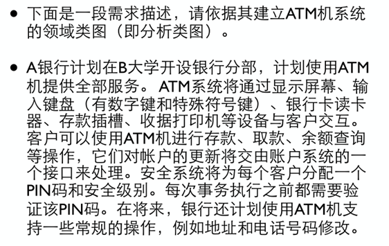
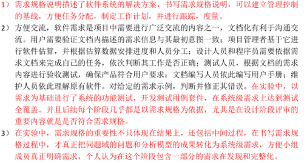
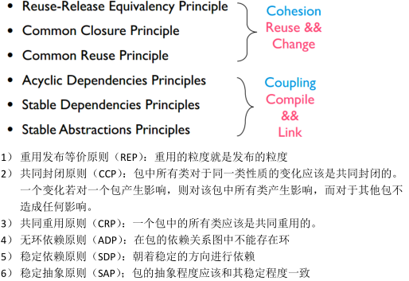
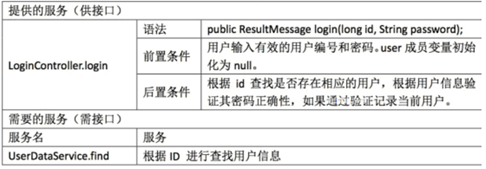
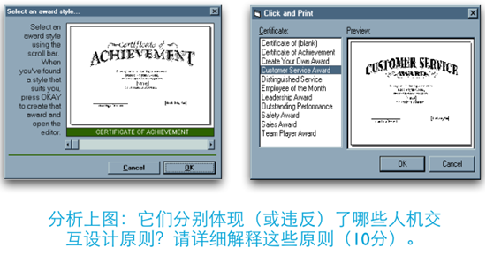
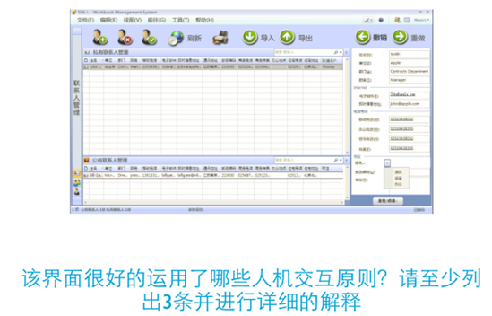

## Chapter 1 & 2

### 什么叫做软件工程

简单地理解，软件工程就是生产软件的工程学

现在应用较为广泛的软件工程定义为：
- 应用系统的、规范的、可量化的方法来开发、运行和维护软件，即将工程应用到软件。
- 对中各种方法的研究
- 事实上，软件工程是一个包含复杂内容的计算机学子学科，其特性不是通过一个或几个有限定义所能概括的。

<!-- more -->

### 从1950s~1960s之间的特点

- 1950s：科学计算；以机器为中心进行编程；像生产硬件一样生产软件
- 1960s：业务应用（批量数据处理和事务计算）；软件不同于硬件；用软件工艺的方式生产软件
- 1970s：结构化方法；瀑布模型；强调规则和纪律
- 1980s：追求生产力最大化；现代结构化方法/面向对象编程广泛应用；重视过程的作用
- 1990s：企业为中心的大规模软件系统开发；追求快速开发、可变更性和用户价值；Web应用出现
- 2000s：大规模Web应用；大量面向大众的Web产品，追求快速开发、可变更性、用户价值和创新

## Chapter 4

### 如何管理团队

### 在实验中采取了哪些方法？有哪些经验？

### 团队结构有哪几种？
1. 主程序员团队
2. 民主团队
3. 开放团队

### 质量保障有哪些措施？结合实验进行说明
1. 需求开发：需求评审、需求度量
2. 体系结构：体系结构评审、集成测试（持续集成）
3. 详细设计：详细设计评审、设计度量、集成测试（持续集成）
4. 实现（构造）：代码评审、代码度量、测试（测试驱动、持续集成）
5. 测试：测试、测试度量

### 配置管理有哪些活动？实验中是如何进行配置管理的？
- 标识配置项
- 版本管理
- 变更控制
- 配置审计
- 状态报告
- 软件发布管理

## Chapter 5

### 什么是需求

1. 用户为了解决问题或者达到某些目标所需要的条件或能力
2. 系统或系统部件为了满足合同、标准、规范或其他正式文档所规定的要求而需要具备的条件或能力
3. 对（1）或（2）中的一个条件或一种能力的一种文档化表述

> 需求工程就是所有需求处理活动的总和，它收集信息、分析问题、整合观点、记录需求并验证其正确性，最终描述出软件被应用后与其环境互动形成的期望效应。

### 需求的三个层次

1. 业务需求：是系统建立的战略出发点，表现为高层次的目标，它描述了组织为什么要开发系统。
2. 用户需求：是执行实际工作的用户对系统所能完成的具体任务的期望，描述了系统能够帮助用户做些什么。
3. 系统级需求：是用户对系统行为的期望，每个系统级需求反映了一次外界与系统的交互行为，或者系统的一个实现细节。

> (常见题型)P72 给出一个实例给出其三个层次的例子 对给定的需求示例，判定其层次，例如课程实验/ATM/图书管理...

### 需求的类型

1. 功能需求
2. 性能需求
    >常见：速度，容量，吞吐量，负载，实时性
3. 质量属性
    >可靠性，可用性，安全性，可维护性，可移植性，易用性
4. 对外接口
    >用户界面、硬件接口、软件接口、网络通信接口等
5. 约束
    >进行系统构造时需要遵守的约定，如编程语言、硬件设施等，常见：系统开发及其运行的环境，问题域内的相关标准（包括法律法规、行业协定、企业规章等），商业规则
6. 数据需求
    >各个功能使用的数据信息，使用频率，可访问性要求，数据实体及其关系，完整性约束，数据保持要求
   
> （常见题型）对给定的实例，给出其不同类型的需求例子 对给定的需求示例，判断其类型，例如课程实验/ATM/图书管理...

## Chapter 6

### 为给定的描述建立用例图

1. 进行目标分析与确定解决方向
2. 寻找参与者
3. 寻找用例
4. 细化用例
5. 注意事项：不要将用例细化为单个操作，不要将同一个业务目标细化为不同用例，不要将没用业务价值的内容作为用例

### 建立分析类图(分析类图)

>概念类图又称为领域模型，关注系统与外界的交互

1. 识别候选类
2. 确定概念类
3. 识别关联
4. 识别重要属性

> 概念类图是描述系统对象及其属性和关系，它描述了系统对象及其属性和关系，以及对象之间的关联关系。

### 建立系统顺序图

1. 确定上下文对象
2. 发现交互对象
3. 根据用例描述当中的流程，逐步添加信息

>如果一个对象发送了一个同步消息，那么它要等待对方对消息的应答，收到应答后才能继续自己的操作。而发送异步消息的对象不需要等待对方对消息的应答便可以继续自己的操作

### 建立状态图
1. 确定上下文环境，搞清楚状态的主体
2. 识别状态
3. 建立状态转换
4. 补充详细信息

> 状态图是描述对象在多个状态之间的转换的图表，它描述了对象在多个状态之间的转换，以及转换时对象所进行的操作。

### 一些例题

## Chapter 7

### 简答题
#### 为什么需要需求规格说明？结合实验进行说明

1. 需求规格说明描述了软件系统的解决方案，书写需求规格说明，可以建立管理控制的基线，方便任务分配，制定工作计划，并进行跟踪、度量
2. 方便交流 软件开发的子任务与人员之间存在着错综复杂的关系，存在大量的沟通和交流，所以软件系统开发中需要编写多种不同类型的文档，每种文档都针对项目中需要进行广泛交流的内容。软件需求是项目中需要进行广泛交流的内容之一，所以需求开发阶段需要进行需求的文档化

>一个更加完整的答案

#### 为给定的需求示例，判定并修正其错误
#### 对给定的需求规格说明片段，找出并修正其错误
#### 为给定的需求示例，设计功能测试用例 P125 结合测试方法

### 技术文档写作要点
- 简洁
- 精确
- 易读（查询）
- 易修改

### 需求书写要点
- 使用用户术语（不要使用“计算机术语”，如函数、对象、参数、类等）
- 可验证（让需求具体化，小心形容词和副词的使用，避免程度词的使用）P120
- 可行性（理论上的技术实现可能性，限定的成本、时间和人员约束内）

> P120

## Chapter 8

### 什么叫做“软件设计”

- 软件设计是指关于软件对象的设计，是一种设计活动。软件设计既指软件对象实现的规格说明，又指这个规格说明产生的过程。
- 首先进行概要设计，根据功能设计软件的整体模块结构；其次进行详细设计，建立模块的层次化分解，定义高质量、可实现的细化模块，并设计各细化模块内部的程序结构。

### 软件设计的核心思想是什么？

- 抽象和分解是软件设计的核心思想。
- 分解：横向上将系统分解为几个相对简单的子系统以及各子系统之间的关系
- 抽象：纵向上聚焦各子系统的接口（区别于实现，各子系统之间交互的契约），可以分离接口和实现，使得人们更好地关注软件系统本质，降低复杂度

### 软件工程设计有哪三个层次？各层次的主要思想是什么？
- 高层设计：基于反映软件高层抽象的构建层次，描述系统的高层结构、关注点和设计决策
- 中层设计：更加关注组成构件的模块的划分、导入/导出、过程之间的调用关系或者类之间的协作
- 低层设计：深入模块和类的内部，关注具体的数据结构、算法、类型、语句和控制结构等

## Chapter 9 & 10

### 什么叫做体系结构

>一个软件系统的体系结构规定了系统的计算部件和部件之间的交互

### 各种体系风格的优缺点

#### 主程序/子程序
- 优点
  - 流程清晰，易于理解
  - 强控制性

- 缺点
  - 程序调用是一种强耦合的连接方式，非常依赖交互方的接口规格，这会使得系统难以修改和复用
  - 程序调用的连接方式限制了各部件之间的数据交互，可能会使得不同部件使用隐含的共享数据交流，产生不必要的公共耦合，进而破坏它的“正确性”控制能力       

#### 面向对象式
- 优点
  - 内部实现的可修改性
  - 易开发、易理解、易复用的结构组织
- 缺点
  - 接口的耦合性
  - 标识的耦合性
  - 副作用 P155
#### 分层
- 优点
  - 设计机制清晰，易于理解
  - 支持并行开发
  - 更好的可复用性与内部可修改性
- 缺点：
  - 交互协议难以修改
  - 性能损失
  - 难以确定层次数量和粒度
#### MVC
- 优点
  - 易开发性
  - 视图和控制的可修改性
  - 适宜于网络系统开发的特征
- 缺点
  - 复杂性
  - 模型修改困难

### 体系结构设计的过程

1. 分析关键需求和项目约束
2. 选择体系结构风格
3. 进行软件体系结构逻辑（抽象）设计
4. 依赖逻辑设计进行软件体系结构物理（实现）设计
5. 完善软件体系结构设计
6. 定义构件接口
7. 迭代过程3）~6）

### 包的原则

### 体系结构构件之间接口的定义（*）

### 体系结构开发集成测试用例
> P177

### Stub和Driver

## Chapter 11

### 可用性/易用性

>易用性是人机交互中一个既重要又复杂的概念。它不仅关注人使用系统的过程，同时还关注系统对使用它的人所产生的作用。易用性是多维度的质量属性，维度包括：易学性、易记性、效率、出错率和主观满意度。
> 
### 能够列出至少5个界面设计的注意事项，并加以解释
1. 简洁设计
2. 一致性设计
3. 低出错率设计
4. 易记性设计
   - 减少短期记忆负担
   - 使用逐层递进的方式展示信息
   - 使用直观的快捷方式
   - 设置有意义的默认值
5. 可视化设计要点
   - 按照任务模型设计界面隐喻，同时不要把软件系统的内部构造机制暴露给用户
   - 可视化设计还应该基于界面隐喻，尽可能地把功能和任务细节表现出来

### EXAMPLE

- 违反了
  - 一致性设计：不一致的交互机制会导致用户的精神模型的不一致，造成不必要的麻烦和负担。
- 体现了：
  - 反馈：对用户行为进行了反馈，让用户意识到行为的结果，单击按钮改变了按钮边框。
  - 简洁设计：第二张图隐喻设计代替描述文字
  - 可视化设计：基于界面隐喻，把功能和任务细节表现了出来。

- 导航：能帮助用户找到任务的入口
- 简洁设计
- 易记性设计：使用直观的快捷方式
### 什么叫做精神模型，以及为什么具有差异性

- 精神模型就是用户进行人机交互时头脑中的任务模型。人机交互设计需要依据精神模型进行隐喻设计
- 对不同用户群体的任务模型是有差异的，所以对他们的人机交互设计也要有差异。按照用户群体自身的特点，可以将其划分为新手用户、专家用户和熟练用户

### 导航、反馈、协作式设计
> 软件系统导航要能帮助用户找到任务的入口，导航的目的就是为用户提供一个很好的完成任务的入口，好的导航会让这个入口非常符合人的精神模型
>
> 好的人机交互设计需要对用户行为进行反馈，让用户能够意识到行为的结果。反馈的目的是提示用户交互行为的结果，但不能打断用户工作时的意识流。
> 
> 对用户思考和反应时间的把握。人和计算机是人机交互的两方，其中人的因素是比较固定的，一定时期内不会发生大的变化，所以要让两者交互顺畅，就需要让计算机更多地适应人的因素，这也是人机交互设计以用户为中心的根本原因。
> 
> 这种调整计算机因素以更好地适应并帮助用户的设计方式被称作为协作式设计。

