## Chapter 12

### 详细设计的出发点以及实现目标

- 出发
  - 以需求开发的结果（需求规格说明书和需求分析模型）和软件体系结构的结果（软件体系结构设计方案与原型）为出发点。
- 设计目的
  - 在详细设计中一般进行中层设计和低层设计，详细设计的目的是实现所有功能性需求和非功能性需求

<!-- more -->

### 详细设计当中的职责分配

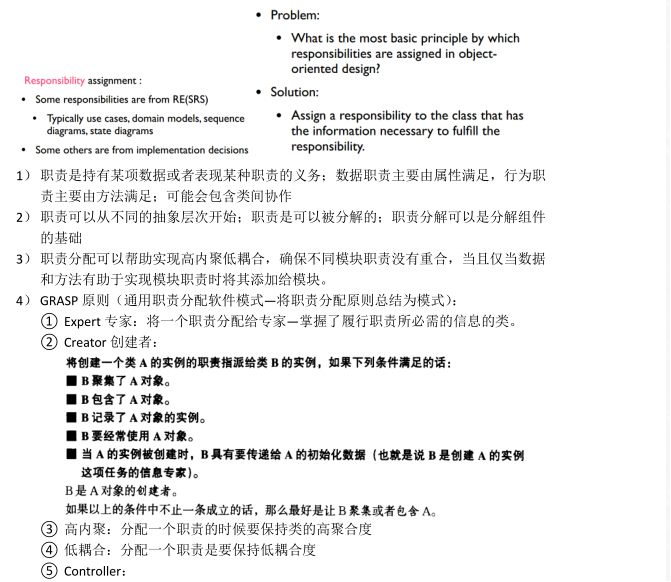

> 续上图当中的controller部分

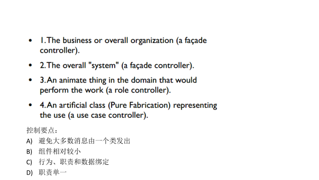

### 协作——抽象对象之间的协作

1. 从小到大，将对象的小职责聚合形成大职责
2. 从大到小，将大职责分配给每一个小对象
3. 这两种方法一般使同时运用的，共同完成对于职责的抽象

### 控制的几种风格

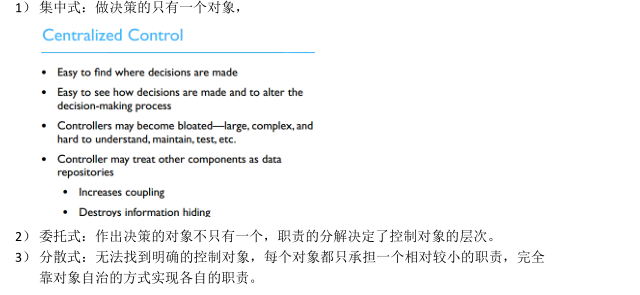
> 抽象图示
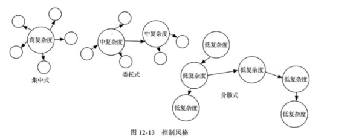

## Chapter 13

### 什么叫做“耦合”和“内聚”

- 耦合描述的是两个模块之间关系的复杂程度  
- 内聚表达的是一个模块内部的联系的紧密性


#### 耦合（从好到坏）

>耦合度越高越糟糕（因为模块依赖太重，改一处牵动全身）
- 内容耦合（最差）： 一个模块直接修改另一个模块的内部变量或代码。绝对不能出现。
- 公共耦合： 多个模块共用同一个全局变量。容易导致数据混乱，排查困难。
- 重复耦合： 复制粘贴代码。修改一个地方，得去另一个地方也改一遍。
- 控制耦合： 传一个标志位（Flag）告诉另一个模块“你按什么逻辑走”。破坏了封装性。
- 印记耦合： 传一个大对象（比如整个“员工”对象），但接收方只需要里面的“年龄”。传得太多了，造成浪费和依赖。
- 数据耦合（最好）： 传你真正需要的数据（比如只传“年龄”这个整数）。这是最理想的耦合方式。
#### 内聚（从坏到好）

>内聚度越低越糟糕（因为模块像个大杂烩，什么都干）。
- 偶然内聚（最差）： 把“打印一句话”、“计算圆面积”、“关掉电源”放在同一个函数里。毫无关联。
- 逻辑内聚： 把几种不同但逻辑相似的东西放一起，比如“处理所有类型的数据输入”。
- 时间内聚： “初始化”函数。系统启动时，要做的所有无关事情（加载配置、清空内存、开启日志）都放这里。
- 过程内聚： 顺序执行，比如“先读文件，再解析，再入库”。但这三个步骤不一定非得绑定在一起。
- 通信内聚： 都在处理同一份数据，比如“读取数据库连接，并发送验证信息”，但做的事情逻辑不同。
- 功能内聚（很好）： 完成一个明确的单一任务（例如 calculate_tax()）。这是最理想的内聚。
- 信息内聚（最好，通常针对类）： 比如一个“栈（Stack）”类，有 push（入栈）、pop（出栈）、peek（查看）等方法，都围绕同一个数据结构工作。

#### 在实际编程中的含义

- 如果你发现一个函数有 1000 行，里面有 switch case 处理不同逻辑，它大概率是逻辑内聚，你应该把它拆解。
- 如果你发现两个类之间传了一个巨大的 JSON 对象，但每个类只用了其中的几个字段，这叫印记耦合，应该改成只传那个具体的字段。
- 如果你的老代码里有一个全局变量 GLOBAL_MODE，那就是公共耦合，尽量不要这么做，改成依赖注入

#### 此处原文

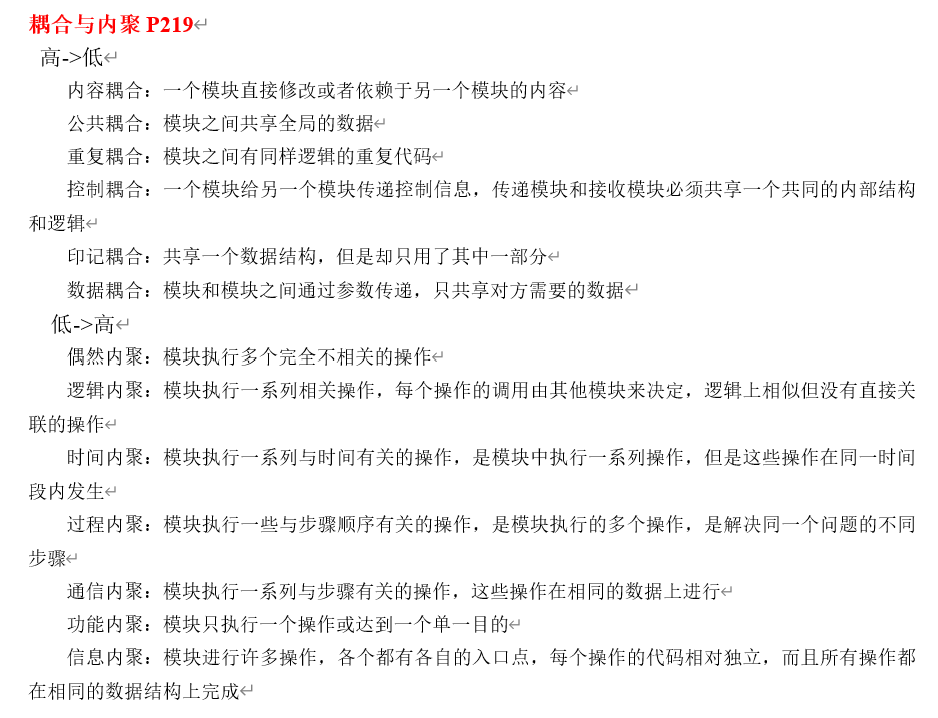

### 有关于"耦合""内聚"的一些例子

#### 一、耦合类型（从高到低）

**1. 内容耦合（Content Coupling）**

定义：一个模块直接修改或依赖另一个模块的内部内容（如直接访问另一个模块的私有变量或代码）。

代码示例（Page 8）：

```java
public class Vector3D {
    public int x, y, z;
}

public class Arch {
    private Vector3D baseline;
    void slant(int newY) {
        baseline.x = 10;   // 直接修改其他类的内部字段
        baseline.y = 13;
    }
}
```

**2. 公共耦合（Common Coupling）**

定义：多个模块共享全局数据。

代码示例（Page 9）：

```java
int x;  // 全局变量

public class myValue {
    public void addValue(int a) {
        x = x + a;
    }
    public void subtractValue(int a) {
        x = x - a;
    }
}
```

**3. 印记耦合（Stamp Coupling）**

定义：模块之间共享一个数据结构，但只使用其中一部分数据。

代码示例（Page 1）：

```java
void validate_checkout_request(input_form i) {
    if (valid_string(i)) {
        error_message("Invalid name");
    }
    if (valid_string(i)) {
        error_message("Invalid book name");
    }
    if (valid_month(i)) {
        error_message("Invalid month");
    }
    int valid_month(input_form i) {
        return i.date.month >= 1 && i.date.month <= 12;
    }
}
```

代码示例（Page 9）：

```java
public class Receiver {
    public void message(MyType X) {
        X.doSomethingForMe(Object data);
    }
}
```

**4. 数据耦合（Data Coupling）**

定义：模块之间通过参数传递，只共享对方需要的数据。

代码示例（Page 1）：

```java
void validate_checkout_request(input_form i) {
    if (valid_string(i.name)) {
        error_message("Invalid name");
    }
    if (valid_string(i.book)) {
        error_message("Invalid book name");
    }
    if (valid_month(i.date)) {
        error_message("Invalid month");
    }
    int valid_month(date d) {
        return d.month >= 1 && d.month <= 12;
    }
}
```

代码示例（Page 9）：

```java
int x;
public class myValue {
    public void addValue(int a) {   // 只传递需要的整型参数
        x = x + a;
    }
    public void subtractValue(int a) {
        x = x - a;
    }
}
```

#### 二、内聚类型（从低到高）

**1. 偶然内聚（Coincidental Cohesion）**

定义：模块执行多个完全不相关的操作。


**2. 逻辑内聚（Logical Cohesion）**

定义：模块执行一系列逻辑相似但不直接关联的操作，由外部决定调用哪个。

代码示例（Page 5）：

```java
public void sample(String flag) {
    switch (flag) {
        case ON:
            break;
        case OFF:
            break;
        case CLOSE:
            break;
    }
}
```

**3. 时间内聚（Temporal Cohesion）**

定义：模块执行一系列与时间相关的操作（如初始化、清理）。

代码示例（Page 5）：

```java
public class foo {
    private String name;
    private int size;

    // constructor
    public void foo() {
        this.name = "Not Set";
        this.size = 12;
    }

    // destructor
    public void ~foo() {
        delete[] name;
        delete size;
    }
}
```

**4. 通信内聚（Communicational Cohesion）**

定义：模块执行一系列与步骤有关的操作，这些操作在相同的数据上进行。

代码示例（Page 1）：

```java
void validate_checkout_request(input_form i) {
    if (valid_string(i.name)) {
        error_message("Invalid name");
    }
    if (valid_string(i.book)) {
        error_message("Invalid book name");
    }
    if (valid_month(i.date)) {
        error_message("Invalid month");
    }
    int valid_month(date d) {
        return d.month >= 1 && d.month <= 12;
    }
}
```

**5. 功能内聚（Functional Cohesion）**

定义：模块只执行一个操作或达到一个单一目的。

代码示例（Page 7）：

```java
public int commission(int sale, long percentage) {
    int com;
    // calculate commission
    return com;
}
```

**6. 信息内聚（Informational Cohesion）**

定义：模块执行多个操作，每个操作独立，但都在相同的数据结构上完成（通常指一个类提供多个相关方法）。

代码示例（Page 7）：

```java
public interface Addressee {
    public abstract String getName();
    public abstract String getAddress();
}

public class Employee implements Addressee {
    // ...
}
```

#### 三、混合/扩展示例（Page 4）

**4-1：复杂验证函数（低内聚）**

```java
void validate_checkout_request(input_form i) {
    int len = 0;
    boolean valid_string = false;
    
    len = i.name.length();
    char arr1[] = new char[len];
    for (char c : arr1) {
        if (c 是小写字母) valid_string = true;
    }
    if (!valid_string) {
        error_message("Invalid name");
    }

    len = i.book.length();
    char arr2[] = new char[len];
    for (char c : arr2) {
        if (c 是小写字母) valid_string = true;
    }
    if (!valid_string) {
        error_message("Invalid month");
    }
}
```

**4-2：多个静态方法混在一起**

```java
public class Rous {
    public static int findPattern(String text, String pattern) {
        // ...
    }
    public static int average(Vector numbers) {
        // ...
    }
    public static OutputStream openFile(String fileName) {
        // ...
    }
}
```


#### 点击 -->[这里](https://ref.hanerson.top/#/post/20260605)<-- 查看原始内容


### 信息隐藏

- 信息隐藏利用了抽象的方法，抽象出每个类的关键细节，也就是模块的职责。换句话说，抽象出来的就是接口，隐藏的就是实现，他们共同体现了模块的职责。

- 信息隐藏的核心设计思路是每个模块都隐藏一个重要的设计决策。每个模块都承担一定的职责，对外表现为一份契约，并且在这份契约之下隐藏着只有这个模块知道的设计决策或者秘密，决策实现的细节（特别是容易改变的细节）只有该模块自己知道。
两种常见的信息隐藏决策

#### 含义

> 面向对象中，需要
1. 封装类的职责，隐藏职责的实现
2. 预计将会发生的变更，抽象它的接口，隐藏内部实现机制


## Chapter 14

> 一些基本原则

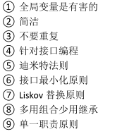


### 降低访问耦合的方法

1. 针对接口编程
2. 接口最小化/接口分离原则
3. 访问耦合的合理范围、迪米特法则

### 降低继承耦合的方法
1. LSP：Liskov替换原则
子类型必须能够替换掉基类型而起同样的作用。
即：子类方法的前置条件必须与超类方法的前置条件相同甚至要求更少；子类方法的后置条件必须与超类方法的后置条件相同或者要求更多

2. 使用组合代替继承

> 利用组合关系，既能复用代码，又能保持接口的灵活性

> 在希望复用代码又不能满足LSP时，往往会用组合来替代继承

### 提高内聚的方法
1. 集中信息与行为
2. SRP：单一职责原则

## Chapter 15

### 封装

#### 分离接口以及实现

1. 将数据和行为同时包含在类中
2. 分离对外接口和内部实现

#### 实现细节
1. 封装数据与行为
2. 封装内部结构
3. 封装其他对象的引用
4. 封装类型信息
5. 封装潜在变更

> 简单示例

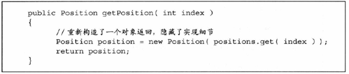

### OCP：开闭原则
1. 好的设计应该对“扩展”开放
2. 好的设计应该对“修改”关闭

简单来说，开闭原则是指：在发生变更时，好的设计只需要添加新的代码而不需要修改原有的代码，就能够实现变更

### DIP：依赖倒置原则
抽象不应该依赖于细节，细节应该依赖于抽象。因为抽象是稳定的，细节是不稳定的

高层模块不应该依赖于低层模块，而是双方都依赖于抽象。因为抽象是稳定的，而高层模块和低层模块都可能是不稳定的

### 一道例题

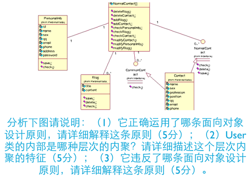


## Chapter 16

### 如何实现可修改性、可扩展性、灵活性？

> 通过接口与实现的分离，将抽象与实现分离，从而实现可扩展性、可修改性、灵活性
1. 通过接口和实现该接口的类完成接口与实现的分离
2. 通过子类继承父类，将父类的接口和子类的实现相分离


### 策略模式

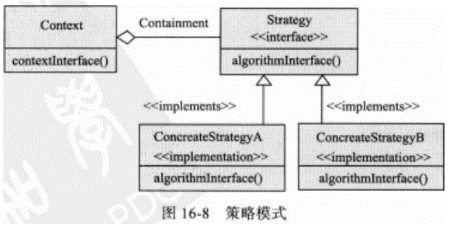

### 抽象工厂模式

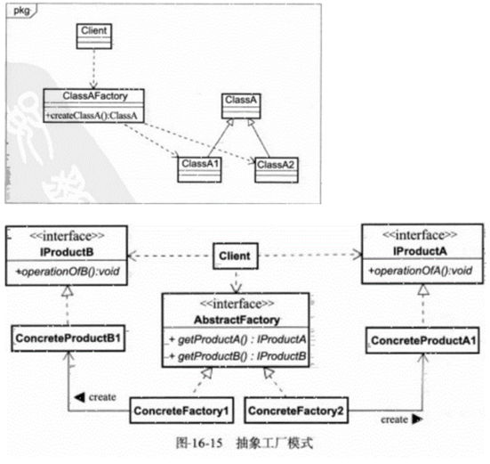

### 单件模式
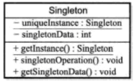
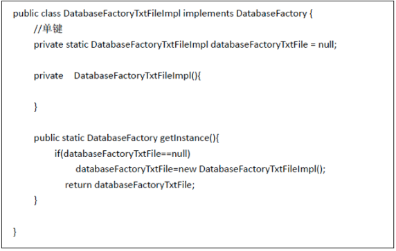

### 迭代器模式


## Chapter 17 & 18

### 构造包含的活动

>定义问题，需求分析，规划构建，软件架构，详细设计，编码与调试，集成，单元测试，集成测试，系统测试，保障维护


### 名词解释

#### 重构

>修改软件系统的严谨方法，它在不改变代码外部表现的情况下改进其内部结构。不改变代码的外部表现，是指不改变软件系统的功能。改进代码的内部结构是指提升详细设计结构的质量，使其能够继续演化下去。

#### 测试驱动开发

> 测试优先的开发
> (来自AI): 测试驱动开发（TDD）是一种开发方法，它要求在开始编写代码之前，先编写测试用例，然后编写代码，最后运行测试用例，并确保测试用例通过。


#### 结对编程
> 两个程序员挨着坐在一起，共同协作进行软件构造活动


***由于这一部分过于混乱不知所云，交给AI进行了简单整理***


### 代码分析与改进标准

**目标：** 分析给定代码段，找出并改进问题。

**考察方向：** 代码的简洁性和可维护性。

**具体手段：**

- **使用数据结构消减复杂判定：** 用 Map 或 Switch 代替大量 if-else
- **控制结构、变量使用、语句处理：** 检查循环、变量作用域、逻辑嵌套是否合理

**陷阱提示：** How to write unmaintainable code（如何写出不可维护的代码）—— 这实际上是反向教学，让学生避免犯下这些典型错误。

---

### 单元测试用例的设计

#### 契约式设计（Design by Contract）

这是一种保证软件正确性的设计方法。

- **前置条件 (Precondition)：** 方法执行前必须满足的条件
- **后置条件 (Postcondition)：** 方法执行结束后必须保证的条件
- **不变式：** 必须始终成立的条件

**结论：** 如果一个方法满足前置条件（进来时是对的），执行后满足后置条件（出去时是对的），那么该方法就是正确且可靠的。

**实现方式：** 通常结合断言 (Assert) 和异常处理。

#### 防御式编程

**核心思想：** 不要相信外部输入（比如用户输入、其他模块的调用、网络数据、硬件状态）。

**做法：** 在边界处增加保护逻辑，比如检查是否为 null、参数是否越界、文件是否打开等。即使外部出错，也要确保自己内部不被损坏。

---

### 2. 表驱动法 (Table-Driven Methods)

这是第二张图下方的代码块所演示的内容。

**代码分析：**

```
prePointArray = {1000, 2000, 5000};
postPointArray = {1000, 2000, 5000};
levelArray = {1, 2, 3};

for (int i=0; i<=2; i++) {
    if ((prePoint < prePointArray[i]) && (postPoint >= postPointArray[i])) {
        triggerGiftEvent(levelArray[i]);
    }
}
```

**核心解释：**

这段代码展示了如何利用数组（表格）来代替复杂的 if-else-if 逻辑链条。

**原理：** 将对数据的判断逻辑（规则）提取出来，存入数据结构（三个数组分别对应：前值阈值、后值阈值、等级）。

**优势：**

- **消除复杂的判定：** 如果用 if 写，需要写成三层 if-else 结构，阅读起来很困难
- **易于扩展：** 如果要增加第4个奖励等级，只需在数组中增加一个元素，而不需要修改 if 代码逻辑
- **易于修改：** 如果阈值变化，比如第一级要改成 1500，直接修改数组值即可，无需修改代码控制流

---

### 总结

1. 先明白软件开发流程
2. 理解重构和结对编程
3. 重点掌握如何写出健壮的代码（契约/防御式编程）
4. 学会使用表驱动法/数据结构优化复杂的逻辑判断


